# Assigment Python 1
## Data Set: London Crime Data, 2008-2016
**Sumber Dataset**: https://www.kaggle.com/datasets/jboysen/london-crime

Data ini adalah data criminal yang diambil di London yang merupakan kota metrepolitan di Inggris. Ada berbagai macam kejahatan yang tercatat pada data tersebut dari katagori tinggi dan kategori rendah dari berbagai wilayah di London tahun 2008 sampai 2016.

Data tersebut meliputi:
* lsoa_code: kode untuk Area Output Super Bawah di London Raya.
* borough: Nama umum untuk wilayah London.
* major_category: Kategorisasi kejahatan tingkat tinggi.
* minor_category: Kategorisasi kejahatan tingkat rendah.
* value: jumlah kejahatan kategorikal yang dilaporkan setiap bulan di wilayah tertentu
* year: Tahun penghitungan yang dilaporkan, 2008-2016
* month: Bulan penghitungan yang dilaporkan, 1-12

Mengimpor modul analis data utama : Pandas dan Numpy


```python
import numpy as np
import pandas as pd
from PIL import Image
```

Membaca data London Crime tahun 2008-2016


```python
lc = pd.read_csv("D:\Python for Data Science\Data\london_crime_by_lsoa.csv")
lc
```


<div>
<style scoped>
    .dataframe tbody tr th:only-of-type {
        vertical-align: middle;
    }

    .dataframe tbody tr th {
        vertical-align: top;
    }

    .dataframe thead th {
        text-align: right;
    }
</style>
<table border="1" class="dataframe">
  <thead>
    <tr style="text-align: right;">
      <th></th>
      <th>lsoa_code</th>
      <th>borough</th>
      <th>major_category</th>
      <th>minor_category</th>
      <th>value</th>
      <th>year</th>
      <th>month</th>
    </tr>
  </thead>
  <tbody>
    <tr>
      <th>0</th>
      <td>E01001116</td>
      <td>Croydon</td>
      <td>Burglary</td>
      <td>Burglary in Other Buildings</td>
      <td>0</td>
      <td>2016</td>
      <td>11</td>
    </tr>
    <tr>
      <th>1</th>
      <td>E01001646</td>
      <td>Greenwich</td>
      <td>Violence Against the Person</td>
      <td>Other violence</td>
      <td>0</td>
      <td>2016</td>
      <td>11</td>
    </tr>
    <tr>
      <th>2</th>
      <td>E01000677</td>
      <td>Bromley</td>
      <td>Violence Against the Person</td>
      <td>Other violence</td>
      <td>0</td>
      <td>2015</td>
      <td>5</td>
    </tr>
    <tr>
      <th>3</th>
      <td>E01003774</td>
      <td>Redbridge</td>
      <td>Burglary</td>
      <td>Burglary in Other Buildings</td>
      <td>0</td>
      <td>2016</td>
      <td>3</td>
    </tr>
    <tr>
      <th>4</th>
      <td>E01004563</td>
      <td>Wandsworth</td>
      <td>Robbery</td>
      <td>Personal Property</td>
      <td>0</td>
      <td>2008</td>
      <td>6</td>
    </tr>
    <tr>
      <th>...</th>
      <td>...</td>
      <td>...</td>
      <td>...</td>
      <td>...</td>
      <td>...</td>
      <td>...</td>
      <td>...</td>
    </tr>
    <tr>
      <th>13490599</th>
      <td>E01000504</td>
      <td>Brent</td>
      <td>Criminal Damage</td>
      <td>Criminal Damage To Dwelling</td>
      <td>0</td>
      <td>2015</td>
      <td>2</td>
    </tr>
    <tr>
      <th>13490600</th>
      <td>E01002504</td>
      <td>Hillingdon</td>
      <td>Robbery</td>
      <td>Personal Property</td>
      <td>1</td>
      <td>2015</td>
      <td>6</td>
    </tr>
    <tr>
      <th>13490601</th>
      <td>E01004165</td>
      <td>Sutton</td>
      <td>Burglary</td>
      <td>Burglary in a Dwelling</td>
      <td>0</td>
      <td>2011</td>
      <td>2</td>
    </tr>
    <tr>
      <th>13490602</th>
      <td>E01001134</td>
      <td>Croydon</td>
      <td>Robbery</td>
      <td>Business Property</td>
      <td>0</td>
      <td>2011</td>
      <td>5</td>
    </tr>
    <tr>
      <th>13490603</th>
      <td>E01003413</td>
      <td>Merton</td>
      <td>Violence Against the Person</td>
      <td>Wounding/GBH</td>
      <td>0</td>
      <td>2015</td>
      <td>6</td>
    </tr>
  </tbody>
</table>
<p>13490604 rows × 7 columns</p>
</div>


Menampilkan 5 baris teratas dari data set


```python
lc.head()
```


<div>
<style scoped>
    .dataframe tbody tr th:only-of-type {
        vertical-align: middle;
    }

    .dataframe tbody tr th {
        vertical-align: top;
    }

    .dataframe thead th {
        text-align: right;
    }
</style>
<table border="1" class="dataframe">
  <thead>
    <tr style="text-align: right;">
      <th></th>
      <th>lsoa_code</th>
      <th>borough</th>
      <th>major_category</th>
      <th>minor_category</th>
      <th>value</th>
      <th>year</th>
      <th>month</th>
    </tr>
  </thead>
  <tbody>
    <tr>
      <th>0</th>
      <td>E01001116</td>
      <td>Croydon</td>
      <td>Burglary</td>
      <td>Burglary in Other Buildings</td>
      <td>0</td>
      <td>2016</td>
      <td>11</td>
    </tr>
    <tr>
      <th>1</th>
      <td>E01001646</td>
      <td>Greenwich</td>
      <td>Violence Against the Person</td>
      <td>Other violence</td>
      <td>0</td>
      <td>2016</td>
      <td>11</td>
    </tr>
    <tr>
      <th>2</th>
      <td>E01000677</td>
      <td>Bromley</td>
      <td>Violence Against the Person</td>
      <td>Other violence</td>
      <td>0</td>
      <td>2015</td>
      <td>5</td>
    </tr>
    <tr>
      <th>3</th>
      <td>E01003774</td>
      <td>Redbridge</td>
      <td>Burglary</td>
      <td>Burglary in Other Buildings</td>
      <td>0</td>
      <td>2016</td>
      <td>3</td>
    </tr>
    <tr>
      <th>4</th>
      <td>E01004563</td>
      <td>Wandsworth</td>
      <td>Robbery</td>
      <td>Personal Property</td>
      <td>0</td>
      <td>2008</td>
      <td>6</td>
    </tr>
  </tbody>
</table>
</div>


Menampilkan 5 baris terbawah dari dataset


```python
lc.tail()
```


<div>
<style scoped>
    .dataframe tbody tr th:only-of-type {
        vertical-align: middle;
    }

    .dataframe tbody tr th {
        vertical-align: top;
    }

    .dataframe thead th {
        text-align: right;
    }
</style>
<table border="1" class="dataframe">
  <thead>
    <tr style="text-align: right;">
      <th></th>
      <th>lsoa_code</th>
      <th>borough</th>
      <th>major_category</th>
      <th>minor_category</th>
      <th>value</th>
      <th>year</th>
      <th>month</th>
    </tr>
  </thead>
  <tbody>
    <tr>
      <th>13490599</th>
      <td>E01000504</td>
      <td>Brent</td>
      <td>Criminal Damage</td>
      <td>Criminal Damage To Dwelling</td>
      <td>0</td>
      <td>2015</td>
      <td>2</td>
    </tr>
    <tr>
      <th>13490600</th>
      <td>E01002504</td>
      <td>Hillingdon</td>
      <td>Robbery</td>
      <td>Personal Property</td>
      <td>1</td>
      <td>2015</td>
      <td>6</td>
    </tr>
    <tr>
      <th>13490601</th>
      <td>E01004165</td>
      <td>Sutton</td>
      <td>Burglary</td>
      <td>Burglary in a Dwelling</td>
      <td>0</td>
      <td>2011</td>
      <td>2</td>
    </tr>
    <tr>
      <th>13490602</th>
      <td>E01001134</td>
      <td>Croydon</td>
      <td>Robbery</td>
      <td>Business Property</td>
      <td>0</td>
      <td>2011</td>
      <td>5</td>
    </tr>
    <tr>
      <th>13490603</th>
      <td>E01003413</td>
      <td>Merton</td>
      <td>Violence Against the Person</td>
      <td>Wounding/GBH</td>
      <td>0</td>
      <td>2015</td>
      <td>6</td>
    </tr>
  </tbody>
</table>
</div>


## Data Preprocessing

Menampilkan jumlah baris dan kolom


```python
lc.shape
```


    (13490604, 7)


Mengecek Tipe Data


```python
lc.info()
```

    <class 'pandas.core.frame.DataFrame'>
    RangeIndex: 13490604 entries, 0 to 13490603
    Data columns (total 7 columns):
     #   Column          Dtype 
    ---  ------          ----- 
     0   lsoa_code       object
     1   borough         object
     2   major_category  object
     3   minor_category  object
     4   value           int64 
     5   year            int64 
     6   month           int64 
    dtypes: int64(3), object(4)
    memory usage: 720.5+ MB
    

Menampilkan kolom


```python
lc.columns
```


    Index(['lsoa_code', 'borough', 'major_category', 'minor_category', 'value',
           'year', 'month'],
          dtype='object')


Memeriksa data untuk melihata berapa banyak objek null


```python
lc.isnull().sum()
```


    lsoa_code         0
    borough           0
    major_category    0
    minor_category    0
    value             0
    year              0
    month             0
    dtype: int64


Melihat ringkasan singkat dari setiap kolom


```python
# Statistik Descriptif
lc.describe()
```


<div>
<style scoped>
    .dataframe tbody tr th:only-of-type {
        vertical-align: middle;
    }

    .dataframe tbody tr th {
        vertical-align: top;
    }

    .dataframe thead th {
        text-align: right;
    }
</style>
<table border="1" class="dataframe">
  <thead>
    <tr style="text-align: right;">
      <th></th>
      <th>value</th>
      <th>year</th>
      <th>month</th>
    </tr>
  </thead>
  <tbody>
    <tr>
      <th>count</th>
      <td>1.349060e+07</td>
      <td>1.349060e+07</td>
      <td>1.349060e+07</td>
    </tr>
    <tr>
      <th>mean</th>
      <td>4.779444e-01</td>
      <td>2.012000e+03</td>
      <td>6.500000e+00</td>
    </tr>
    <tr>
      <th>std</th>
      <td>1.771513e+00</td>
      <td>2.581989e+00</td>
      <td>3.452053e+00</td>
    </tr>
    <tr>
      <th>min</th>
      <td>0.000000e+00</td>
      <td>2.008000e+03</td>
      <td>1.000000e+00</td>
    </tr>
    <tr>
      <th>25%</th>
      <td>0.000000e+00</td>
      <td>2.010000e+03</td>
      <td>3.750000e+00</td>
    </tr>
    <tr>
      <th>50%</th>
      <td>0.000000e+00</td>
      <td>2.012000e+03</td>
      <td>6.500000e+00</td>
    </tr>
    <tr>
      <th>75%</th>
      <td>1.000000e+00</td>
      <td>2.014000e+03</td>
      <td>9.250000e+00</td>
    </tr>
    <tr>
      <th>max</th>
      <td>3.090000e+02</td>
      <td>2.016000e+03</td>
      <td>1.200000e+01</td>
    </tr>
  </tbody>
</table>
</div>


Melihat missing value pada data


```python
# Melihat missing value
lc.isnull().sum()
```


    lsoa_code         0
    borough           0
    major_category    0
    minor_category    0
    value             0
    year              0
    month             0
    dtype: int64


## Analisis 1: Trend Kejahatan per Tahun

Mengimpor modul matplotlib


```python
import matplotlib as mpl
import matplotlib.pyplot as plt
```


```python
print(plt.style.available)
mpl.style.use(['ggplot'])
```

    ['Solarize_Light2', '_classic_test_patch', '_mpl-gallery', '_mpl-gallery-nogrid', 'bmh', 'classic', 'dark_background', 'fast', 'fivethirtyeight', 'ggplot', 'grayscale', 'seaborn-v0_8', 'seaborn-v0_8-bright', 'seaborn-v0_8-colorblind', 'seaborn-v0_8-dark', 'seaborn-v0_8-dark-palette', 'seaborn-v0_8-darkgrid', 'seaborn-v0_8-deep', 'seaborn-v0_8-muted', 'seaborn-v0_8-notebook', 'seaborn-v0_8-paper', 'seaborn-v0_8-pastel', 'seaborn-v0_8-poster', 'seaborn-v0_8-talk', 'seaborn-v0_8-ticks', 'seaborn-v0_8-white', 'seaborn-v0_8-whitegrid', 'tableau-colorblind10']
    

Membuat tabel baru yang berisi value (jumlah kejahatan) yang terjadi setiap tahun


```python
crime_by_year = lc.pivot_table(index='year', values='value', aggfunc=np.sum, fill_value=0)
crime_by_year
```


<div>
<style scoped>
    .dataframe tbody tr th:only-of-type {
        vertical-align: middle;
    }

    .dataframe tbody tr th {
        vertical-align: top;
    }

    .dataframe thead th {
        text-align: right;
    }
</style>
<table border="1" class="dataframe">
  <thead>
    <tr style="text-align: right;">
      <th></th>
      <th>value</th>
    </tr>
    <tr>
      <th>year</th>
      <th></th>
    </tr>
  </thead>
  <tbody>
    <tr>
      <th>2008</th>
      <td>738641</td>
    </tr>
    <tr>
      <th>2009</th>
      <td>717214</td>
    </tr>
    <tr>
      <th>2010</th>
      <td>715324</td>
    </tr>
    <tr>
      <th>2011</th>
      <td>724915</td>
    </tr>
    <tr>
      <th>2012</th>
      <td>737329</td>
    </tr>
    <tr>
      <th>2013</th>
      <td>686407</td>
    </tr>
    <tr>
      <th>2014</th>
      <td>680183</td>
    </tr>
    <tr>
      <th>2015</th>
      <td>711624</td>
    </tr>
    <tr>
      <th>2016</th>
      <td>736121</td>
    </tr>
  </tbody>
</table>
</div>


### Plot 1: Area Plot

Memplotkan dengan plot area menggunakan fungsi .plot()


```python
crime_by_year.plot(kind='area',
            alpha = 0.3, # 0-1, default value a= 0.5|
            color = 'darkblue',
            stacked=False,
            legend=False,
            figsize=(10,6)
            )

plt.title('Trend Kejahatan per Tahun')
plt.ylabel('Value')
plt.xlabel('Years')

plt.show()
```


    
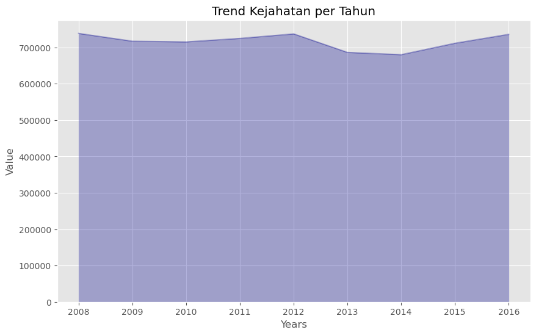
    


### Plot 2: Line Plot

Memplotkan data dengan plot garis 


```python
crime_by_year.plot(kind='line',
            alpha = 0.3, # 0-1, default value a= 0.5|
            color = 'darkblue',
            stacked=False,
            legend=False,
            figsize=(10,6)
            )

plt.title('Trend Kejahatan per Tahun')
plt.ylabel('Value')
plt.xlabel('Years')

plt.show()
```


    
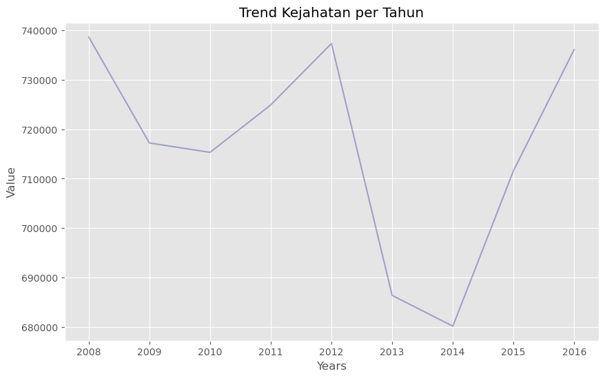
    


### Plot 3: Bar Plot

Memplotkan data dengan plot Bar


```python
crime_by_year.plot(kind='barh',
            alpha = 0.3, # 0-1, default value a= 0.5|
            color = 'darkblue',
            stacked=False,
            legend=False,
            figsize=(12,8)
            )

plt.title('Trend Kejahatan per Tahun')
plt.ylabel('Value')
plt.xlabel('Years')

plt.show()
```


    
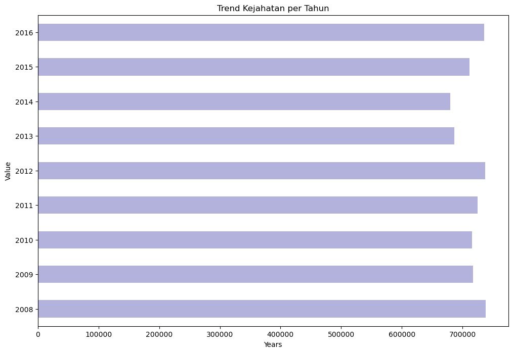
    


### Plot 4: Pie Chart

Memplotkan data dengan plot Pie Chart dengan passing kind = 'pie', bersama dengan parameter tambahan yaitu : autopct, statangle, dan shadow


```python

colors_list = ['coral', 'seashell', 'peachpuff', 'lightcoral', 'darkorange', 'sandybrown', 'lightgrey', 'moccasin', 'rosybrown']
explode_list = [0.1, 0.1, 0.1, 0.1, 0.1, 0.1, 0.1, 0.1, 0.1] # ratio for each continent with which to offset each wedge.

fig, ax = plt.subplots(figsize = (12,12))

crime_by_year['value'].plot(kind='pie',
                            figsize=(16, 6),
                            autopct=lambda p:f'{p:.1f}% ({int(p*sum(crime_by_year["value"])/100)})',    # add in percentages
                            startangle=90,        # start angel 90* (Africa)
                            shadow= True,         # add shadow
                            labels= None,         # turn off labels on pie chart
                            pctdistance= 1.4,    # the ratio between the center of each pie slice and the start of the text generated by autopct
                            colors=colors_list,   # add custom colors
                            explode= explode_list,
                            ax=ax #'explode' lowest 3 continents
                           )
    
plt.title('Total London Criminal by Year [2008-2016]', y=1.12)
plt.axis('equal') # Sets the pie chart to look like a circle.

# add legend
plt.legend(labels=crime_by_year.index, loc='upper left')

plt.show()
```


    
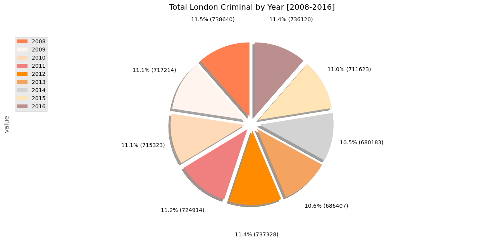
    


### Plot 5: Box Plot

Plot data dengan passing kind= 'box'


```python
crime_by_year.plot(kind='box', 
                   color='green', 
                   vert=True, 
                   figsize=(10, 8), 
                   legend=False)

plt.title('Trend Kejahatan per Tahun [2008-2016]')
plt.ylabel('Value')

plt.show()
```


    
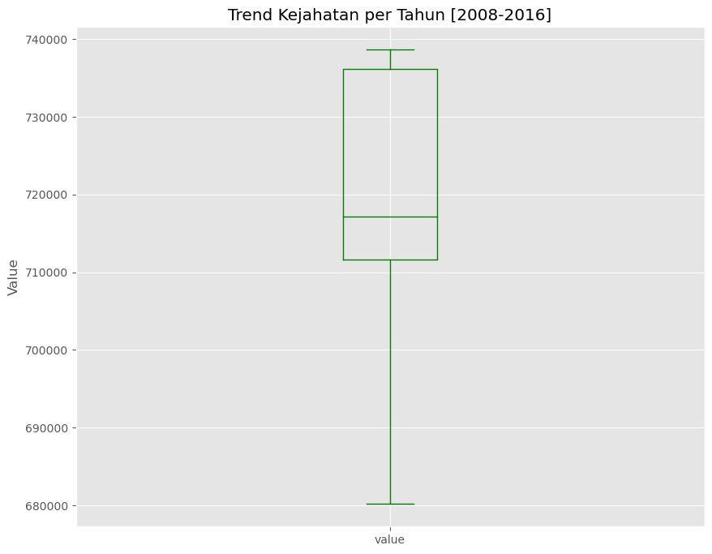
    


### Plot 6: Buble Plot

Untuk Buble plot kita akan mengambil data 'year' dan 'value' dari datset tersebut. Kemudian lakukan normaliasi dan plot data dengan menggunakan kind='scatter' 


```python
crime_by_year = lc.groupby(['year'])['value'].sum().reset_index()

norm_trend = (crime_by_year['value']-crime_by_year['value'].min()) / (crime_by_year['value'].max() - crime_by_year['value'].min())

crime_by_year.plot(kind='scatter',
                    x ='year',
                    y ='value',
                    figsize=(10,6),
                    s=norm_trend * 600+10,
                    alpha=0.5,
                    color='darkblue',
                    xlim=(2007,2017))

plt.title('Trend Kejahatan per Tahun')
plt.ylabel('Value')
plt.xlabel('Years')

plt.show()
```


    
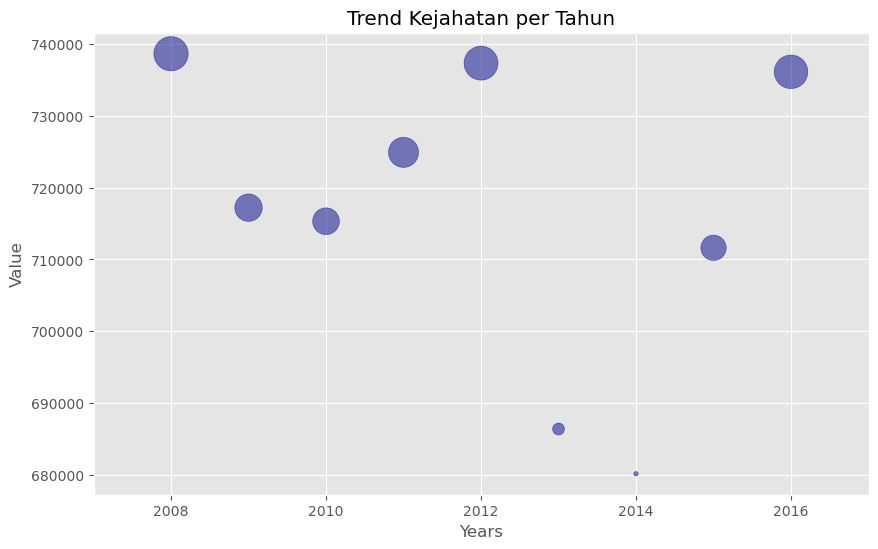
    


### Plot 7: Buble and Line Plot

Berikut adalah gabungan dari plot data buble dan line plot dengan fungsi ax.


```python
crime_by_year = lc.groupby(['year'])['value'].sum().reset_index()

# normalisasi data kriminal per tahun
norm_trend = (crime_by_year['value']-crime_by_year['value'].min()) / (crime_by_year['value'].max() - crime_by_year['value'].min())

ax0 = crime_by_year.plot(kind='scatter',
                    x ='year',
                    y ='value',
                    figsize=(10,6),
                    s=norm_trend * 600+10,
                    alpha=0.5,
                    color='darkblue',
                    xlim=(2007,2017))

ax1 = crime_by_year.plot(kind='line',
            x ='year',
            y ='value',
            alpha = 0.3, # 0-1, default value a= 0.5|
            color = 'darkblue',
            stacked=False,
            legend=False,
            figsize=(10,6),
            ax=ax0
            )

ax0.set_title('Trend Kejahatan per Tahun')
ax0.set_ylabel('Value')
ax0.set_xlabel('Years')

plt.show()
```


    
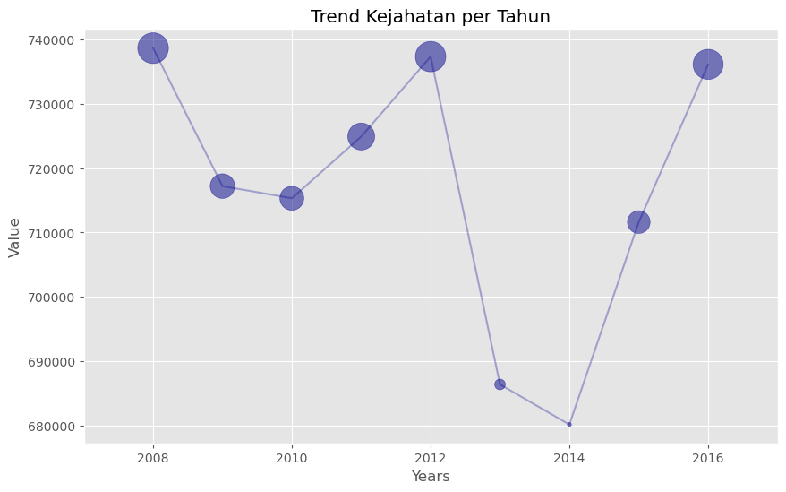
    


Dari hasil analisis dan visualisasi di atas dapat dilihat Trend Kejahatan yang paling tinggi berada di tahun 2008 dengan total kasus kejahatan sebesar 738641 kasus. Di tahun 2008 sampai dengan 2010 total kejahatan mengalami penurunan, kemudian di tahun 2010 sampai 2012 mengalami kenaikan kembali. Di tahun 2012 hingga 2014 mengalami penurunan secara signifikan dengan total kasus di tahun 2014 mencapai 680183 kasus. Pada tahun 2014 sampai 2016 total kejahatan mengalami kenaikan secara signifikan di mana tahun 2016 terdapat 736121 kasus. 

## Analisis 2: Total Kejahatan per Wilayah [2008 - 2016]

Untuk analisis data yang kedua ini hal yang perlu dilakukan adalah membuat tabel yang berisikan index='year', columns = 'borough', dan values='value'.


```python
# Menampilkan total kasus per wilayah
crime_borough = lc.pivot_table(index='year', columns = 'borough', values='value', aggfunc=np.sum, fill_value=0)
crime_borough
```


<div>
<style scoped>
    .dataframe tbody tr th:only-of-type {
        vertical-align: middle;
    }

    .dataframe tbody tr th {
        vertical-align: top;
    }

    .dataframe thead th {
        text-align: right;
    }
</style>
<table border="1" class="dataframe">
  <thead>
    <tr style="text-align: right;">
      <th>borough</th>
      <th>Barking and Dagenham</th>
      <th>Barnet</th>
      <th>Bexley</th>
      <th>Brent</th>
      <th>Bromley</th>
      <th>Camden</th>
      <th>City of London</th>
      <th>Croydon</th>
      <th>Ealing</th>
      <th>Enfield</th>
      <th>...</th>
      <th>Merton</th>
      <th>Newham</th>
      <th>Redbridge</th>
      <th>Richmond upon Thames</th>
      <th>Southwark</th>
      <th>Sutton</th>
      <th>Tower Hamlets</th>
      <th>Waltham Forest</th>
      <th>Wandsworth</th>
      <th>Westminster</th>
    </tr>
    <tr>
      <th>year</th>
      <th></th>
      <th></th>
      <th></th>
      <th></th>
      <th></th>
      <th></th>
      <th></th>
      <th></th>
      <th></th>
      <th></th>
      <th></th>
      <th></th>
      <th></th>
      <th></th>
      <th></th>
      <th></th>
      <th></th>
      <th></th>
      <th></th>
      <th></th>
      <th></th>
    </tr>
  </thead>
  <tbody>
    <tr>
      <th>2008</th>
      <td>17656</td>
      <td>23944</td>
      <td>15305</td>
      <td>23504</td>
      <td>24015</td>
      <td>32010</td>
      <td>0</td>
      <td>29516</td>
      <td>28947</td>
      <td>21980</td>
      <td>...</td>
      <td>13875</td>
      <td>29752</td>
      <td>20873</td>
      <td>11106</td>
      <td>33470</td>
      <td>12943</td>
      <td>23578</td>
      <td>24080</td>
      <td>23330</td>
      <td>47846</td>
    </tr>
    <tr>
      <th>2009</th>
      <td>17713</td>
      <td>23449</td>
      <td>14445</td>
      <td>24748</td>
      <td>21858</td>
      <td>31612</td>
      <td>0</td>
      <td>29784</td>
      <td>28617</td>
      <td>21147</td>
      <td>...</td>
      <td>13561</td>
      <td>28610</td>
      <td>20837</td>
      <td>10618</td>
      <td>30623</td>
      <td>12240</td>
      <td>21959</td>
      <td>24761</td>
      <td>23021</td>
      <td>48456</td>
    </tr>
    <tr>
      <th>2010</th>
      <td>17130</td>
      <td>23416</td>
      <td>13166</td>
      <td>25512</td>
      <td>19572</td>
      <td>31804</td>
      <td>0</td>
      <td>29373</td>
      <td>31360</td>
      <td>20808</td>
      <td>...</td>
      <td>13595</td>
      <td>30728</td>
      <td>20652</td>
      <td>10601</td>
      <td>31320</td>
      <td>12032</td>
      <td>23072</td>
      <td>24818</td>
      <td>22815</td>
      <td>48116</td>
    </tr>
    <tr>
      <th>2011</th>
      <td>16686</td>
      <td>24007</td>
      <td>11325</td>
      <td>27669</td>
      <td>19868</td>
      <td>33956</td>
      <td>69</td>
      <td>29830</td>
      <td>29537</td>
      <td>21041</td>
      <td>...</td>
      <td>13548</td>
      <td>27978</td>
      <td>21994</td>
      <td>10896</td>
      <td>30723</td>
      <td>11068</td>
      <td>24712</td>
      <td>23714</td>
      <td>21384</td>
      <td>54243</td>
    </tr>
    <tr>
      <th>2012</th>
      <td>15990</td>
      <td>23573</td>
      <td>11669</td>
      <td>26357</td>
      <td>19622</td>
      <td>31472</td>
      <td>157</td>
      <td>30189</td>
      <td>28832</td>
      <td>21069</td>
      <td>...</td>
      <td>12856</td>
      <td>30067</td>
      <td>21424</td>
      <td>11168</td>
      <td>30737</td>
      <td>10948</td>
      <td>26784</td>
      <td>22647</td>
      <td>24457</td>
      <td>59226</td>
    </tr>
    <tr>
      <th>2013</th>
      <td>15759</td>
      <td>22510</td>
      <td>11552</td>
      <td>23759</td>
      <td>18945</td>
      <td>28435</td>
      <td>110</td>
      <td>27444</td>
      <td>25917</td>
      <td>21574</td>
      <td>...</td>
      <td>11595</td>
      <td>27577</td>
      <td>19793</td>
      <td>10439</td>
      <td>31128</td>
      <td>10057</td>
      <td>26258</td>
      <td>21903</td>
      <td>22290</td>
      <td>53852</td>
    </tr>
    <tr>
      <th>2014</th>
      <td>15426</td>
      <td>22572</td>
      <td>11844</td>
      <td>24426</td>
      <td>19668</td>
      <td>27198</td>
      <td>115</td>
      <td>27357</td>
      <td>24978</td>
      <td>21700</td>
      <td>...</td>
      <td>11596</td>
      <td>28005</td>
      <td>19590</td>
      <td>10456</td>
      <td>28912</td>
      <td>10443</td>
      <td>25504</td>
      <td>20271</td>
      <td>21364</td>
      <td>47564</td>
    </tr>
    <tr>
      <th>2015</th>
      <td>16346</td>
      <td>24036</td>
      <td>11990</td>
      <td>24883</td>
      <td>20637</td>
      <td>29477</td>
      <td>151</td>
      <td>28089</td>
      <td>26247</td>
      <td>22076</td>
      <td>...</td>
      <td>12273</td>
      <td>29217</td>
      <td>18897</td>
      <td>10413</td>
      <td>30260</td>
      <td>10598</td>
      <td>27493</td>
      <td>20969</td>
      <td>22401</td>
      <td>47395</td>
    </tr>
    <tr>
      <th>2016</th>
      <td>16741</td>
      <td>24684</td>
      <td>12840</td>
      <td>26693</td>
      <td>20164</td>
      <td>29183</td>
      <td>178</td>
      <td>28712</td>
      <td>27127</td>
      <td>22485</td>
      <td>...</td>
      <td>12755</td>
      <td>30090</td>
      <td>19502</td>
      <td>11074</td>
      <td>31636</td>
      <td>10658</td>
      <td>29253</td>
      <td>20716</td>
      <td>23679</td>
      <td>48330</td>
    </tr>
  </tbody>
</table>
<p>9 rows × 33 columns</p>
</div>


Langkah selanjutnya adalah mentranspose 'borough' menjadi kolom


```python
# Mentranspose borough dari baris menjadi kolom
crime_borough =crime_borough.transpose()
crime_borough.head()
```


<div>
<style scoped>
    .dataframe tbody tr th:only-of-type {
        vertical-align: middle;
    }

    .dataframe tbody tr th {
        vertical-align: top;
    }

    .dataframe thead th {
        text-align: right;
    }
</style>
<table border="1" class="dataframe">
  <thead>
    <tr style="text-align: right;">
      <th>year</th>
      <th>2008</th>
      <th>2009</th>
      <th>2010</th>
      <th>2011</th>
      <th>2012</th>
      <th>2013</th>
      <th>2014</th>
      <th>2015</th>
      <th>2016</th>
    </tr>
    <tr>
      <th>borough</th>
      <th></th>
      <th></th>
      <th></th>
      <th></th>
      <th></th>
      <th></th>
      <th></th>
      <th></th>
      <th></th>
    </tr>
  </thead>
  <tbody>
    <tr>
      <th>Barking and Dagenham</th>
      <td>17656</td>
      <td>17713</td>
      <td>17130</td>
      <td>16686</td>
      <td>15990</td>
      <td>15759</td>
      <td>15426</td>
      <td>16346</td>
      <td>16741</td>
    </tr>
    <tr>
      <th>Barnet</th>
      <td>23944</td>
      <td>23449</td>
      <td>23416</td>
      <td>24007</td>
      <td>23573</td>
      <td>22510</td>
      <td>22572</td>
      <td>24036</td>
      <td>24684</td>
    </tr>
    <tr>
      <th>Bexley</th>
      <td>15305</td>
      <td>14445</td>
      <td>13166</td>
      <td>11325</td>
      <td>11669</td>
      <td>11552</td>
      <td>11844</td>
      <td>11990</td>
      <td>12840</td>
    </tr>
    <tr>
      <th>Brent</th>
      <td>23504</td>
      <td>24748</td>
      <td>25512</td>
      <td>27669</td>
      <td>26357</td>
      <td>23759</td>
      <td>24426</td>
      <td>24883</td>
      <td>26693</td>
    </tr>
    <tr>
      <th>Bromley</th>
      <td>24015</td>
      <td>21858</td>
      <td>19572</td>
      <td>19868</td>
      <td>19622</td>
      <td>18945</td>
      <td>19668</td>
      <td>20637</td>
      <td>20164</td>
    </tr>
  </tbody>
</table>
</div>


Menambah kolom baru untuk menjumlahkan kejahatan yang terjadi pada setiap wilayah tahun 2008-2016 dengan nama 'total'


```python
# Menambah kolom Total Kejahatan di borough
crime_borough['total'] = crime_borough.sum(axis=1, numeric_only=True)
crime_borough.head()
```


<div>
<style scoped>
    .dataframe tbody tr th:only-of-type {
        vertical-align: middle;
    }

    .dataframe tbody tr th {
        vertical-align: top;
    }

    .dataframe thead th {
        text-align: right;
    }
</style>
<table border="1" class="dataframe">
  <thead>
    <tr style="text-align: right;">
      <th>year</th>
      <th>2008</th>
      <th>2009</th>
      <th>2010</th>
      <th>2011</th>
      <th>2012</th>
      <th>2013</th>
      <th>2014</th>
      <th>2015</th>
      <th>2016</th>
      <th>total</th>
    </tr>
    <tr>
      <th>borough</th>
      <th></th>
      <th></th>
      <th></th>
      <th></th>
      <th></th>
      <th></th>
      <th></th>
      <th></th>
      <th></th>
      <th></th>
    </tr>
  </thead>
  <tbody>
    <tr>
      <th>Barking and Dagenham</th>
      <td>17656</td>
      <td>17713</td>
      <td>17130</td>
      <td>16686</td>
      <td>15990</td>
      <td>15759</td>
      <td>15426</td>
      <td>16346</td>
      <td>16741</td>
      <td>149447</td>
    </tr>
    <tr>
      <th>Barnet</th>
      <td>23944</td>
      <td>23449</td>
      <td>23416</td>
      <td>24007</td>
      <td>23573</td>
      <td>22510</td>
      <td>22572</td>
      <td>24036</td>
      <td>24684</td>
      <td>212191</td>
    </tr>
    <tr>
      <th>Bexley</th>
      <td>15305</td>
      <td>14445</td>
      <td>13166</td>
      <td>11325</td>
      <td>11669</td>
      <td>11552</td>
      <td>11844</td>
      <td>11990</td>
      <td>12840</td>
      <td>114136</td>
    </tr>
    <tr>
      <th>Brent</th>
      <td>23504</td>
      <td>24748</td>
      <td>25512</td>
      <td>27669</td>
      <td>26357</td>
      <td>23759</td>
      <td>24426</td>
      <td>24883</td>
      <td>26693</td>
      <td>227551</td>
    </tr>
    <tr>
      <th>Bromley</th>
      <td>24015</td>
      <td>21858</td>
      <td>19572</td>
      <td>19868</td>
      <td>19622</td>
      <td>18945</td>
      <td>19668</td>
      <td>20637</td>
      <td>20164</td>
      <td>184349</td>
    </tr>
  </tbody>
</table>
</div>


Jadikan kolom sebagai string


```python
# jadikan kolom sebagai string
crime_borough.columns 
crime_borough.columns = list(map(str, crime_borough.columns))
```

Konvers tahun sebagai string


```python
# Konversi tahun menjadi string
years = list(map(str, range(2008, 2017)))
years
```


    ['2008', '2009', '2010', '2011', '2012', '2013', '2014', '2015', '2016']


```python
crime_borough.columns
```


    Index(['2008', '2009', '2010', '2011', '2012', '2013', '2014', '2015', '2016',
           'total'],
          dtype='object')


### 5 Wilayah dengan Kasus Terbanyak

#### Area Plot

Langkah berikut adalah mengurutkan data dari yang terbesar hingga terkecil dan mengambil 5 wilayah dengan kasus kejahatan terbanyak.


```python
crime_borough.sort_values(by='total', ascending=False, axis=0, inplace=True)

top5_head = crime_borough.head()

top5_head = top5_head[years].transpose()

top5_head.index = top5_head.index.map(int)

top5_head
```


<div>
<style scoped>
    .dataframe tbody tr th:only-of-type {
        vertical-align: middle;
    }

    .dataframe tbody tr th {
        vertical-align: top;
    }

    .dataframe thead th {
        text-align: right;
    }
</style>
<table border="1" class="dataframe">
  <thead>
    <tr style="text-align: right;">
      <th>borough</th>
      <th>Westminster</th>
      <th>Lambeth</th>
      <th>Southwark</th>
      <th>Camden</th>
      <th>Newham</th>
    </tr>
  </thead>
  <tbody>
    <tr>
      <th>2008</th>
      <td>47846</td>
      <td>31717</td>
      <td>33470</td>
      <td>32010</td>
      <td>29752</td>
    </tr>
    <tr>
      <th>2009</th>
      <td>48456</td>
      <td>31225</td>
      <td>30623</td>
      <td>31612</td>
      <td>28610</td>
    </tr>
    <tr>
      <th>2010</th>
      <td>48116</td>
      <td>31671</td>
      <td>31320</td>
      <td>31804</td>
      <td>30728</td>
    </tr>
    <tr>
      <th>2011</th>
      <td>54243</td>
      <td>33224</td>
      <td>30723</td>
      <td>33956</td>
      <td>27978</td>
    </tr>
    <tr>
      <th>2012</th>
      <td>59226</td>
      <td>33473</td>
      <td>30737</td>
      <td>31472</td>
      <td>30067</td>
    </tr>
    <tr>
      <th>2013</th>
      <td>53852</td>
      <td>31868</td>
      <td>31128</td>
      <td>28435</td>
      <td>27577</td>
    </tr>
    <tr>
      <th>2014</th>
      <td>47564</td>
      <td>31765</td>
      <td>28912</td>
      <td>27198</td>
      <td>28005</td>
    </tr>
    <tr>
      <th>2015</th>
      <td>47395</td>
      <td>33164</td>
      <td>30260</td>
      <td>29477</td>
      <td>29217</td>
    </tr>
    <tr>
      <th>2016</th>
      <td>48330</td>
      <td>34071</td>
      <td>31636</td>
      <td>29183</td>
      <td>30090</td>
    </tr>
  </tbody>
</table>
</div>


#### Area Plot

Memvisualisasikan data menggunakan area plot dengan kind='area' dan  menambahkan list warna sesuai jumlah data yang akan diplotkan


```python
colors_list = [ 'seashell', 'peachpuff',  'lightgrey', 'moccasin', 'rosybrown']
top5_head.plot(kind='area',
                alpha=0.75,
                stacked=False,
                figsize=(20,10), 
                color=colors_list
                )

plt.title('5 Regions with High Number of Cases', fontsize=15)
plt.ylabel('Total Crimes', fontsize=15)
plt.xlabel('Years', fontsize=15)

plt.show()
```


    
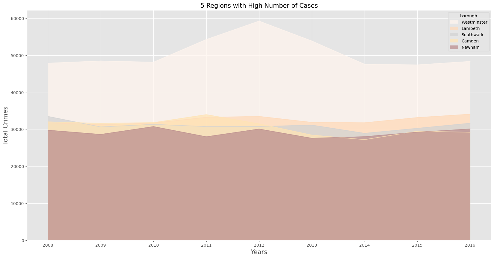
    


#### Line Plot

Memvisualisasikan data dengan Line Plot menggunakan kin='line'


```python
top5_head.plot(kind='line',
                alpha=0.75,
                stacked=False,
                figsize=(20,10)
                )

plt.title('5 Regions with High Number of Cases', fontsize=15)
plt.ylabel('Total Crimes', fontsize=15)
plt.xlabel('Years', fontsize=15)

plt.show()
```


    
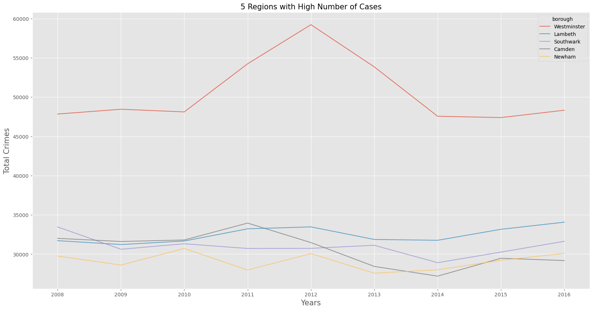
    


#### Scatter and Buble Plot


```python
crime_borough = crime_borough[years].transpose()
crime_borough.index = map(int, crime_borough.index)
crime_borough.index.name = 'year'
crime_borough.reset_index(inplace=True)
crime_borough.head()
```


<div>
<style scoped>
    .dataframe tbody tr th:only-of-type {
        vertical-align: middle;
    }

    .dataframe tbody tr th {
        vertical-align: top;
    }

    .dataframe thead th {
        text-align: right;
    }
</style>
<table border="1" class="dataframe">
  <thead>
    <tr style="text-align: right;">
      <th>borough</th>
      <th>year</th>
      <th>Barking and Dagenham</th>
      <th>Barnet</th>
      <th>Bexley</th>
      <th>Brent</th>
      <th>Bromley</th>
      <th>Camden</th>
      <th>City of London</th>
      <th>Croydon</th>
      <th>Ealing</th>
      <th>...</th>
      <th>Merton</th>
      <th>Newham</th>
      <th>Redbridge</th>
      <th>Richmond upon Thames</th>
      <th>Southwark</th>
      <th>Sutton</th>
      <th>Tower Hamlets</th>
      <th>Waltham Forest</th>
      <th>Wandsworth</th>
      <th>Westminster</th>
    </tr>
  </thead>
  <tbody>
    <tr>
      <th>0</th>
      <td>2008</td>
      <td>17656</td>
      <td>23944</td>
      <td>15305</td>
      <td>23504</td>
      <td>24015</td>
      <td>32010</td>
      <td>0</td>
      <td>29516</td>
      <td>28947</td>
      <td>...</td>
      <td>13875</td>
      <td>29752</td>
      <td>20873</td>
      <td>11106</td>
      <td>33470</td>
      <td>12943</td>
      <td>23578</td>
      <td>24080</td>
      <td>23330</td>
      <td>47846</td>
    </tr>
    <tr>
      <th>1</th>
      <td>2009</td>
      <td>17713</td>
      <td>23449</td>
      <td>14445</td>
      <td>24748</td>
      <td>21858</td>
      <td>31612</td>
      <td>0</td>
      <td>29784</td>
      <td>28617</td>
      <td>...</td>
      <td>13561</td>
      <td>28610</td>
      <td>20837</td>
      <td>10618</td>
      <td>30623</td>
      <td>12240</td>
      <td>21959</td>
      <td>24761</td>
      <td>23021</td>
      <td>48456</td>
    </tr>
    <tr>
      <th>2</th>
      <td>2010</td>
      <td>17130</td>
      <td>23416</td>
      <td>13166</td>
      <td>25512</td>
      <td>19572</td>
      <td>31804</td>
      <td>0</td>
      <td>29373</td>
      <td>31360</td>
      <td>...</td>
      <td>13595</td>
      <td>30728</td>
      <td>20652</td>
      <td>10601</td>
      <td>31320</td>
      <td>12032</td>
      <td>23072</td>
      <td>24818</td>
      <td>22815</td>
      <td>48116</td>
    </tr>
    <tr>
      <th>3</th>
      <td>2011</td>
      <td>16686</td>
      <td>24007</td>
      <td>11325</td>
      <td>27669</td>
      <td>19868</td>
      <td>33956</td>
      <td>69</td>
      <td>29830</td>
      <td>29537</td>
      <td>...</td>
      <td>13548</td>
      <td>27978</td>
      <td>21994</td>
      <td>10896</td>
      <td>30723</td>
      <td>11068</td>
      <td>24712</td>
      <td>23714</td>
      <td>21384</td>
      <td>54243</td>
    </tr>
    <tr>
      <th>4</th>
      <td>2012</td>
      <td>15990</td>
      <td>23573</td>
      <td>11669</td>
      <td>26357</td>
      <td>19622</td>
      <td>31472</td>
      <td>157</td>
      <td>30189</td>
      <td>28832</td>
      <td>...</td>
      <td>12856</td>
      <td>30067</td>
      <td>21424</td>
      <td>11168</td>
      <td>30737</td>
      <td>10948</td>
      <td>26784</td>
      <td>22647</td>
      <td>24457</td>
      <td>59226</td>
    </tr>
  </tbody>
</table>
<p>5 rows × 34 columns</p>
</div>


selanjutnya adalah memplotkan data dengan buble plot menggunakan kin='scatter' dimana sebelumnya membuat bobot yang dinormalisasi.


```python
# Westminster
ax0 = crime_borough.plot(kind='scatter',
                    x ='year',
                    y ='Westminster',
                    figsize=(10,6),
                    color = 'blue',
                    alpha=0.5,
                    xlim=(2007,2017))

# Lambeth
ax1 = crime_borough.plot(kind='scatter',
                    x ='year',
                    y ='Lambeth',
                    figsize=(10,6),
                    color ='green', 
                    alpha=0.5,
                    xlim=(2007,2017),
                    ax=ax0)
# Southwark
ax2 = crime_borough.plot(kind='scatter',
                    x ='year',
                    y ='Southwark',
                    figsize=(10,6),
                    color= 'red',
                    alpha=0.5,
                    xlim=(2007,2017),
                    ax=ax1)
# Camden
ax3 = crime_borough.plot(kind='scatter',
                    x ='year',
                    y ='Camden',
                    figsize=(10,6),
                    color='orange',
                    alpha=0.5,
                    xlim=(2007,2017),
                    ax=ax2)
# Newham
ax4 = crime_borough.plot(kind='scatter',
                    x ='year',
                    y ='Newham',
                    figsize=(10,6),
                    color= 'purple',
                    alpha=0.5,
                    xlim=(2007,2017),
                    ax=ax3)

ax0.set_title('5 Regions with High Number of Cases [2008-2016]')
ax0.set_ylabel('Value')
ax0.set_xlabel('Years')
ax0.legend(['Westminster', 'Lambeth', 'Southwark', 'Camden', 'Newham'], loc='upper left', fontsize='x-large', bbox_to_anchor=(1, 0.5))

plt.show()
```


    
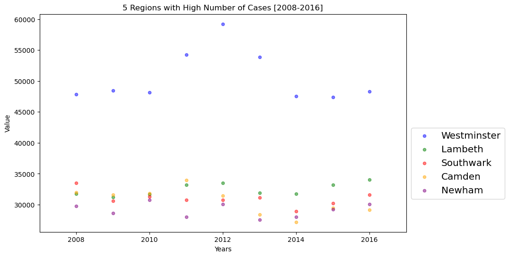
    


sebelum melakukan visualisi menggunakan buble plot, data crime_borough ditranspose terlebih dahulu, kemudian memasukan 'year' sebagai index, dan reset indeks untuk memasukan 'year' sebagai kolom.


```python
# normalisasi 5 wilayah tertinggi

norm_Westminster = (crime_borough['Westminster']-crime_borough['Westminster'].min()) / (crime_borough['Westminster'].max() -crime_borough['Westminster'].min())
norm_Lambeth = (crime_borough['Lambeth']-crime_borough['Lambeth'].min()) / (crime_borough['Lambeth'].max() -crime_borough['Lambeth'].min())
norm_Southwark = (crime_borough['Southwark']-crime_borough['Southwark'].min()) / (crime_borough['Southwark'].max() -crime_borough['Southwark'].min())
norm_Camden = (crime_borough['Camden']-crime_borough['Camden'].min()) / (crime_borough['Camden'].max() -crime_borough['Camden'].min())
norm_Newham = (crime_borough['Newham']-crime_borough['Newham'].min()) / (crime_borough['Newham'].max() -crime_borough['Newham'].min())

# Westminster
ax0 = crime_borough.plot(kind='scatter',
                    x ='year',
                    y ='Westminster',
                    figsize=(10,6),
                    color = 'blue',
                    s=norm_Westminster * 600+10,
                    alpha=0.5,
                    xlim=(2007,2017))

# Lambeth
ax1 = crime_borough.plot(kind='scatter',
                    x ='year',
                    y ='Lambeth',
                    figsize=(10,6),
                    color ='green', 
                    s=norm_Lambeth * 600+10,
                    alpha=0.5,
                    xlim=(2007,2017),
                    ax=ax0)
# Southwark
ax2 = crime_borough.plot(kind='scatter',
                    x ='year',
                    y ='Southwark',
                    figsize=(10,6),
                    color= 'red',
                    s=norm_Southwark * 600+10,
                    alpha=0.5,
                    xlim=(2007,2017),
                    ax=ax1)
# Camden
ax3 = crime_borough.plot(kind='scatter',
                    x ='year',
                    y ='Camden',
                    figsize=(10,6),
                    color='orange',
                    s=norm_Camden * 600+10,
                    alpha=0.5,
                    xlim=(2007,2017),
                    ax=ax2)
# Newham
ax4 = crime_borough.plot(kind='scatter',
                    x ='year',
                    y ='Newham',
                    figsize=(10,6),
                    color= 'purple',
                    s=norm_Newham * 600+10,
                    alpha=0.5,
                    xlim=(2007,2017),
                    ax=ax3)

ax0.set_title('5 Regions with High Number of Cases [2008-2016]')
ax0.set_ylabel('Value')
ax0.set_xlabel('Years')
ax0.legend(['Westminster', 'Lambeth', 'Southwark', 'Camden', 'Newham'], loc='upper left', fontsize='x-large', bbox_to_anchor=(1, 0.5))

plt.show()
```


    
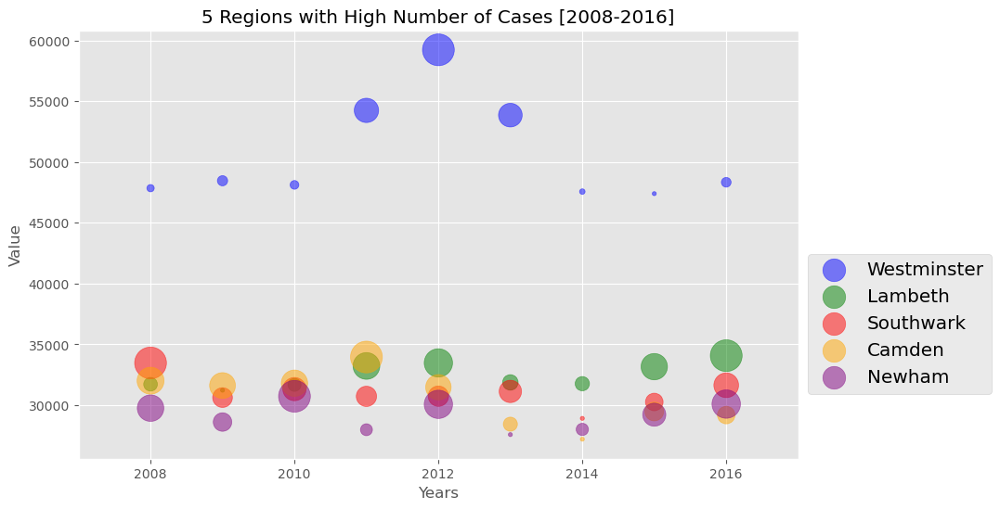
    


#### Histrogram

Sebelum melakukan plot histogram, menampilkan tabel yang berisi 5 wilayah dengan kasus kejahatan yang paling tinggi. Kemudiam gunakan metode Numpy's histogram untuk mendapatakn range bin dan jumlah frekuensi.


```python
crime_borough.loc[['Westminster', 'Lambeth', 'Southwark', 'Camden','Newham'], years]
```


<div>
<style scoped>
    .dataframe tbody tr th:only-of-type {
        vertical-align: middle;
    }

    .dataframe tbody tr th {
        vertical-align: top;
    }

    .dataframe thead th {
        text-align: right;
    }
</style>
<table border="1" class="dataframe">
  <thead>
    <tr style="text-align: right;">
      <th></th>
      <th>2008</th>
      <th>2009</th>
      <th>2010</th>
      <th>2011</th>
      <th>2012</th>
      <th>2013</th>
      <th>2014</th>
      <th>2015</th>
      <th>2016</th>
    </tr>
    <tr>
      <th>borough</th>
      <th></th>
      <th></th>
      <th></th>
      <th></th>
      <th></th>
      <th></th>
      <th></th>
      <th></th>
      <th></th>
    </tr>
  </thead>
  <tbody>
    <tr>
      <th>Westminster</th>
      <td>47846</td>
      <td>48456</td>
      <td>48116</td>
      <td>54243</td>
      <td>59226</td>
      <td>53852</td>
      <td>47564</td>
      <td>47395</td>
      <td>48330</td>
    </tr>
    <tr>
      <th>Lambeth</th>
      <td>31717</td>
      <td>31225</td>
      <td>31671</td>
      <td>33224</td>
      <td>33473</td>
      <td>31868</td>
      <td>31765</td>
      <td>33164</td>
      <td>34071</td>
    </tr>
    <tr>
      <th>Southwark</th>
      <td>33470</td>
      <td>30623</td>
      <td>31320</td>
      <td>30723</td>
      <td>30737</td>
      <td>31128</td>
      <td>28912</td>
      <td>30260</td>
      <td>31636</td>
    </tr>
    <tr>
      <th>Camden</th>
      <td>32010</td>
      <td>31612</td>
      <td>31804</td>
      <td>33956</td>
      <td>31472</td>
      <td>28435</td>
      <td>27198</td>
      <td>29477</td>
      <td>29183</td>
    </tr>
    <tr>
      <th>Newham</th>
      <td>29752</td>
      <td>28610</td>
      <td>30728</td>
      <td>27978</td>
      <td>30067</td>
      <td>27577</td>
      <td>28005</td>
      <td>29217</td>
      <td>30090</td>
    </tr>
  </tbody>
</table>
</div>


```python
crime_borough_t =crime_borough.loc[['Westminster', 'Lambeth', 'Southwark', 'Camden','Newham'], years].transpose()
crime_borough_t.head()
```


<div>
<style scoped>
    .dataframe tbody tr th:only-of-type {
        vertical-align: middle;
    }

    .dataframe tbody tr th {
        vertical-align: top;
    }

    .dataframe thead th {
        text-align: right;
    }
</style>
<table border="1" class="dataframe">
  <thead>
    <tr style="text-align: right;">
      <th>borough</th>
      <th>Westminster</th>
      <th>Lambeth</th>
      <th>Southwark</th>
      <th>Camden</th>
      <th>Newham</th>
    </tr>
  </thead>
  <tbody>
    <tr>
      <th>2008</th>
      <td>47846</td>
      <td>31717</td>
      <td>33470</td>
      <td>32010</td>
      <td>29752</td>
    </tr>
    <tr>
      <th>2009</th>
      <td>48456</td>
      <td>31225</td>
      <td>30623</td>
      <td>31612</td>
      <td>28610</td>
    </tr>
    <tr>
      <th>2010</th>
      <td>48116</td>
      <td>31671</td>
      <td>31320</td>
      <td>31804</td>
      <td>30728</td>
    </tr>
    <tr>
      <th>2011</th>
      <td>54243</td>
      <td>33224</td>
      <td>30723</td>
      <td>33956</td>
      <td>27978</td>
    </tr>
    <tr>
      <th>2012</th>
      <td>59226</td>
      <td>33473</td>
      <td>30737</td>
      <td>31472</td>
      <td>30067</td>
    </tr>
  </tbody>
</table>
</div>


```python
count, bin_edges= np.histogram(crime_borough_t, 15)
print(count)
print(bin_edges)
```

    [ 9 12 13  2  0  0  0  0  0  6  0  0  2  0  1]
    [27198.  29333.2 31468.4 33603.6 35738.8 37874.  40009.2 42144.4 44279.6
     46414.8 48550.  50685.2 52820.4 54955.6 57090.8 59226. ]
    

Setelah itu adalah visulasi dengan Histogram menggunakan kin='hist'


```python
count, bin_edges= np.histogram(crime_borough_t, 15)
xmin = bin_edges[0] - 10
xmax = bin_edges[-1] + 10
```


```python
import matplotlib.pyplot as plt
import numpy as np


crime_borough_t.plot(kind='hist',
          figsize=(10,6),
          bins=15,
          xticks=bin_edges,
          stacked=True,
          color=['seashell', 'peachpuff',  'lightgrey', 'moccasin', 'rosybrown'],
          xlim=(xmin,xmax)
        )

plt.title('5 Regions with High Number of Cases')
plt.ylabel('Numbers of Years')
plt.xlabel('Numbers of Crime')

plt.show()
```


    
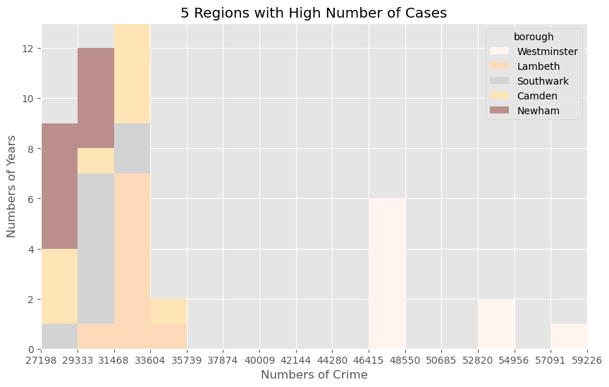
    


Dari hasil analisi dan visualisasi di atas dapat diketahui 5 wilayah dengan kasus terbanyak yaitu Westminster, Lambeth,	Southwark, Camden, dan Newham tahun 2008-2016. Wilayah Westminster sebagai wilayah dengan jumlah kasus kejahtan terbanyak dengan puncak kasus terdapat pada tahun 2012.

### 5 Wilayah dengan Kasus Terendah

Untuk analisis berikut seperti pada analisis di atas


```python
crime_borough.sort_values(by='total', ascending=False, axis=0, inplace=True)

top5_tail = crime_borough.tail()

top5_tail = top5_tail[years].transpose()

top5_tail.index = top5_tail.index.map(int)

top5_tail
```


<div>
<style scoped>
    .dataframe tbody tr th:only-of-type {
        vertical-align: middle;
    }

    .dataframe tbody tr th {
        vertical-align: top;
    }

    .dataframe thead th {
        text-align: right;
    }
</style>
<table border="1" class="dataframe">
  <thead>
    <tr style="text-align: right;">
      <th>borough</th>
      <th>Bexley</th>
      <th>Sutton</th>
      <th>Richmond upon Thames</th>
      <th>Kingston upon Thames</th>
      <th>City of London</th>
    </tr>
  </thead>
  <tbody>
    <tr>
      <th>2008</th>
      <td>15305</td>
      <td>12943</td>
      <td>11106</td>
      <td>10661</td>
      <td>0</td>
    </tr>
    <tr>
      <th>2009</th>
      <td>14445</td>
      <td>12240</td>
      <td>10618</td>
      <td>10163</td>
      <td>0</td>
    </tr>
    <tr>
      <th>2010</th>
      <td>13166</td>
      <td>12032</td>
      <td>10601</td>
      <td>10171</td>
      <td>0</td>
    </tr>
    <tr>
      <th>2011</th>
      <td>11325</td>
      <td>11068</td>
      <td>10896</td>
      <td>10155</td>
      <td>69</td>
    </tr>
    <tr>
      <th>2012</th>
      <td>11669</td>
      <td>10948</td>
      <td>11168</td>
      <td>9956</td>
      <td>157</td>
    </tr>
    <tr>
      <th>2013</th>
      <td>11552</td>
      <td>10057</td>
      <td>10439</td>
      <td>9191</td>
      <td>110</td>
    </tr>
    <tr>
      <th>2014</th>
      <td>11844</td>
      <td>10443</td>
      <td>10456</td>
      <td>9288</td>
      <td>115</td>
    </tr>
    <tr>
      <th>2015</th>
      <td>11990</td>
      <td>10598</td>
      <td>10413</td>
      <td>9738</td>
      <td>151</td>
    </tr>
    <tr>
      <th>2016</th>
      <td>12840</td>
      <td>10658</td>
      <td>11074</td>
      <td>9983</td>
      <td>178</td>
    </tr>
  </tbody>
</table>
</div>


#### Area Plot


```python
colors_list = [ 'seashell', 'peachpuff',  'lightgrey', 'moccasin', 'rosybrown']
top5_tail.plot(kind='area',
                alpha=0.75,
                stacked=False,
                figsize=(20,10), 
                color=colors_list
                )

plt.title('5 Regions with Low Number of Cases [2008-2016]', fontsize=15)
plt.ylabel('Total Crimes', fontsize=15)
plt.xlabel('Years', fontsize=15)

plt.show()
```


    
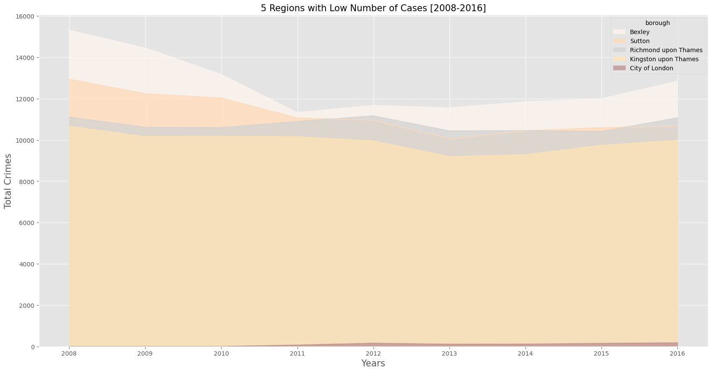
    


#### Buble Plot


```python
# normalisasi 5 wilayah terendah

norm_Bexley	 = (crime_borough['Bexley']-crime_borough['Bexley'].min()) / (crime_borough['Bexley'].max() -crime_borough['Bexley'].min())
norm_Sutton = (crime_borough['Sutton']-crime_borough['Sutton'].min()) / (crime_borough['Sutton'].max() -crime_borough['Sutton'].min())
norm_Richmond_upon_Thames = (crime_borough['Richmond upon Thames']-crime_borough['Richmond upon Thames'].min()) / (crime_borough['Richmond upon Thames'].max() -crime_borough['Richmond upon Thames'].min())
norm_Kingston_upon_Thames = (crime_borough['Kingston upon Thames']-crime_borough['Kingston upon Thames'].min()) / (crime_borough['Kingston upon Thames'].max() -crime_borough['Kingston upon Thames'].min())
norm_City_of_London = (crime_borough['City of London']-crime_borough['City of London'].min()) / (crime_borough['City of London'].max() -crime_borough['City of London'].min())

# Bexley
ax0 = crime_borough.plot(kind='scatter',
                    x ='year',
                    y ='Bexley',
                    figsize=(10,6),
                    color = 'blue',
                    s=norm_Bexley * 600+10,
                    alpha=0.5,
                    xlim=(2007,2017))

# Sutton
ax1 = crime_borough.plot(kind='scatter',
                    x ='year',
                    y ='Sutton',
                    figsize=(10,6),
                    color ='green', 
                    s=norm_Sutton * 600+10,
                    alpha=0.5,
                    xlim=(2007,2017),
                    ax=ax0)
# Richmond upon Thames
ax2 = crime_borough.plot(kind='scatter',
                    x ='year',
                    y ='Richmond upon Thames',
                    figsize=(10,6),
                    color= 'red',
                    s=norm_Richmond_upon_Thames * 600+10,
                    alpha=0.5,
                    xlim=(2007,2017),
                    ax=ax1)
# Kingston upon Thames
ax3 = crime_borough.plot(kind='scatter',
                    x ='year',
                    y ='Kingston upon Thames',
                    figsize=(10,6),
                    color='orange',
                    s=norm_Kingston_upon_Thames * 600+10,
                    alpha=0.5,
                    xlim=(2007,2017),
                    ax=ax2)
# City of London
ax4 = crime_borough.plot(kind='scatter',
                    x ='year',
                    y ='City of London',
                    figsize=(10,6),
                    color= 'purple',
                    s=norm_City_of_London * 600+10,
                    alpha=0.5,
                    xlim=(2007,2017),
                    ax=ax3)

ax0.set_title('5 Regions with L Number of Cases [2008-2016]')
ax0.set_ylabel('Value')
ax0.set_xlabel('Years')
ax0.legend(['Bexley',	'Sutton',	'Richmond upon Thames',	'Kingston upon Thames',	'City of London'], loc='upper left', fontsize='x-large', bbox_to_anchor=(1, 0.5))

plt.show()
```


    
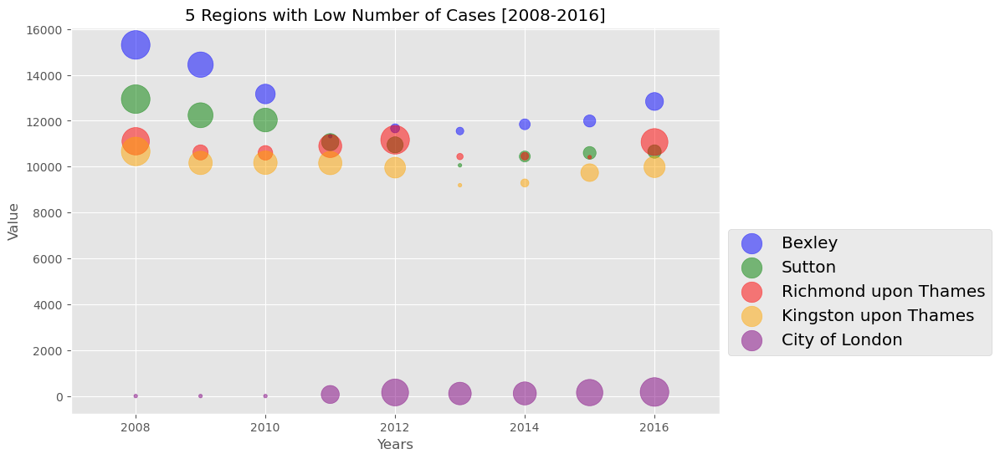
    


Dari analisis visualisasi diatas diketahui 5 wilayah yang memiliki kasus kejahatan terendah yaitu Bexley, Sutton, Richmond upon Thames, Kingston upon Thames dan , City of London. Dimana wilayah City of London memilliki kasus kejahatan yang paling rendah dari wilayah yang lain dengan perbedaan yang sangat besar. Pada tahun 2008-2010 di wilayah wilayah tersebut tidak terdapat kasus kejahatan.

## Analisis 3: Kejahatan Kategori Besar Terjadi [2008 - 2016]

Melihat kategori kejatahatan besar


```python
lc['major_category'].value_counts()
```


    Theft and Handling             3966300
    Violence Against the Person    3171744
    Criminal Damage                2069172
    Drugs                          1179468
    Burglary                       1043604
    Robbery                         939384
    Other Notifiable Offences       776304
    Fraud or Forgery                236520
    Sexual Offences                 108108
    Name: major_category, dtype: int64


Untuk analisis data yang ketiga membuat tabel kejahatan besar yang berisikan index='year', columns = 'major_category', dan values='value'.


```python
mc = lc.pivot_table(index='year', columns='major_category', values='value', aggfunc=np.sum, fill_value=0)
mc
```


<div>
<style scoped>
    .dataframe tbody tr th:only-of-type {
        vertical-align: middle;
    }

    .dataframe tbody tr th {
        vertical-align: top;
    }

    .dataframe thead th {
        text-align: right;
    }
</style>
<table border="1" class="dataframe">
  <thead>
    <tr style="text-align: right;">
      <th>major_category</th>
      <th>Burglary</th>
      <th>Criminal Damage</th>
      <th>Drugs</th>
      <th>Fraud or Forgery</th>
      <th>Other Notifiable Offences</th>
      <th>Robbery</th>
      <th>Sexual Offences</th>
      <th>Theft and Handling</th>
      <th>Violence Against the Person</th>
    </tr>
    <tr>
      <th>year</th>
      <th></th>
      <th></th>
      <th></th>
      <th></th>
      <th></th>
      <th></th>
      <th></th>
      <th></th>
      <th></th>
    </tr>
  </thead>
  <tbody>
    <tr>
      <th>2008</th>
      <td>88092</td>
      <td>91872</td>
      <td>68804</td>
      <td>5325</td>
      <td>10112</td>
      <td>29627</td>
      <td>1273</td>
      <td>283692</td>
      <td>159844</td>
    </tr>
    <tr>
      <th>2009</th>
      <td>90619</td>
      <td>85565</td>
      <td>60549</td>
      <td>0</td>
      <td>10644</td>
      <td>29568</td>
      <td>0</td>
      <td>279492</td>
      <td>160777</td>
    </tr>
    <tr>
      <th>2010</th>
      <td>86826</td>
      <td>77897</td>
      <td>58674</td>
      <td>0</td>
      <td>10768</td>
      <td>32341</td>
      <td>0</td>
      <td>290924</td>
      <td>157894</td>
    </tr>
    <tr>
      <th>2011</th>
      <td>93315</td>
      <td>70914</td>
      <td>57550</td>
      <td>0</td>
      <td>10264</td>
      <td>36679</td>
      <td>0</td>
      <td>309292</td>
      <td>146901</td>
    </tr>
    <tr>
      <th>2012</th>
      <td>93392</td>
      <td>62158</td>
      <td>51776</td>
      <td>0</td>
      <td>10675</td>
      <td>35260</td>
      <td>0</td>
      <td>334054</td>
      <td>150014</td>
    </tr>
    <tr>
      <th>2013</th>
      <td>87222</td>
      <td>56206</td>
      <td>50278</td>
      <td>0</td>
      <td>10811</td>
      <td>29337</td>
      <td>0</td>
      <td>306372</td>
      <td>146181</td>
    </tr>
    <tr>
      <th>2014</th>
      <td>76053</td>
      <td>59279</td>
      <td>44435</td>
      <td>0</td>
      <td>13037</td>
      <td>22150</td>
      <td>0</td>
      <td>279880</td>
      <td>185349</td>
    </tr>
    <tr>
      <th>2015</th>
      <td>70489</td>
      <td>62976</td>
      <td>39785</td>
      <td>0</td>
      <td>14229</td>
      <td>21383</td>
      <td>0</td>
      <td>284022</td>
      <td>218740</td>
    </tr>
    <tr>
      <th>2016</th>
      <td>68285</td>
      <td>64071</td>
      <td>38914</td>
      <td>0</td>
      <td>15809</td>
      <td>22528</td>
      <td>0</td>
      <td>294133</td>
      <td>232381</td>
    </tr>
  </tbody>
</table>
</div>


Melakukan transpose pada mc untuk merubah baris menjadi kolom


```python
mc = mc.transpose()
mc
```


<div>
<style scoped>
    .dataframe tbody tr th:only-of-type {
        vertical-align: middle;
    }

    .dataframe tbody tr th {
        vertical-align: top;
    }

    .dataframe thead th {
        text-align: right;
    }
</style>
<table border="1" class="dataframe">
  <thead>
    <tr style="text-align: right;">
      <th>year</th>
      <th>2008</th>
      <th>2009</th>
      <th>2010</th>
      <th>2011</th>
      <th>2012</th>
      <th>2013</th>
      <th>2014</th>
      <th>2015</th>
      <th>2016</th>
    </tr>
    <tr>
      <th>major_category</th>
      <th></th>
      <th></th>
      <th></th>
      <th></th>
      <th></th>
      <th></th>
      <th></th>
      <th></th>
      <th></th>
    </tr>
  </thead>
  <tbody>
    <tr>
      <th>Burglary</th>
      <td>88092</td>
      <td>90619</td>
      <td>86826</td>
      <td>93315</td>
      <td>93392</td>
      <td>87222</td>
      <td>76053</td>
      <td>70489</td>
      <td>68285</td>
    </tr>
    <tr>
      <th>Criminal Damage</th>
      <td>91872</td>
      <td>85565</td>
      <td>77897</td>
      <td>70914</td>
      <td>62158</td>
      <td>56206</td>
      <td>59279</td>
      <td>62976</td>
      <td>64071</td>
    </tr>
    <tr>
      <th>Drugs</th>
      <td>68804</td>
      <td>60549</td>
      <td>58674</td>
      <td>57550</td>
      <td>51776</td>
      <td>50278</td>
      <td>44435</td>
      <td>39785</td>
      <td>38914</td>
    </tr>
    <tr>
      <th>Fraud or Forgery</th>
      <td>5325</td>
      <td>0</td>
      <td>0</td>
      <td>0</td>
      <td>0</td>
      <td>0</td>
      <td>0</td>
      <td>0</td>
      <td>0</td>
    </tr>
    <tr>
      <th>Other Notifiable Offences</th>
      <td>10112</td>
      <td>10644</td>
      <td>10768</td>
      <td>10264</td>
      <td>10675</td>
      <td>10811</td>
      <td>13037</td>
      <td>14229</td>
      <td>15809</td>
    </tr>
    <tr>
      <th>Robbery</th>
      <td>29627</td>
      <td>29568</td>
      <td>32341</td>
      <td>36679</td>
      <td>35260</td>
      <td>29337</td>
      <td>22150</td>
      <td>21383</td>
      <td>22528</td>
    </tr>
    <tr>
      <th>Sexual Offences</th>
      <td>1273</td>
      <td>0</td>
      <td>0</td>
      <td>0</td>
      <td>0</td>
      <td>0</td>
      <td>0</td>
      <td>0</td>
      <td>0</td>
    </tr>
    <tr>
      <th>Theft and Handling</th>
      <td>283692</td>
      <td>279492</td>
      <td>290924</td>
      <td>309292</td>
      <td>334054</td>
      <td>306372</td>
      <td>279880</td>
      <td>284022</td>
      <td>294133</td>
    </tr>
    <tr>
      <th>Violence Against the Person</th>
      <td>159844</td>
      <td>160777</td>
      <td>157894</td>
      <td>146901</td>
      <td>150014</td>
      <td>146181</td>
      <td>185349</td>
      <td>218740</td>
      <td>232381</td>
    </tr>
  </tbody>
</table>
</div>


```python
mc.columns
```


    Int64Index([2008, 2009, 2010, 2011, 2012, 2013, 2014, 2015, 2016], dtype='int64', name='year')


Menambahkan colom Total Crime yang menjumlahkan total kasus kejahatan pada setiap wilayah


```python
mc['total crime'] = mc.sum(axis=1, numeric_only=True)
mc
```


<div>
<style scoped>
    .dataframe tbody tr th:only-of-type {
        vertical-align: middle;
    }

    .dataframe tbody tr th {
        vertical-align: top;
    }

    .dataframe thead th {
        text-align: right;
    }
</style>
<table border="1" class="dataframe">
  <thead>
    <tr style="text-align: right;">
      <th>year</th>
      <th>2008</th>
      <th>2009</th>
      <th>2010</th>
      <th>2011</th>
      <th>2012</th>
      <th>2013</th>
      <th>2014</th>
      <th>2015</th>
      <th>2016</th>
      <th>total crime</th>
    </tr>
    <tr>
      <th>major_category</th>
      <th></th>
      <th></th>
      <th></th>
      <th></th>
      <th></th>
      <th></th>
      <th></th>
      <th></th>
      <th></th>
      <th></th>
    </tr>
  </thead>
  <tbody>
    <tr>
      <th>Burglary</th>
      <td>88092</td>
      <td>90619</td>
      <td>86826</td>
      <td>93315</td>
      <td>93392</td>
      <td>87222</td>
      <td>76053</td>
      <td>70489</td>
      <td>68285</td>
      <td>754293</td>
    </tr>
    <tr>
      <th>Criminal Damage</th>
      <td>91872</td>
      <td>85565</td>
      <td>77897</td>
      <td>70914</td>
      <td>62158</td>
      <td>56206</td>
      <td>59279</td>
      <td>62976</td>
      <td>64071</td>
      <td>630938</td>
    </tr>
    <tr>
      <th>Drugs</th>
      <td>68804</td>
      <td>60549</td>
      <td>58674</td>
      <td>57550</td>
      <td>51776</td>
      <td>50278</td>
      <td>44435</td>
      <td>39785</td>
      <td>38914</td>
      <td>470765</td>
    </tr>
    <tr>
      <th>Fraud or Forgery</th>
      <td>5325</td>
      <td>0</td>
      <td>0</td>
      <td>0</td>
      <td>0</td>
      <td>0</td>
      <td>0</td>
      <td>0</td>
      <td>0</td>
      <td>5325</td>
    </tr>
    <tr>
      <th>Other Notifiable Offences</th>
      <td>10112</td>
      <td>10644</td>
      <td>10768</td>
      <td>10264</td>
      <td>10675</td>
      <td>10811</td>
      <td>13037</td>
      <td>14229</td>
      <td>15809</td>
      <td>106349</td>
    </tr>
    <tr>
      <th>Robbery</th>
      <td>29627</td>
      <td>29568</td>
      <td>32341</td>
      <td>36679</td>
      <td>35260</td>
      <td>29337</td>
      <td>22150</td>
      <td>21383</td>
      <td>22528</td>
      <td>258873</td>
    </tr>
    <tr>
      <th>Sexual Offences</th>
      <td>1273</td>
      <td>0</td>
      <td>0</td>
      <td>0</td>
      <td>0</td>
      <td>0</td>
      <td>0</td>
      <td>0</td>
      <td>0</td>
      <td>1273</td>
    </tr>
    <tr>
      <th>Theft and Handling</th>
      <td>283692</td>
      <td>279492</td>
      <td>290924</td>
      <td>309292</td>
      <td>334054</td>
      <td>306372</td>
      <td>279880</td>
      <td>284022</td>
      <td>294133</td>
      <td>2661861</td>
    </tr>
    <tr>
      <th>Violence Against the Person</th>
      <td>159844</td>
      <td>160777</td>
      <td>157894</td>
      <td>146901</td>
      <td>150014</td>
      <td>146181</td>
      <td>185349</td>
      <td>218740</td>
      <td>232381</td>
      <td>1558081</td>
    </tr>
  </tbody>
</table>
</div>


Merubah nama kolom menjadi string


```python
mc.columns = list(map(str, mc.columns))
mc.columns
```


    Index(['2008', '2009', '2010', '2011', '2012', '2013', '2014', '2015', '2016',
           'total crime'],
          dtype='object')


Dengan diubahnya atau dikonversinya tahun menjadi string, maka di deklarasikan variabel tahun


```python
years = list(map(str, range(2008, 2017)))
years
```


    ['2008', '2009', '2010', '2011', '2012', '2013', '2014', '2015', '2016']


### Box Plot

Membuat variabel 'mc_t' dan mengambil data yang diperlukan


```python
mc_t = mc.loc[['Burglary', 'Criminal Damage', 'Drugs',	'Fraud or Forgery',	'Other Notifiable Offences', 'Robbery',	'Sexual Offences',	'Theft and Handling', 'Violence Against the Person'], years]
```


```python
mc_t
```


<div>
<style scoped>
    .dataframe tbody tr th:only-of-type {
        vertical-align: middle;
    }

    .dataframe tbody tr th {
        vertical-align: top;
    }

    .dataframe thead th {
        text-align: right;
    }
</style>
<table border="1" class="dataframe">
  <thead>
    <tr style="text-align: right;">
      <th></th>
      <th>2008</th>
      <th>2009</th>
      <th>2010</th>
      <th>2011</th>
      <th>2012</th>
      <th>2013</th>
      <th>2014</th>
      <th>2015</th>
      <th>2016</th>
    </tr>
    <tr>
      <th>major_category</th>
      <th></th>
      <th></th>
      <th></th>
      <th></th>
      <th></th>
      <th></th>
      <th></th>
      <th></th>
      <th></th>
    </tr>
  </thead>
  <tbody>
    <tr>
      <th>Burglary</th>
      <td>88092</td>
      <td>90619</td>
      <td>86826</td>
      <td>93315</td>
      <td>93392</td>
      <td>87222</td>
      <td>76053</td>
      <td>70489</td>
      <td>68285</td>
    </tr>
    <tr>
      <th>Criminal Damage</th>
      <td>91872</td>
      <td>85565</td>
      <td>77897</td>
      <td>70914</td>
      <td>62158</td>
      <td>56206</td>
      <td>59279</td>
      <td>62976</td>
      <td>64071</td>
    </tr>
    <tr>
      <th>Drugs</th>
      <td>68804</td>
      <td>60549</td>
      <td>58674</td>
      <td>57550</td>
      <td>51776</td>
      <td>50278</td>
      <td>44435</td>
      <td>39785</td>
      <td>38914</td>
    </tr>
    <tr>
      <th>Fraud or Forgery</th>
      <td>5325</td>
      <td>0</td>
      <td>0</td>
      <td>0</td>
      <td>0</td>
      <td>0</td>
      <td>0</td>
      <td>0</td>
      <td>0</td>
    </tr>
    <tr>
      <th>Other Notifiable Offences</th>
      <td>10112</td>
      <td>10644</td>
      <td>10768</td>
      <td>10264</td>
      <td>10675</td>
      <td>10811</td>
      <td>13037</td>
      <td>14229</td>
      <td>15809</td>
    </tr>
    <tr>
      <th>Robbery</th>
      <td>29627</td>
      <td>29568</td>
      <td>32341</td>
      <td>36679</td>
      <td>35260</td>
      <td>29337</td>
      <td>22150</td>
      <td>21383</td>
      <td>22528</td>
    </tr>
    <tr>
      <th>Sexual Offences</th>
      <td>1273</td>
      <td>0</td>
      <td>0</td>
      <td>0</td>
      <td>0</td>
      <td>0</td>
      <td>0</td>
      <td>0</td>
      <td>0</td>
    </tr>
    <tr>
      <th>Theft and Handling</th>
      <td>283692</td>
      <td>279492</td>
      <td>290924</td>
      <td>309292</td>
      <td>334054</td>
      <td>306372</td>
      <td>279880</td>
      <td>284022</td>
      <td>294133</td>
    </tr>
    <tr>
      <th>Violence Against the Person</th>
      <td>159844</td>
      <td>160777</td>
      <td>157894</td>
      <td>146901</td>
      <td>150014</td>
      <td>146181</td>
      <td>185349</td>
      <td>218740</td>
      <td>232381</td>
    </tr>
  </tbody>
</table>
</div>


Melakukan transpose pada mc_t untuk merubah baris menjadi kolom.


```python
mc_t = mc_t.transpose()
```

Membuat plot atau visualisasi dengan jenis box


```python
mc_t.plot(kind='box', figsize=(10, 6), grid=True, color='darkseagreen', vert=False)

plt.title('Major Category Crimes [2008-2016]')
plt.xlabel('Total Crime')

plt.show()
```


    
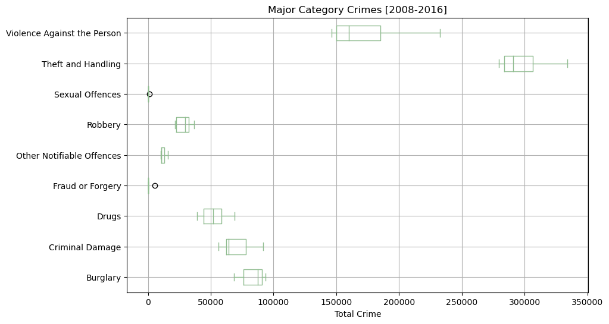
    


Dari hasil analisis dan visulisasi di atas diketahui kejahatan yang paling tinggi terjadi adalah Theft and Handling dengan total kasus tahun 2008-2016 sebesar  3966300 kasus, sedangkan kategori kejahatan yang paling rendah adalah Sexual Offences dengan total kasus tahun 2008-2016 sebesar 108108 kasus.

### Pie Chart

Membuat plot data menggunakan pie chart


```python
colors_list = ['antiquewhite', 'aliceblue', 'cadetblue', 'darkkhaki', 'khaki', 'darkseagreen', 'beige', 'moccasin', 'rosybrown']
explode_list = [0.1, 0.1, 0.1, 0.1, 0.1, 0.1, 0.1, 0.3, 0.1] 

fig, ax = plt.subplots(figsize = (12,6))

mc['total crime'].plot(kind='pie',
                            figsize=(16, 6),
                            autopct=lambda p:f'{p:.1f}% ({int(p*sum(crime_by_year["value"])/100)})',  
                            startangle=90,       
                            shadow= True,        
                            labels= None,         
                            pctdistance= 1.5,   
                            explode= explode_list,
                            colors=colors_list,
                            ax=ax
                           )
    
plt.title('Major Category Crimes [2008-2016]', y=1.12)
plt.axis('equal')

# add legend
plt.legend(labels=mc.index, loc='upper left')

plt.show()
```


    

    


Dari hasil analisis dan visulisasi di atas diketahui kejahatan yang paling tinggi terjadi adalah Theft and Handling dengan total kasus tahun 2008-2016 sebesar  3966300 (41.3%) kasus, sedangkan kategori kejahatan yang paling rendah adalah Sexual Offences dengan total kasus tahun 2008-2016 sebesar 108108 kasus.

## Analisis 4: Kejahatan Kategori Kecil [2008-2016]

Mengecek kategory kejahatan


```python
# Mengecek kategory kejahatan
lc['minor_category'].value_counts()
```


    Common Assault                            522180
    Theft From Motor Vehicle                  522180
    Other Theft                               522180
    Burglary in Other Buildings               522072
    Theft/Taking Of Motor Vehicle             522072
    Harassment                                522072
    Criminal Damage To Motor Vehicle          521964
    Assault with Injury                       521856
    Other Criminal Damage                     521856
    Possession Of Drugs                       521748
    Burglary in a Dwelling                    521532
    Criminal Damage To Dwelling               521424
    Personal Property                         520668
    Motor Vehicle Interference & Tampering    520452
    Other Notifiable                          519696
    Other Theft Person                        519480
    Wounding/GBH                              519372
    Theft/Taking of Pedal Cycle               516996
    Other violence                            512028
    Criminal Damage To Other Building         503928
    Drug Trafficking                          490536
    Offensive Weapon                          481896
    Handling Stolen Goods                     426168
    Business Property                         418716
    Theft From Shops                          416772
    Going Equipped                            256608
    Other Drugs                               167184
    Counted per Victim                        137916
    Other Fraud & Forgery                      98604
    Murder                                     92340
    Other Sexual                               81108
    Rape                                       27000
    Name: minor_category, dtype: int64


Untuk analisis data yang ketiga membuat tabel kejahatan kecil yang berisikan index='year', columns = 'minor_category', dan values='value'.


```python
min_c = lc.pivot_table(index='year', columns='minor_category', values='value', aggfunc=np.sum, fill_value=0)
min_c
```


<div>
<style scoped>
    .dataframe tbody tr th:only-of-type {
        vertical-align: middle;
    }

    .dataframe tbody tr th {
        vertical-align: top;
    }

    .dataframe thead th {
        text-align: right;
    }
</style>
<table border="1" class="dataframe">
  <thead>
    <tr style="text-align: right;">
      <th>minor_category</th>
      <th>Assault with Injury</th>
      <th>Burglary in Other Buildings</th>
      <th>Burglary in a Dwelling</th>
      <th>Business Property</th>
      <th>Common Assault</th>
      <th>Counted per Victim</th>
      <th>Criminal Damage To Dwelling</th>
      <th>Criminal Damage To Motor Vehicle</th>
      <th>Criminal Damage To Other Building</th>
      <th>Drug Trafficking</th>
      <th>...</th>
      <th>Other Theft Person</th>
      <th>Other violence</th>
      <th>Personal Property</th>
      <th>Possession Of Drugs</th>
      <th>Rape</th>
      <th>Theft From Motor Vehicle</th>
      <th>Theft From Shops</th>
      <th>Theft/Taking Of Motor Vehicle</th>
      <th>Theft/Taking of Pedal Cycle</th>
      <th>Wounding/GBH</th>
    </tr>
    <tr>
      <th>year</th>
      <th></th>
      <th></th>
      <th></th>
      <th></th>
      <th></th>
      <th></th>
      <th></th>
      <th></th>
      <th></th>
      <th></th>
      <th></th>
      <th></th>
      <th></th>
      <th></th>
      <th></th>
      <th></th>
      <th></th>
      <th></th>
      <th></th>
      <th></th>
      <th></th>
    </tr>
  </thead>
  <tbody>
    <tr>
      <th>2008</th>
      <td>56586</td>
      <td>31437</td>
      <td>56655</td>
      <td>2964</td>
      <td>37356</td>
      <td>3840</td>
      <td>23519</td>
      <td>41693</td>
      <td>9011</td>
      <td>4203</td>
      <td>...</td>
      <td>24453</td>
      <td>7721</td>
      <td>26663</td>
      <td>64228</td>
      <td>268</td>
      <td>76570</td>
      <td>32857</td>
      <td>28303</td>
      <td>15895</td>
      <td>8701</td>
    </tr>
    <tr>
      <th>2009</th>
      <td>55297</td>
      <td>30434</td>
      <td>60185</td>
      <td>3115</td>
      <td>39671</td>
      <td>0</td>
      <td>22475</td>
      <td>36621</td>
      <td>8348</td>
      <td>4172</td>
      <td>...</td>
      <td>27549</td>
      <td>7571</td>
      <td>26453</td>
      <td>56070</td>
      <td>0</td>
      <td>68856</td>
      <td>36349</td>
      <td>24476</td>
      <td>20721</td>
      <td>10005</td>
    </tr>
    <tr>
      <th>2010</th>
      <td>54173</td>
      <td>29703</td>
      <td>57123</td>
      <td>3041</td>
      <td>41591</td>
      <td>0</td>
      <td>20253</td>
      <td>32907</td>
      <td>7962</td>
      <td>4252</td>
      <td>...</td>
      <td>29547</td>
      <td>6947</td>
      <td>29300</td>
      <td>54026</td>
      <td>0</td>
      <td>69709</td>
      <td>36935</td>
      <td>24890</td>
      <td>19726</td>
      <td>8033</td>
    </tr>
    <tr>
      <th>2011</th>
      <td>50768</td>
      <td>30876</td>
      <td>62439</td>
      <td>2685</td>
      <td>40502</td>
      <td>0</td>
      <td>18037</td>
      <td>29494</td>
      <td>7445</td>
      <td>4460</td>
      <td>...</td>
      <td>36090</td>
      <td>6414</td>
      <td>33994</td>
      <td>52769</td>
      <td>0</td>
      <td>69604</td>
      <td>36351</td>
      <td>26161</td>
      <td>20885</td>
      <td>7628</td>
    </tr>
    <tr>
      <th>2012</th>
      <td>50369</td>
      <td>31676</td>
      <td>61716</td>
      <td>2450</td>
      <td>39246</td>
      <td>0</td>
      <td>15330</td>
      <td>25777</td>
      <td>6753</td>
      <td>3964</td>
      <td>...</td>
      <td>46585</td>
      <td>6623</td>
      <td>32810</td>
      <td>47491</td>
      <td>0</td>
      <td>68198</td>
      <td>36562</td>
      <td>22464</td>
      <td>21339</td>
      <td>7151</td>
    </tr>
    <tr>
      <th>2013</th>
      <td>39929</td>
      <td>30685</td>
      <td>56537</td>
      <td>2026</td>
      <td>37882</td>
      <td>0</td>
      <td>13512</td>
      <td>23452</td>
      <td>6367</td>
      <td>4151</td>
      <td>...</td>
      <td>44964</td>
      <td>7628</td>
      <td>27311</td>
      <td>45755</td>
      <td>0</td>
      <td>63509</td>
      <td>36441</td>
      <td>20377</td>
      <td>18708</td>
      <td>15526</td>
    </tr>
    <tr>
      <th>2014</th>
      <td>45677</td>
      <td>27078</td>
      <td>48975</td>
      <td>1642</td>
      <td>51244</td>
      <td>0</td>
      <td>13391</td>
      <td>24137</td>
      <td>6641</td>
      <td>3830</td>
      <td>...</td>
      <td>30957</td>
      <td>7785</td>
      <td>20508</td>
      <td>40309</td>
      <td>0</td>
      <td>52167</td>
      <td>40141</td>
      <td>21653</td>
      <td>17186</td>
      <td>21556</td>
    </tr>
    <tr>
      <th>2015</th>
      <td>48164</td>
      <td>25833</td>
      <td>44656</td>
      <td>1718</td>
      <td>61758</td>
      <td>0</td>
      <td>13648</td>
      <td>25595</td>
      <td>6776</td>
      <td>3395</td>
      <td>...</td>
      <td>33829</td>
      <td>9501</td>
      <td>19665</td>
      <td>36097</td>
      <td>0</td>
      <td>50024</td>
      <td>42549</td>
      <td>21848</td>
      <td>16513</td>
      <td>23431</td>
    </tr>
    <tr>
      <th>2016</th>
      <td>50038</td>
      <td>25289</td>
      <td>42996</td>
      <td>1654</td>
      <td>64440</td>
      <td>0</td>
      <td>13951</td>
      <td>25787</td>
      <td>6700</td>
      <td>3392</td>
      <td>...</td>
      <td>34868</td>
      <td>10588</td>
      <td>20874</td>
      <td>35203</td>
      <td>0</td>
      <td>51319</td>
      <td>46957</td>
      <td>26366</td>
      <td>18001</td>
      <td>23525</td>
    </tr>
  </tbody>
</table>
<p>9 rows × 32 columns</p>
</div>


```python
min_c = min_c.transpose()
min_c
```


<div>
<style scoped>
    .dataframe tbody tr th:only-of-type {
        vertical-align: middle;
    }

    .dataframe tbody tr th {
        vertical-align: top;
    }

    .dataframe thead th {
        text-align: right;
    }
</style>
<table border="1" class="dataframe">
  <thead>
    <tr style="text-align: right;">
      <th>year</th>
      <th>2008</th>
      <th>2009</th>
      <th>2010</th>
      <th>2011</th>
      <th>2012</th>
      <th>2013</th>
      <th>2014</th>
      <th>2015</th>
      <th>2016</th>
    </tr>
    <tr>
      <th>minor_category</th>
      <th></th>
      <th></th>
      <th></th>
      <th></th>
      <th></th>
      <th></th>
      <th></th>
      <th></th>
      <th></th>
    </tr>
  </thead>
  <tbody>
    <tr>
      <th>Assault with Injury</th>
      <td>56586</td>
      <td>55297</td>
      <td>54173</td>
      <td>50768</td>
      <td>50369</td>
      <td>39929</td>
      <td>45677</td>
      <td>48164</td>
      <td>50038</td>
    </tr>
    <tr>
      <th>Burglary in Other Buildings</th>
      <td>31437</td>
      <td>30434</td>
      <td>29703</td>
      <td>30876</td>
      <td>31676</td>
      <td>30685</td>
      <td>27078</td>
      <td>25833</td>
      <td>25289</td>
    </tr>
    <tr>
      <th>Burglary in a Dwelling</th>
      <td>56655</td>
      <td>60185</td>
      <td>57123</td>
      <td>62439</td>
      <td>61716</td>
      <td>56537</td>
      <td>48975</td>
      <td>44656</td>
      <td>42996</td>
    </tr>
    <tr>
      <th>Business Property</th>
      <td>2964</td>
      <td>3115</td>
      <td>3041</td>
      <td>2685</td>
      <td>2450</td>
      <td>2026</td>
      <td>1642</td>
      <td>1718</td>
      <td>1654</td>
    </tr>
    <tr>
      <th>Common Assault</th>
      <td>37356</td>
      <td>39671</td>
      <td>41591</td>
      <td>40502</td>
      <td>39246</td>
      <td>37882</td>
      <td>51244</td>
      <td>61758</td>
      <td>64440</td>
    </tr>
    <tr>
      <th>Counted per Victim</th>
      <td>3840</td>
      <td>0</td>
      <td>0</td>
      <td>0</td>
      <td>0</td>
      <td>0</td>
      <td>0</td>
      <td>0</td>
      <td>0</td>
    </tr>
    <tr>
      <th>Criminal Damage To Dwelling</th>
      <td>23519</td>
      <td>22475</td>
      <td>20253</td>
      <td>18037</td>
      <td>15330</td>
      <td>13512</td>
      <td>13391</td>
      <td>13648</td>
      <td>13951</td>
    </tr>
    <tr>
      <th>Criminal Damage To Motor Vehicle</th>
      <td>41693</td>
      <td>36621</td>
      <td>32907</td>
      <td>29494</td>
      <td>25777</td>
      <td>23452</td>
      <td>24137</td>
      <td>25595</td>
      <td>25787</td>
    </tr>
    <tr>
      <th>Criminal Damage To Other Building</th>
      <td>9011</td>
      <td>8348</td>
      <td>7962</td>
      <td>7445</td>
      <td>6753</td>
      <td>6367</td>
      <td>6641</td>
      <td>6776</td>
      <td>6700</td>
    </tr>
    <tr>
      <th>Drug Trafficking</th>
      <td>4203</td>
      <td>4172</td>
      <td>4252</td>
      <td>4460</td>
      <td>3964</td>
      <td>4151</td>
      <td>3830</td>
      <td>3395</td>
      <td>3392</td>
    </tr>
    <tr>
      <th>Going Equipped</th>
      <td>621</td>
      <td>637</td>
      <td>667</td>
      <td>699</td>
      <td>600</td>
      <td>579</td>
      <td>557</td>
      <td>566</td>
      <td>604</td>
    </tr>
    <tr>
      <th>Handling Stolen Goods</th>
      <td>2466</td>
      <td>1907</td>
      <td>1714</td>
      <td>2104</td>
      <td>1737</td>
      <td>1819</td>
      <td>1588</td>
      <td>1388</td>
      <td>1377</td>
    </tr>
    <tr>
      <th>Harassment</th>
      <td>43389</td>
      <td>43594</td>
      <td>42808</td>
      <td>37493</td>
      <td>43396</td>
      <td>41805</td>
      <td>55330</td>
      <td>71633</td>
      <td>78676</td>
    </tr>
    <tr>
      <th>Motor Vehicle Interference &amp; Tampering</th>
      <td>3868</td>
      <td>4210</td>
      <td>4406</td>
      <td>4481</td>
      <td>5113</td>
      <td>4797</td>
      <td>7611</td>
      <td>10300</td>
      <td>11438</td>
    </tr>
    <tr>
      <th>Murder</th>
      <td>130</td>
      <td>119</td>
      <td>113</td>
      <td>105</td>
      <td>95</td>
      <td>96</td>
      <td>81</td>
      <td>109</td>
      <td>101</td>
    </tr>
    <tr>
      <th>Offensive Weapon</th>
      <td>5961</td>
      <td>4520</td>
      <td>4229</td>
      <td>3991</td>
      <td>3134</td>
      <td>3315</td>
      <td>3676</td>
      <td>4144</td>
      <td>5013</td>
    </tr>
    <tr>
      <th>Other Criminal Damage</th>
      <td>17649</td>
      <td>18121</td>
      <td>16775</td>
      <td>15938</td>
      <td>14298</td>
      <td>12875</td>
      <td>15110</td>
      <td>16957</td>
      <td>17633</td>
    </tr>
    <tr>
      <th>Other Drugs</th>
      <td>373</td>
      <td>307</td>
      <td>396</td>
      <td>321</td>
      <td>321</td>
      <td>372</td>
      <td>296</td>
      <td>293</td>
      <td>319</td>
    </tr>
    <tr>
      <th>Other Fraud &amp; Forgery</th>
      <td>1485</td>
      <td>0</td>
      <td>0</td>
      <td>0</td>
      <td>0</td>
      <td>0</td>
      <td>0</td>
      <td>0</td>
      <td>0</td>
    </tr>
    <tr>
      <th>Other Notifiable</th>
      <td>9491</td>
      <td>10007</td>
      <td>10101</td>
      <td>9565</td>
      <td>10075</td>
      <td>10232</td>
      <td>12480</td>
      <td>13663</td>
      <td>15205</td>
    </tr>
    <tr>
      <th>Other Sexual</th>
      <td>1005</td>
      <td>0</td>
      <td>0</td>
      <td>0</td>
      <td>0</td>
      <td>0</td>
      <td>0</td>
      <td>0</td>
      <td>0</td>
    </tr>
    <tr>
      <th>Other Theft</th>
      <td>99280</td>
      <td>95424</td>
      <td>103997</td>
      <td>113616</td>
      <td>132056</td>
      <td>115757</td>
      <td>108577</td>
      <td>107571</td>
      <td>103807</td>
    </tr>
    <tr>
      <th>Other Theft Person</th>
      <td>24453</td>
      <td>27549</td>
      <td>29547</td>
      <td>36090</td>
      <td>46585</td>
      <td>44964</td>
      <td>30957</td>
      <td>33829</td>
      <td>34868</td>
    </tr>
    <tr>
      <th>Other violence</th>
      <td>7721</td>
      <td>7571</td>
      <td>6947</td>
      <td>6414</td>
      <td>6623</td>
      <td>7628</td>
      <td>7785</td>
      <td>9501</td>
      <td>10588</td>
    </tr>
    <tr>
      <th>Personal Property</th>
      <td>26663</td>
      <td>26453</td>
      <td>29300</td>
      <td>33994</td>
      <td>32810</td>
      <td>27311</td>
      <td>20508</td>
      <td>19665</td>
      <td>20874</td>
    </tr>
    <tr>
      <th>Possession Of Drugs</th>
      <td>64228</td>
      <td>56070</td>
      <td>54026</td>
      <td>52769</td>
      <td>47491</td>
      <td>45755</td>
      <td>40309</td>
      <td>36097</td>
      <td>35203</td>
    </tr>
    <tr>
      <th>Rape</th>
      <td>268</td>
      <td>0</td>
      <td>0</td>
      <td>0</td>
      <td>0</td>
      <td>0</td>
      <td>0</td>
      <td>0</td>
      <td>0</td>
    </tr>
    <tr>
      <th>Theft From Motor Vehicle</th>
      <td>76570</td>
      <td>68856</td>
      <td>69709</td>
      <td>69604</td>
      <td>68198</td>
      <td>63509</td>
      <td>52167</td>
      <td>50024</td>
      <td>51319</td>
    </tr>
    <tr>
      <th>Theft From Shops</th>
      <td>32857</td>
      <td>36349</td>
      <td>36935</td>
      <td>36351</td>
      <td>36562</td>
      <td>36441</td>
      <td>40141</td>
      <td>42549</td>
      <td>46957</td>
    </tr>
    <tr>
      <th>Theft/Taking Of Motor Vehicle</th>
      <td>28303</td>
      <td>24476</td>
      <td>24890</td>
      <td>26161</td>
      <td>22464</td>
      <td>20377</td>
      <td>21653</td>
      <td>21848</td>
      <td>26366</td>
    </tr>
    <tr>
      <th>Theft/Taking of Pedal Cycle</th>
      <td>15895</td>
      <td>20721</td>
      <td>19726</td>
      <td>20885</td>
      <td>21339</td>
      <td>18708</td>
      <td>17186</td>
      <td>16513</td>
      <td>18001</td>
    </tr>
    <tr>
      <th>Wounding/GBH</th>
      <td>8701</td>
      <td>10005</td>
      <td>8033</td>
      <td>7628</td>
      <td>7151</td>
      <td>15526</td>
      <td>21556</td>
      <td>23431</td>
      <td>23525</td>
    </tr>
  </tbody>
</table>
</div>


```python
min_c['total minor'] = min_c.sum(axis=1, numeric_only=True)
min_c
```


<div>
<style scoped>
    .dataframe tbody tr th:only-of-type {
        vertical-align: middle;
    }

    .dataframe tbody tr th {
        vertical-align: top;
    }

    .dataframe thead th {
        text-align: right;
    }
</style>
<table border="1" class="dataframe">
  <thead>
    <tr style="text-align: right;">
      <th>year</th>
      <th>2008</th>
      <th>2009</th>
      <th>2010</th>
      <th>2011</th>
      <th>2012</th>
      <th>2013</th>
      <th>2014</th>
      <th>2015</th>
      <th>2016</th>
      <th>total minor</th>
    </tr>
    <tr>
      <th>minor_category</th>
      <th></th>
      <th></th>
      <th></th>
      <th></th>
      <th></th>
      <th></th>
      <th></th>
      <th></th>
      <th></th>
      <th></th>
    </tr>
  </thead>
  <tbody>
    <tr>
      <th>Assault with Injury</th>
      <td>56586</td>
      <td>55297</td>
      <td>54173</td>
      <td>50768</td>
      <td>50369</td>
      <td>39929</td>
      <td>45677</td>
      <td>48164</td>
      <td>50038</td>
      <td>451001</td>
    </tr>
    <tr>
      <th>Burglary in Other Buildings</th>
      <td>31437</td>
      <td>30434</td>
      <td>29703</td>
      <td>30876</td>
      <td>31676</td>
      <td>30685</td>
      <td>27078</td>
      <td>25833</td>
      <td>25289</td>
      <td>263011</td>
    </tr>
    <tr>
      <th>Burglary in a Dwelling</th>
      <td>56655</td>
      <td>60185</td>
      <td>57123</td>
      <td>62439</td>
      <td>61716</td>
      <td>56537</td>
      <td>48975</td>
      <td>44656</td>
      <td>42996</td>
      <td>491282</td>
    </tr>
    <tr>
      <th>Business Property</th>
      <td>2964</td>
      <td>3115</td>
      <td>3041</td>
      <td>2685</td>
      <td>2450</td>
      <td>2026</td>
      <td>1642</td>
      <td>1718</td>
      <td>1654</td>
      <td>21295</td>
    </tr>
    <tr>
      <th>Common Assault</th>
      <td>37356</td>
      <td>39671</td>
      <td>41591</td>
      <td>40502</td>
      <td>39246</td>
      <td>37882</td>
      <td>51244</td>
      <td>61758</td>
      <td>64440</td>
      <td>413690</td>
    </tr>
    <tr>
      <th>Counted per Victim</th>
      <td>3840</td>
      <td>0</td>
      <td>0</td>
      <td>0</td>
      <td>0</td>
      <td>0</td>
      <td>0</td>
      <td>0</td>
      <td>0</td>
      <td>3840</td>
    </tr>
    <tr>
      <th>Criminal Damage To Dwelling</th>
      <td>23519</td>
      <td>22475</td>
      <td>20253</td>
      <td>18037</td>
      <td>15330</td>
      <td>13512</td>
      <td>13391</td>
      <td>13648</td>
      <td>13951</td>
      <td>154116</td>
    </tr>
    <tr>
      <th>Criminal Damage To Motor Vehicle</th>
      <td>41693</td>
      <td>36621</td>
      <td>32907</td>
      <td>29494</td>
      <td>25777</td>
      <td>23452</td>
      <td>24137</td>
      <td>25595</td>
      <td>25787</td>
      <td>265463</td>
    </tr>
    <tr>
      <th>Criminal Damage To Other Building</th>
      <td>9011</td>
      <td>8348</td>
      <td>7962</td>
      <td>7445</td>
      <td>6753</td>
      <td>6367</td>
      <td>6641</td>
      <td>6776</td>
      <td>6700</td>
      <td>66003</td>
    </tr>
    <tr>
      <th>Drug Trafficking</th>
      <td>4203</td>
      <td>4172</td>
      <td>4252</td>
      <td>4460</td>
      <td>3964</td>
      <td>4151</td>
      <td>3830</td>
      <td>3395</td>
      <td>3392</td>
      <td>35819</td>
    </tr>
    <tr>
      <th>Going Equipped</th>
      <td>621</td>
      <td>637</td>
      <td>667</td>
      <td>699</td>
      <td>600</td>
      <td>579</td>
      <td>557</td>
      <td>566</td>
      <td>604</td>
      <td>5530</td>
    </tr>
    <tr>
      <th>Handling Stolen Goods</th>
      <td>2466</td>
      <td>1907</td>
      <td>1714</td>
      <td>2104</td>
      <td>1737</td>
      <td>1819</td>
      <td>1588</td>
      <td>1388</td>
      <td>1377</td>
      <td>16100</td>
    </tr>
    <tr>
      <th>Harassment</th>
      <td>43389</td>
      <td>43594</td>
      <td>42808</td>
      <td>37493</td>
      <td>43396</td>
      <td>41805</td>
      <td>55330</td>
      <td>71633</td>
      <td>78676</td>
      <td>458124</td>
    </tr>
    <tr>
      <th>Motor Vehicle Interference &amp; Tampering</th>
      <td>3868</td>
      <td>4210</td>
      <td>4406</td>
      <td>4481</td>
      <td>5113</td>
      <td>4797</td>
      <td>7611</td>
      <td>10300</td>
      <td>11438</td>
      <td>56224</td>
    </tr>
    <tr>
      <th>Murder</th>
      <td>130</td>
      <td>119</td>
      <td>113</td>
      <td>105</td>
      <td>95</td>
      <td>96</td>
      <td>81</td>
      <td>109</td>
      <td>101</td>
      <td>949</td>
    </tr>
    <tr>
      <th>Offensive Weapon</th>
      <td>5961</td>
      <td>4520</td>
      <td>4229</td>
      <td>3991</td>
      <td>3134</td>
      <td>3315</td>
      <td>3676</td>
      <td>4144</td>
      <td>5013</td>
      <td>37983</td>
    </tr>
    <tr>
      <th>Other Criminal Damage</th>
      <td>17649</td>
      <td>18121</td>
      <td>16775</td>
      <td>15938</td>
      <td>14298</td>
      <td>12875</td>
      <td>15110</td>
      <td>16957</td>
      <td>17633</td>
      <td>145356</td>
    </tr>
    <tr>
      <th>Other Drugs</th>
      <td>373</td>
      <td>307</td>
      <td>396</td>
      <td>321</td>
      <td>321</td>
      <td>372</td>
      <td>296</td>
      <td>293</td>
      <td>319</td>
      <td>2998</td>
    </tr>
    <tr>
      <th>Other Fraud &amp; Forgery</th>
      <td>1485</td>
      <td>0</td>
      <td>0</td>
      <td>0</td>
      <td>0</td>
      <td>0</td>
      <td>0</td>
      <td>0</td>
      <td>0</td>
      <td>1485</td>
    </tr>
    <tr>
      <th>Other Notifiable</th>
      <td>9491</td>
      <td>10007</td>
      <td>10101</td>
      <td>9565</td>
      <td>10075</td>
      <td>10232</td>
      <td>12480</td>
      <td>13663</td>
      <td>15205</td>
      <td>100819</td>
    </tr>
    <tr>
      <th>Other Sexual</th>
      <td>1005</td>
      <td>0</td>
      <td>0</td>
      <td>0</td>
      <td>0</td>
      <td>0</td>
      <td>0</td>
      <td>0</td>
      <td>0</td>
      <td>1005</td>
    </tr>
    <tr>
      <th>Other Theft</th>
      <td>99280</td>
      <td>95424</td>
      <td>103997</td>
      <td>113616</td>
      <td>132056</td>
      <td>115757</td>
      <td>108577</td>
      <td>107571</td>
      <td>103807</td>
      <td>980085</td>
    </tr>
    <tr>
      <th>Other Theft Person</th>
      <td>24453</td>
      <td>27549</td>
      <td>29547</td>
      <td>36090</td>
      <td>46585</td>
      <td>44964</td>
      <td>30957</td>
      <td>33829</td>
      <td>34868</td>
      <td>308842</td>
    </tr>
    <tr>
      <th>Other violence</th>
      <td>7721</td>
      <td>7571</td>
      <td>6947</td>
      <td>6414</td>
      <td>6623</td>
      <td>7628</td>
      <td>7785</td>
      <td>9501</td>
      <td>10588</td>
      <td>70778</td>
    </tr>
    <tr>
      <th>Personal Property</th>
      <td>26663</td>
      <td>26453</td>
      <td>29300</td>
      <td>33994</td>
      <td>32810</td>
      <td>27311</td>
      <td>20508</td>
      <td>19665</td>
      <td>20874</td>
      <td>237578</td>
    </tr>
    <tr>
      <th>Possession Of Drugs</th>
      <td>64228</td>
      <td>56070</td>
      <td>54026</td>
      <td>52769</td>
      <td>47491</td>
      <td>45755</td>
      <td>40309</td>
      <td>36097</td>
      <td>35203</td>
      <td>431948</td>
    </tr>
    <tr>
      <th>Rape</th>
      <td>268</td>
      <td>0</td>
      <td>0</td>
      <td>0</td>
      <td>0</td>
      <td>0</td>
      <td>0</td>
      <td>0</td>
      <td>0</td>
      <td>268</td>
    </tr>
    <tr>
      <th>Theft From Motor Vehicle</th>
      <td>76570</td>
      <td>68856</td>
      <td>69709</td>
      <td>69604</td>
      <td>68198</td>
      <td>63509</td>
      <td>52167</td>
      <td>50024</td>
      <td>51319</td>
      <td>569956</td>
    </tr>
    <tr>
      <th>Theft From Shops</th>
      <td>32857</td>
      <td>36349</td>
      <td>36935</td>
      <td>36351</td>
      <td>36562</td>
      <td>36441</td>
      <td>40141</td>
      <td>42549</td>
      <td>46957</td>
      <td>345142</td>
    </tr>
    <tr>
      <th>Theft/Taking Of Motor Vehicle</th>
      <td>28303</td>
      <td>24476</td>
      <td>24890</td>
      <td>26161</td>
      <td>22464</td>
      <td>20377</td>
      <td>21653</td>
      <td>21848</td>
      <td>26366</td>
      <td>216538</td>
    </tr>
    <tr>
      <th>Theft/Taking of Pedal Cycle</th>
      <td>15895</td>
      <td>20721</td>
      <td>19726</td>
      <td>20885</td>
      <td>21339</td>
      <td>18708</td>
      <td>17186</td>
      <td>16513</td>
      <td>18001</td>
      <td>168974</td>
    </tr>
    <tr>
      <th>Wounding/GBH</th>
      <td>8701</td>
      <td>10005</td>
      <td>8033</td>
      <td>7628</td>
      <td>7151</td>
      <td>15526</td>
      <td>21556</td>
      <td>23431</td>
      <td>23525</td>
      <td>125556</td>
    </tr>
  </tbody>
</table>
</div>


```python
min_c.columns = list(map(str, min_c.columns))
min_c.columns
```


    Index(['2008', '2009', '2010', '2011', '2012', '2013', '2014', '2015', '2016',
           'total minor'],
          dtype='object')


```python
years = list(map(str, range(2008, 2017)))
years
```


    ['2008', '2009', '2010', '2011', '2012', '2013', '2014', '2015', '2016']


### Bar Plot


```python
minc = min_c.loc['Harassment', years]
```


```python
minc.plot(kind='bar',
            alpha = 0.3, # 0-1, default value a= 0.5|
            color = 'darkblue',
            stacked=False,
            legend=False,
            figsize=(12,8)
            )

plt.title('Harassment Crime [2008-2016]')
plt.ylabel('Value')
plt.xlabel('Years')

plt.show()
```


    
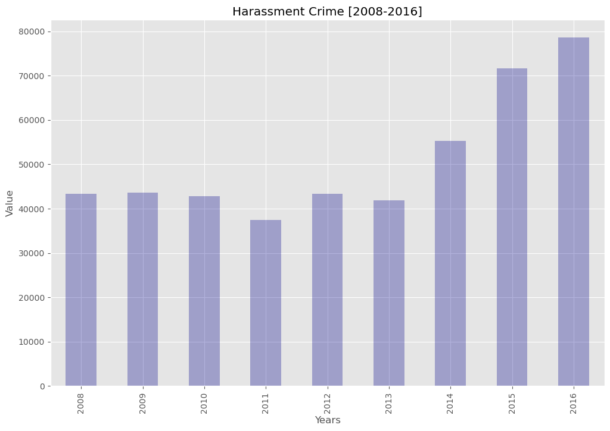
    


Dari hasil analisis dan visualisasi di atas diketahui bahwa Kategori kejahatan Harassment mengalami kenaikan secara signifikan dari tahun 2013 hingga tahun 2014.

## Word Clouds


```python
from wordcloud import STOPWORDS
```


```python
from wordcloud import WordCloud
```

Mengguunakan set uuntuk menghapus stopword yang berllebihan


```python
stopwords = set(STOPWORDS)
```

Membuat variabel minor_crime


```python
minor_crime = ''.join(lc.minor_category)

```

Inisialisasi objek wordcloud dan generate wordcloud


```python
crime_min = WordCloud(background_color='aliceblue',
                     max_words=100, 
                     stopwords=stopwords
                    )

crime_min.generate(minor_crime)
```


    <wordcloud.wordcloud.WordCloud at 0x1d086ae8c50>


Menampilkan wordcloud


```python
plt.imshow(crime_min, interpolation='bilinear')
plt.axis('off')
plt.show()
```


    

    


### Visualisasi dengan gambar

Memasukan gambar, di sini menggunakan gambar penjahat


```python
gambar = np.array(Image.open("D:/Python for Data Science/Crime.jpeg"))
```

Mengecek masking


```python
gambar
```


    array([[[255, 255, 255],
            [255, 255, 255],
            [255, 255, 255],
            ...,
            [255, 255, 255],
            [255, 255, 255],
            [255, 255, 255]],
    
           [[255, 255, 255],
            [255, 255, 255],
            [255, 255, 255],
            ...,
            [255, 255, 255],
            [255, 255, 255],
            [255, 255, 255]],
    
           [[255, 255, 255],
            [255, 255, 255],
            [255, 255, 255],
            ...,
            [255, 255, 255],
            [255, 255, 255],
            [255, 255, 255]],
    
           ...,
    
           [[255, 255, 255],
            [255, 255, 255],
            [255, 255, 255],
            ...,
            [255, 255, 255],
            [255, 255, 255],
            [255, 255, 255]],
    
           [[255, 255, 255],
            [255, 255, 255],
            [255, 255, 255],
            ...,
            [255, 255, 255],
            [255, 255, 255],
            [255, 255, 255]],
    
           [[255, 255, 255],
            [255, 255, 255],
            [255, 255, 255],
            ...,
            [255, 255, 255],
            [255, 255, 255],
            [255, 255, 255]]], dtype=uint8)


Menampilkan gambar masking yang di gunakan


```python
gb = plt.figure()
gb.set_figwidth(10)
gb.set_figheight(14)

plt.imshow(gambar,cmap=plt.cm.gray, interpolation='bilinear')
plt.axis('off')
plt.show()
```


    

    


Membentuk wordcloud sesuai masking


```python
crime_min = WordCloud(background_color='white', max_words=300,
                    mask=gambar, stopwords=stopwords)

crime_min.generate(minor_crime)

fig=plt.figure()
fig.set_figwidth(10)
fig.set_figheight(14)

plt.imshow(crime_min,interpolation='bilinear')
plt.axis('off')
plt.show()
```


    

    


Dari Wordcloud diatas dilihat bahwa tulisan yang paling besar yaitu Vehicle Interference, Motor Vehicle Other, dan Motor Vehicle Thef yang merupakan kategori kejahatan yang paling banyak terjadi di London tahun 2008-2016.

## Folium Map

Import folium


```python
import folium
```

Membuat variabel london_map dan menampilkannya dengan mengatur latitude(lintang) dan longitude(bujur) dari negara London


```python
london_map = folium.Map(location=[51.509865, -0.118092], zoom_start=12)

london_map
```


<div style="width:100%;"><div style="position:relative;width:100%;height:0;padding-bottom:60%;"><span style="color:#565656">Make this Notebook Trusted to load map: File -> Trust Notebook</span><iframe srcdoc="&lt;!DOCTYPE html&gt;
&lt;html&gt;
&lt;head&gt;

    &lt;meta http-equiv=&quot;content-type&quot; content=&quot;text/html; charset=UTF-8&quot; /&gt;

        &lt;script&gt;
            L_NO_TOUCH = false;
            L_DISABLE_3D = false;
        &lt;/script&gt;

    &lt;style&gt;html, body {width: 100%;height: 100%;margin: 0;padding: 0;}&lt;/style&gt;
    &lt;style&gt;#map {position:absolute;top:0;bottom:0;right:0;left:0;}&lt;/style&gt;
    &lt;script src=&quot;https://cdn.jsdelivr.net/npm/leaflet@1.9.3/dist/leaflet.js&quot;&gt;&lt;/script&gt;
    &lt;script src=&quot;https://code.jquery.com/jquery-1.12.4.min.js&quot;&gt;&lt;/script&gt;
    &lt;script src=&quot;https://cdn.jsdelivr.net/npm/bootstrap@5.2.2/dist/js/bootstrap.bundle.min.js&quot;&gt;&lt;/script&gt;
    &lt;script src=&quot;https://cdnjs.cloudflare.com/ajax/libs/Leaflet.awesome-markers/2.0.2/leaflet.awesome-markers.js&quot;&gt;&lt;/script&gt;
    &lt;link rel=&quot;stylesheet&quot; href=&quot;https://cdn.jsdelivr.net/npm/leaflet@1.9.3/dist/leaflet.css&quot;/&gt;
    &lt;link rel=&quot;stylesheet&quot; href=&quot;https://cdn.jsdelivr.net/npm/bootstrap@5.2.2/dist/css/bootstrap.min.css&quot;/&gt;
    &lt;link rel=&quot;stylesheet&quot; href=&quot;https://netdna.bootstrapcdn.com/bootstrap/3.0.0/css/bootstrap.min.css&quot;/&gt;
    &lt;link rel=&quot;stylesheet&quot; href=&quot;https://cdn.jsdelivr.net/npm/@fortawesome/fontawesome-free@6.2.0/css/all.min.css&quot;/&gt;
    &lt;link rel=&quot;stylesheet&quot; href=&quot;https://cdnjs.cloudflare.com/ajax/libs/Leaflet.awesome-markers/2.0.2/leaflet.awesome-markers.css&quot;/&gt;
    &lt;link rel=&quot;stylesheet&quot; href=&quot;https://cdn.jsdelivr.net/gh/python-visualization/folium/folium/templates/leaflet.awesome.rotate.min.css&quot;/&gt;

            &lt;meta name=&quot;viewport&quot; content=&quot;width=device-width,
                initial-scale=1.0, maximum-scale=1.0, user-scalable=no&quot; /&gt;
            &lt;style&gt;
                #map_3346cb410945d34051e8e8c405126441 {
                    position: relative;
                    width: 100.0%;
                    height: 100.0%;
                    left: 0.0%;
                    top: 0.0%;
                }
                .leaflet-container { font-size: 1rem; }
            &lt;/style&gt;

&lt;/head&gt;
&lt;body&gt;


            &lt;div class=&quot;folium-map&quot; id=&quot;map_3346cb410945d34051e8e8c405126441&quot; &gt;&lt;/div&gt;

&lt;/body&gt;
&lt;script&gt;


            var map_3346cb410945d34051e8e8c405126441 = L.map(
                &quot;map_3346cb410945d34051e8e8c405126441&quot;,
                {
                    center: [51.509865, -0.118092],
                    crs: L.CRS.EPSG3857,
                    zoom: 12,
                    zoomControl: true,
                    preferCanvas: false,
                }
            );


            var tile_layer_f13f91f4dc06eb18a6d025baf6205e53 = L.tileLayer(
                &quot;https://{s}.tile.openstreetmap.org/{z}/{x}/{y}.png&quot;,
                {&quot;attribution&quot;: &quot;Data by \u0026copy; \u003ca target=\&quot;_blank\&quot; href=\&quot;http://openstreetmap.org\&quot;\u003eOpenStreetMap\u003c/a\u003e, under \u003ca target=\&quot;_blank\&quot; href=\&quot;http://www.openstreetmap.org/copyright\&quot;\u003eODbL\u003c/a\u003e.&quot;, &quot;detectRetina&quot;: false, &quot;maxNativeZoom&quot;: 18, &quot;maxZoom&quot;: 18, &quot;minZoom&quot;: 0, &quot;noWrap&quot;: false, &quot;opacity&quot;: 1, &quot;subdomains&quot;: &quot;abc&quot;, &quot;tms&quot;: false}
            ).addTo(map_3346cb410945d34051e8e8c405126441);

&lt;/script&gt;
&lt;/html&gt;" style="position:absolute;width:100%;height:100%;left:0;top:0;border:none !important;" allowfullscreen webkitallowfullscreen mozallowfullscreen></iframe></div></div>


Visualisasi peta London dengan Stamen Toner Maps


```python
london_map = folium.Map(location=[51.509865, -0.118092], zoom_start=12, tiles='Stamen Toner')

london_map
```


<div style="width:100%;"><div style="position:relative;width:100%;height:0;padding-bottom:60%;"><span style="color:#565656">Make this Notebook Trusted to load map: File -> Trust Notebook</span><iframe srcdoc="&lt;!DOCTYPE html&gt;
&lt;html&gt;
&lt;head&gt;

    &lt;meta http-equiv=&quot;content-type&quot; content=&quot;text/html; charset=UTF-8&quot; /&gt;

        &lt;script&gt;
            L_NO_TOUCH = false;
            L_DISABLE_3D = false;
        &lt;/script&gt;

    &lt;style&gt;html, body {width: 100%;height: 100%;margin: 0;padding: 0;}&lt;/style&gt;
    &lt;style&gt;#map {position:absolute;top:0;bottom:0;right:0;left:0;}&lt;/style&gt;
    &lt;script src=&quot;https://cdn.jsdelivr.net/npm/leaflet@1.9.3/dist/leaflet.js&quot;&gt;&lt;/script&gt;
    &lt;script src=&quot;https://code.jquery.com/jquery-1.12.4.min.js&quot;&gt;&lt;/script&gt;
    &lt;script src=&quot;https://cdn.jsdelivr.net/npm/bootstrap@5.2.2/dist/js/bootstrap.bundle.min.js&quot;&gt;&lt;/script&gt;
    &lt;script src=&quot;https://cdnjs.cloudflare.com/ajax/libs/Leaflet.awesome-markers/2.0.2/leaflet.awesome-markers.js&quot;&gt;&lt;/script&gt;
    &lt;link rel=&quot;stylesheet&quot; href=&quot;https://cdn.jsdelivr.net/npm/leaflet@1.9.3/dist/leaflet.css&quot;/&gt;
    &lt;link rel=&quot;stylesheet&quot; href=&quot;https://cdn.jsdelivr.net/npm/bootstrap@5.2.2/dist/css/bootstrap.min.css&quot;/&gt;
    &lt;link rel=&quot;stylesheet&quot; href=&quot;https://netdna.bootstrapcdn.com/bootstrap/3.0.0/css/bootstrap.min.css&quot;/&gt;
    &lt;link rel=&quot;stylesheet&quot; href=&quot;https://cdn.jsdelivr.net/npm/@fortawesome/fontawesome-free@6.2.0/css/all.min.css&quot;/&gt;
    &lt;link rel=&quot;stylesheet&quot; href=&quot;https://cdnjs.cloudflare.com/ajax/libs/Leaflet.awesome-markers/2.0.2/leaflet.awesome-markers.css&quot;/&gt;
    &lt;link rel=&quot;stylesheet&quot; href=&quot;https://cdn.jsdelivr.net/gh/python-visualization/folium/folium/templates/leaflet.awesome.rotate.min.css&quot;/&gt;

            &lt;meta name=&quot;viewport&quot; content=&quot;width=device-width,
                initial-scale=1.0, maximum-scale=1.0, user-scalable=no&quot; /&gt;
            &lt;style&gt;
                #map_c89093fb287f8c044deaecfaad418a11 {
                    position: relative;
                    width: 100.0%;
                    height: 100.0%;
                    left: 0.0%;
                    top: 0.0%;
                }
                .leaflet-container { font-size: 1rem; }
            &lt;/style&gt;

&lt;/head&gt;
&lt;body&gt;


            &lt;div class=&quot;folium-map&quot; id=&quot;map_c89093fb287f8c044deaecfaad418a11&quot; &gt;&lt;/div&gt;

&lt;/body&gt;
&lt;script&gt;


            var map_c89093fb287f8c044deaecfaad418a11 = L.map(
                &quot;map_c89093fb287f8c044deaecfaad418a11&quot;,
                {
                    center: [51.509865, -0.118092],
                    crs: L.CRS.EPSG3857,
                    zoom: 12,
                    zoomControl: true,
                    preferCanvas: false,
                }
            );


            var tile_layer_ebcb40cadc6380b1165dd3af5e09623a = L.tileLayer(
                &quot;https://stamen-tiles-{s}.a.ssl.fastly.net/toner/{z}/{x}/{y}.png&quot;,
                {&quot;attribution&quot;: &quot;Map tiles by \u003ca target=\&quot;_blank\&quot; href=\&quot;http://stamen.com\&quot;\u003eStamen Design\u003c/a\u003e, under \u003ca target=\&quot;_blank\&quot; href=\&quot;http://creativecommons.org/licenses/by/3.0\&quot;\u003eCC BY 3.0\u003c/a\u003e. Data by \u0026copy; \u003ca target=\&quot;_blank\&quot; href=\&quot;http://openstreetmap.org\&quot;\u003eOpenStreetMap\u003c/a\u003e, under \u003ca target=\&quot;_blank\&quot; href=\&quot;http://www.openstreetmap.org/copyright\&quot;\u003eODbL\u003c/a\u003e.&quot;, &quot;detectRetina&quot;: false, &quot;maxNativeZoom&quot;: 18, &quot;maxZoom&quot;: 18, &quot;minZoom&quot;: 0, &quot;noWrap&quot;: false, &quot;opacity&quot;: 1, &quot;subdomains&quot;: &quot;abc&quot;, &quot;tms&quot;: false}
            ).addTo(map_c89093fb287f8c044deaecfaad418a11);

&lt;/script&gt;
&lt;/html&gt;" style="position:absolute;width:100%;height:100%;left:0;top:0;border:none !important;" allowfullscreen webkitallowfullscreen mozallowfullscreen></iframe></div></div>


Visualisasi peta London dengan Stamen Terrain Maps


```python
london_map = folium.Map(location=[51.509865, -0.118092], zoom_start=12, tiles='Stamen Terrain')

london_map
```


<div style="width:100%;"><div style="position:relative;width:100%;height:0;padding-bottom:60%;"><span style="color:#565656">Make this Notebook Trusted to load map: File -> Trust Notebook</span><iframe srcdoc="&lt;!DOCTYPE html&gt;
&lt;html&gt;
&lt;head&gt;

    &lt;meta http-equiv=&quot;content-type&quot; content=&quot;text/html; charset=UTF-8&quot; /&gt;

        &lt;script&gt;
            L_NO_TOUCH = false;
            L_DISABLE_3D = false;
        &lt;/script&gt;

    &lt;style&gt;html, body {width: 100%;height: 100%;margin: 0;padding: 0;}&lt;/style&gt;
    &lt;style&gt;#map {position:absolute;top:0;bottom:0;right:0;left:0;}&lt;/style&gt;
    &lt;script src=&quot;https://cdn.jsdelivr.net/npm/leaflet@1.9.3/dist/leaflet.js&quot;&gt;&lt;/script&gt;
    &lt;script src=&quot;https://code.jquery.com/jquery-1.12.4.min.js&quot;&gt;&lt;/script&gt;
    &lt;script src=&quot;https://cdn.jsdelivr.net/npm/bootstrap@5.2.2/dist/js/bootstrap.bundle.min.js&quot;&gt;&lt;/script&gt;
    &lt;script src=&quot;https://cdnjs.cloudflare.com/ajax/libs/Leaflet.awesome-markers/2.0.2/leaflet.awesome-markers.js&quot;&gt;&lt;/script&gt;
    &lt;link rel=&quot;stylesheet&quot; href=&quot;https://cdn.jsdelivr.net/npm/leaflet@1.9.3/dist/leaflet.css&quot;/&gt;
    &lt;link rel=&quot;stylesheet&quot; href=&quot;https://cdn.jsdelivr.net/npm/bootstrap@5.2.2/dist/css/bootstrap.min.css&quot;/&gt;
    &lt;link rel=&quot;stylesheet&quot; href=&quot;https://netdna.bootstrapcdn.com/bootstrap/3.0.0/css/bootstrap.min.css&quot;/&gt;
    &lt;link rel=&quot;stylesheet&quot; href=&quot;https://cdn.jsdelivr.net/npm/@fortawesome/fontawesome-free@6.2.0/css/all.min.css&quot;/&gt;
    &lt;link rel=&quot;stylesheet&quot; href=&quot;https://cdnjs.cloudflare.com/ajax/libs/Leaflet.awesome-markers/2.0.2/leaflet.awesome-markers.css&quot;/&gt;
    &lt;link rel=&quot;stylesheet&quot; href=&quot;https://cdn.jsdelivr.net/gh/python-visualization/folium/folium/templates/leaflet.awesome.rotate.min.css&quot;/&gt;

            &lt;meta name=&quot;viewport&quot; content=&quot;width=device-width,
                initial-scale=1.0, maximum-scale=1.0, user-scalable=no&quot; /&gt;
            &lt;style&gt;
                #map_c5ca8bc66a44e07de88919d0cc53a21d {
                    position: relative;
                    width: 100.0%;
                    height: 100.0%;
                    left: 0.0%;
                    top: 0.0%;
                }
                .leaflet-container { font-size: 1rem; }
            &lt;/style&gt;

&lt;/head&gt;
&lt;body&gt;


            &lt;div class=&quot;folium-map&quot; id=&quot;map_c5ca8bc66a44e07de88919d0cc53a21d&quot; &gt;&lt;/div&gt;

&lt;/body&gt;
&lt;script&gt;


            var map_c5ca8bc66a44e07de88919d0cc53a21d = L.map(
                &quot;map_c5ca8bc66a44e07de88919d0cc53a21d&quot;,
                {
                    center: [51.509865, -0.118092],
                    crs: L.CRS.EPSG3857,
                    zoom: 12,
                    zoomControl: true,
                    preferCanvas: false,
                }
            );


            var tile_layer_f97c0c2082e074189850145fb6677798 = L.tileLayer(
                &quot;https://stamen-tiles-{s}.a.ssl.fastly.net/terrain/{z}/{x}/{y}.jpg&quot;,
                {&quot;attribution&quot;: &quot;Map tiles by \u003ca target=\&quot;_blank\&quot; href=\&quot;http://stamen.com\&quot;\u003eStamen Design\u003c/a\u003e, under \u003ca target=\&quot;_blank\&quot; href=\&quot;http://creativecommons.org/licenses/by/3.0\&quot;\u003eCC BY 3.0\u003c/a\u003e. Data by \u0026copy; \u003ca target=\&quot;_blank\&quot; href=\&quot;http://openstreetmap.org\&quot;\u003eOpenStreetMap\u003c/a\u003e, under \u003ca target=\&quot;_blank\&quot; href=\&quot;http://creativecommons.org/licenses/by-sa/3.0\&quot;\u003eCC BY SA\u003c/a\u003e.&quot;, &quot;detectRetina&quot;: false, &quot;maxNativeZoom&quot;: 18, &quot;maxZoom&quot;: 18, &quot;minZoom&quot;: 0, &quot;noWrap&quot;: false, &quot;opacity&quot;: 1, &quot;subdomains&quot;: &quot;abc&quot;, &quot;tms&quot;: false}
            ).addTo(map_c5ca8bc66a44e07de88919d0cc53a21d);

&lt;/script&gt;
&lt;/html&gt;" style="position:absolute;width:100%;height:100%;left:0;top:0;border:none !important;" allowfullscreen webkitallowfullscreen mozallowfullscreen></iframe></div></div>


