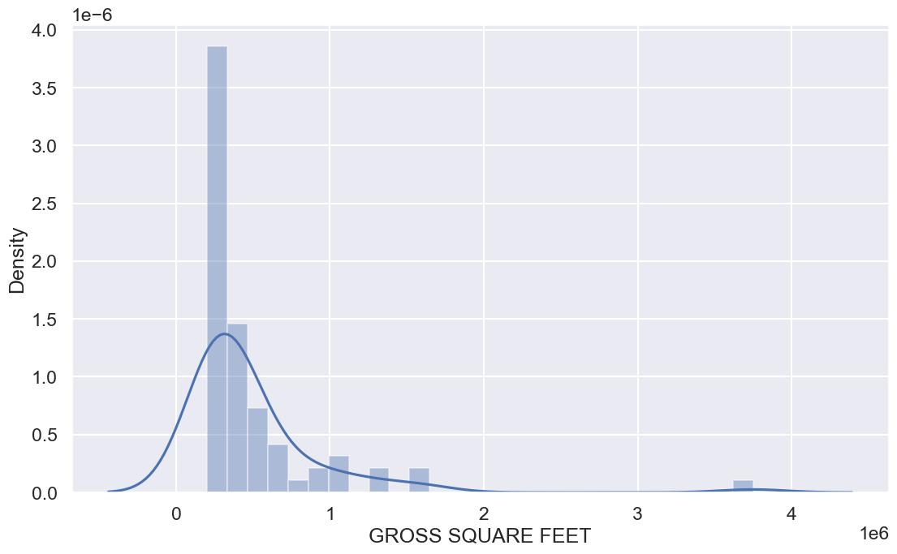

# Assigment Python 2

## Data Set: New York City Property Sales [September 2016 - September 2017]

**Sumber Data:** https://www.kaggle.com/datasets/new-york-city/nyc-property-sale

## About Dataset
**Context**

This dataset is a record of every building or building unit (apartment, etc.) sold in the New York City property market over a 12-month period.

**Content**

This dataset contains the location, address, type, sale price, and sale date of building units sold. A reference on the trickier fields:
* BOROUGH: A digit code for the borough the property is located in; in order these are Manhattan (1), Bronx (2), Brooklyn (3), Queens (4), and Staten Island (5).
* BLOCK; LOT: The combination of borough, block, and lot forms a unique key for property in New York City. Commonly called a BBL.
* BUILDING CLASS AT PRESENT and BUILDING CLASS AT TIME OF SALE: The type of building at various points in time. See the glossary linked to below.

## Import Libraries


```python
import pandas as pd
import numpy as np
import matplotlib.pyplot as plt
import seaborn as sns
import scipy.stats
from scipy import stats
import scipy.stats as scistats
import statsmodels.api as sm
import math
import statistics
import warnings
warnings.filterwarnings("ignore")
%matplotlib inline
```

Masukan data terlebih dahulu


```python
nyc = pd.read_csv('D:/Python for Data Science/Data/nyc-rolling-sales.csv', skipinitialspace = True)
```

## Eksplorasi Data

Melihat berapa jumlah baris dan kolom


```python
nyc.shape
```


    (84548, 22)


Hasil di atas menunjukkan bahwa dataset tersebut memiliki 84548 baris dan 22 kolom.

Mengganti kode area 1 dengan manhattan, 2 dengan bronx, 3 dengan brooklyn, 4 dengan queens, dan 5 dengan staten islands


```python
nyc['BOROUGH'] = nyc.BOROUGH.replace({1: "Manhattan", 2: "Bronx", 3: "Brooklyn", 4: "Queens", 5: "Staten Islands"})
nyc.head()
```


<div>
<style scoped>
    .dataframe tbody tr th:only-of-type {
        vertical-align: middle;
    }

    .dataframe tbody tr th {
        vertical-align: top;
    }

    .dataframe thead th {
        text-align: right;
    }
</style>
<table border="1" class="dataframe">
  <thead>
    <tr style="text-align: right;">
      <th></th>
      <th>Unnamed: 0</th>
      <th>BOROUGH</th>
      <th>NEIGHBORHOOD</th>
      <th>BUILDING CLASS CATEGORY</th>
      <th>TAX CLASS AT PRESENT</th>
      <th>BLOCK</th>
      <th>LOT</th>
      <th>EASE-MENT</th>
      <th>BUILDING CLASS AT PRESENT</th>
      <th>ADDRESS</th>
      <th>...</th>
      <th>RESIDENTIAL UNITS</th>
      <th>COMMERCIAL UNITS</th>
      <th>TOTAL UNITS</th>
      <th>LAND SQUARE FEET</th>
      <th>GROSS SQUARE FEET</th>
      <th>YEAR BUILT</th>
      <th>TAX CLASS AT TIME OF SALE</th>
      <th>BUILDING CLASS AT TIME OF SALE</th>
      <th>SALE PRICE</th>
      <th>SALE DATE</th>
    </tr>
  </thead>
  <tbody>
    <tr>
      <th>0</th>
      <td>4</td>
      <td>Manhattan</td>
      <td>ALPHABET CITY</td>
      <td>07 RENTALS - WALKUP APARTMENTS</td>
      <td>2A</td>
      <td>392</td>
      <td>6</td>
      <td>NaN</td>
      <td>C2</td>
      <td>153 AVENUE B</td>
      <td>...</td>
      <td>5</td>
      <td>0</td>
      <td>5</td>
      <td>1633</td>
      <td>6440</td>
      <td>1900</td>
      <td>2</td>
      <td>C2</td>
      <td>6625000</td>
      <td>2017-07-19 00:00:00</td>
    </tr>
    <tr>
      <th>1</th>
      <td>5</td>
      <td>Manhattan</td>
      <td>ALPHABET CITY</td>
      <td>07 RENTALS - WALKUP APARTMENTS</td>
      <td>2</td>
      <td>399</td>
      <td>26</td>
      <td>NaN</td>
      <td>C7</td>
      <td>234 EAST 4TH   STREET</td>
      <td>...</td>
      <td>28</td>
      <td>3</td>
      <td>31</td>
      <td>4616</td>
      <td>18690</td>
      <td>1900</td>
      <td>2</td>
      <td>C7</td>
      <td>-</td>
      <td>2016-12-14 00:00:00</td>
    </tr>
    <tr>
      <th>2</th>
      <td>6</td>
      <td>Manhattan</td>
      <td>ALPHABET CITY</td>
      <td>07 RENTALS - WALKUP APARTMENTS</td>
      <td>2</td>
      <td>399</td>
      <td>39</td>
      <td>NaN</td>
      <td>C7</td>
      <td>197 EAST 3RD   STREET</td>
      <td>...</td>
      <td>16</td>
      <td>1</td>
      <td>17</td>
      <td>2212</td>
      <td>7803</td>
      <td>1900</td>
      <td>2</td>
      <td>C7</td>
      <td>-</td>
      <td>2016-12-09 00:00:00</td>
    </tr>
    <tr>
      <th>3</th>
      <td>7</td>
      <td>Manhattan</td>
      <td>ALPHABET CITY</td>
      <td>07 RENTALS - WALKUP APARTMENTS</td>
      <td>2B</td>
      <td>402</td>
      <td>21</td>
      <td>NaN</td>
      <td>C4</td>
      <td>154 EAST 7TH STREET</td>
      <td>...</td>
      <td>10</td>
      <td>0</td>
      <td>10</td>
      <td>2272</td>
      <td>6794</td>
      <td>1913</td>
      <td>2</td>
      <td>C4</td>
      <td>3936272</td>
      <td>2016-09-23 00:00:00</td>
    </tr>
    <tr>
      <th>4</th>
      <td>8</td>
      <td>Manhattan</td>
      <td>ALPHABET CITY</td>
      <td>07 RENTALS - WALKUP APARTMENTS</td>
      <td>2A</td>
      <td>404</td>
      <td>55</td>
      <td>NaN</td>
      <td>C2</td>
      <td>301 EAST 10TH   STREET</td>
      <td>...</td>
      <td>6</td>
      <td>0</td>
      <td>6</td>
      <td>2369</td>
      <td>4615</td>
      <td>1900</td>
      <td>2</td>
      <td>C2</td>
      <td>8000000</td>
      <td>2016-11-17 00:00:00</td>
    </tr>
  </tbody>
</table>
<p>5 rows × 22 columns</p>
</div>


Melihat lima baris pertama

Melihat lima baris terakhir


```python
nyc.tail()
```


<div>
<style scoped>
    .dataframe tbody tr th:only-of-type {
        vertical-align: middle;
    }

    .dataframe tbody tr th {
        vertical-align: top;
    }

    .dataframe thead th {
        text-align: right;
    }
</style>
<table border="1" class="dataframe">
  <thead>
    <tr style="text-align: right;">
      <th></th>
      <th>Unnamed: 0</th>
      <th>BOROUGH</th>
      <th>NEIGHBORHOOD</th>
      <th>BUILDING CLASS CATEGORY</th>
      <th>TAX CLASS AT PRESENT</th>
      <th>BLOCK</th>
      <th>LOT</th>
      <th>EASE-MENT</th>
      <th>BUILDING CLASS AT PRESENT</th>
      <th>ADDRESS</th>
      <th>...</th>
      <th>RESIDENTIAL UNITS</th>
      <th>COMMERCIAL UNITS</th>
      <th>TOTAL UNITS</th>
      <th>LAND SQUARE FEET</th>
      <th>GROSS SQUARE FEET</th>
      <th>YEAR BUILT</th>
      <th>TAX CLASS AT TIME OF SALE</th>
      <th>BUILDING CLASS AT TIME OF SALE</th>
      <th>SALE PRICE</th>
      <th>SALE DATE</th>
    </tr>
  </thead>
  <tbody>
    <tr>
      <th>84543</th>
      <td>8409</td>
      <td>Staten Islands</td>
      <td>WOODROW</td>
      <td>02 TWO FAMILY DWELLINGS</td>
      <td>1</td>
      <td>7349</td>
      <td>34</td>
      <td>NaN</td>
      <td>B9</td>
      <td>37 QUAIL LANE</td>
      <td>...</td>
      <td>2</td>
      <td>0</td>
      <td>2</td>
      <td>2400</td>
      <td>2575</td>
      <td>1998</td>
      <td>1</td>
      <td>B9</td>
      <td>450000</td>
      <td>2016-11-28 00:00:00</td>
    </tr>
    <tr>
      <th>84544</th>
      <td>8410</td>
      <td>Staten Islands</td>
      <td>WOODROW</td>
      <td>02 TWO FAMILY DWELLINGS</td>
      <td>1</td>
      <td>7349</td>
      <td>78</td>
      <td>NaN</td>
      <td>B9</td>
      <td>32 PHEASANT LANE</td>
      <td>...</td>
      <td>2</td>
      <td>0</td>
      <td>2</td>
      <td>2498</td>
      <td>2377</td>
      <td>1998</td>
      <td>1</td>
      <td>B9</td>
      <td>550000</td>
      <td>2017-04-21 00:00:00</td>
    </tr>
    <tr>
      <th>84545</th>
      <td>8411</td>
      <td>Staten Islands</td>
      <td>WOODROW</td>
      <td>02 TWO FAMILY DWELLINGS</td>
      <td>1</td>
      <td>7351</td>
      <td>60</td>
      <td>NaN</td>
      <td>B2</td>
      <td>49 PITNEY AVENUE</td>
      <td>...</td>
      <td>2</td>
      <td>0</td>
      <td>2</td>
      <td>4000</td>
      <td>1496</td>
      <td>1925</td>
      <td>1</td>
      <td>B2</td>
      <td>460000</td>
      <td>2017-07-05 00:00:00</td>
    </tr>
    <tr>
      <th>84546</th>
      <td>8412</td>
      <td>Staten Islands</td>
      <td>WOODROW</td>
      <td>22 STORE BUILDINGS</td>
      <td>4</td>
      <td>7100</td>
      <td>28</td>
      <td>NaN</td>
      <td>K6</td>
      <td>2730 ARTHUR KILL ROAD</td>
      <td>...</td>
      <td>0</td>
      <td>7</td>
      <td>7</td>
      <td>208033</td>
      <td>64117</td>
      <td>2001</td>
      <td>4</td>
      <td>K6</td>
      <td>11693337</td>
      <td>2016-12-21 00:00:00</td>
    </tr>
    <tr>
      <th>84547</th>
      <td>8413</td>
      <td>Staten Islands</td>
      <td>WOODROW</td>
      <td>35 INDOOR PUBLIC AND CULTURAL FACILITIES</td>
      <td>4</td>
      <td>7105</td>
      <td>679</td>
      <td>NaN</td>
      <td>P9</td>
      <td>155 CLAY PIT ROAD</td>
      <td>...</td>
      <td>0</td>
      <td>1</td>
      <td>1</td>
      <td>10796</td>
      <td>2400</td>
      <td>2006</td>
      <td>4</td>
      <td>P9</td>
      <td>69300</td>
      <td>2016-10-27 00:00:00</td>
    </tr>
  </tbody>
</table>
<p>5 rows × 22 columns</p>
</div>


Melihat ringkasan data


```python
nyc.describe().transpose()
```


<div>
<style scoped>
    .dataframe tbody tr th:only-of-type {
        vertical-align: middle;
    }

    .dataframe tbody tr th {
        vertical-align: top;
    }

    .dataframe thead th {
        text-align: right;
    }
</style>
<table border="1" class="dataframe">
  <thead>
    <tr style="text-align: right;">
      <th></th>
      <th>count</th>
      <th>mean</th>
      <th>std</th>
      <th>min</th>
      <th>25%</th>
      <th>50%</th>
      <th>75%</th>
      <th>max</th>
    </tr>
  </thead>
  <tbody>
    <tr>
      <th>Unnamed: 0</th>
      <td>84548.0</td>
      <td>10344.359878</td>
      <td>7151.779436</td>
      <td>4.0</td>
      <td>4231.00</td>
      <td>8942.0</td>
      <td>15987.25</td>
      <td>26739.0</td>
    </tr>
    <tr>
      <th>BLOCK</th>
      <td>84548.0</td>
      <td>4237.218976</td>
      <td>3568.263407</td>
      <td>1.0</td>
      <td>1322.75</td>
      <td>3311.0</td>
      <td>6281.00</td>
      <td>16322.0</td>
    </tr>
    <tr>
      <th>LOT</th>
      <td>84548.0</td>
      <td>376.224015</td>
      <td>658.136814</td>
      <td>1.0</td>
      <td>22.00</td>
      <td>50.0</td>
      <td>1001.00</td>
      <td>9106.0</td>
    </tr>
    <tr>
      <th>EASE-MENT</th>
      <td>0.0</td>
      <td>NaN</td>
      <td>NaN</td>
      <td>NaN</td>
      <td>NaN</td>
      <td>NaN</td>
      <td>NaN</td>
      <td>NaN</td>
    </tr>
    <tr>
      <th>ZIP CODE</th>
      <td>84548.0</td>
      <td>10731.991614</td>
      <td>1290.879147</td>
      <td>0.0</td>
      <td>10305.00</td>
      <td>11209.0</td>
      <td>11357.00</td>
      <td>11694.0</td>
    </tr>
    <tr>
      <th>RESIDENTIAL UNITS</th>
      <td>84548.0</td>
      <td>2.025264</td>
      <td>16.721037</td>
      <td>0.0</td>
      <td>0.00</td>
      <td>1.0</td>
      <td>2.00</td>
      <td>1844.0</td>
    </tr>
    <tr>
      <th>COMMERCIAL UNITS</th>
      <td>84548.0</td>
      <td>0.193559</td>
      <td>8.713183</td>
      <td>0.0</td>
      <td>0.00</td>
      <td>0.0</td>
      <td>0.00</td>
      <td>2261.0</td>
    </tr>
    <tr>
      <th>TOTAL UNITS</th>
      <td>84548.0</td>
      <td>2.249184</td>
      <td>18.972584</td>
      <td>0.0</td>
      <td>1.00</td>
      <td>1.0</td>
      <td>2.00</td>
      <td>2261.0</td>
    </tr>
    <tr>
      <th>YEAR BUILT</th>
      <td>84548.0</td>
      <td>1789.322976</td>
      <td>537.344993</td>
      <td>0.0</td>
      <td>1920.00</td>
      <td>1940.0</td>
      <td>1965.00</td>
      <td>2017.0</td>
    </tr>
    <tr>
      <th>TAX CLASS AT TIME OF SALE</th>
      <td>84548.0</td>
      <td>1.657485</td>
      <td>0.819341</td>
      <td>1.0</td>
      <td>1.00</td>
      <td>2.0</td>
      <td>2.00</td>
      <td>4.0</td>
    </tr>
  </tbody>
</table>
</div>


```python
nyc.describe(include = 'O').transpose()
```


<div>
<style scoped>
    .dataframe tbody tr th:only-of-type {
        vertical-align: middle;
    }

    .dataframe tbody tr th {
        vertical-align: top;
    }

    .dataframe thead th {
        text-align: right;
    }
</style>
<table border="1" class="dataframe">
  <thead>
    <tr style="text-align: right;">
      <th></th>
      <th>count</th>
      <th>unique</th>
      <th>top</th>
      <th>freq</th>
    </tr>
  </thead>
  <tbody>
    <tr>
      <th>BOROUGH</th>
      <td>84548</td>
      <td>5</td>
      <td>Queens</td>
      <td>26736</td>
    </tr>
    <tr>
      <th>NEIGHBORHOOD</th>
      <td>84548</td>
      <td>254</td>
      <td>FLUSHING-NORTH</td>
      <td>3068</td>
    </tr>
    <tr>
      <th>BUILDING CLASS CATEGORY</th>
      <td>84548</td>
      <td>47</td>
      <td>01 ONE FAMILY DWELLINGS</td>
      <td>18235</td>
    </tr>
    <tr>
      <th>TAX CLASS AT PRESENT</th>
      <td>83810</td>
      <td>10</td>
      <td>1</td>
      <td>38633</td>
    </tr>
    <tr>
      <th>BUILDING CLASS AT PRESENT</th>
      <td>83810</td>
      <td>166</td>
      <td>D4</td>
      <td>12663</td>
    </tr>
    <tr>
      <th>ADDRESS</th>
      <td>84548</td>
      <td>67563</td>
      <td>131-05 40TH   ROAD</td>
      <td>210</td>
    </tr>
    <tr>
      <th>APARTMENT NUMBER</th>
      <td>19052</td>
      <td>3988</td>
      <td>4</td>
      <td>298</td>
    </tr>
    <tr>
      <th>LAND SQUARE FEET</th>
      <td>84548</td>
      <td>6062</td>
      <td>-</td>
      <td>26252</td>
    </tr>
    <tr>
      <th>GROSS SQUARE FEET</th>
      <td>84548</td>
      <td>5691</td>
      <td>-</td>
      <td>27612</td>
    </tr>
    <tr>
      <th>BUILDING CLASS AT TIME OF SALE</th>
      <td>84548</td>
      <td>166</td>
      <td>R4</td>
      <td>12989</td>
    </tr>
    <tr>
      <th>SALE PRICE</th>
      <td>84548</td>
      <td>10008</td>
      <td>-</td>
      <td>14561</td>
    </tr>
    <tr>
      <th>SALE DATE</th>
      <td>84548</td>
      <td>364</td>
      <td>2017-06-29 00:00:00</td>
      <td>544</td>
    </tr>
  </tbody>
</table>
</div>


## Data Cleaning

Melihat tipe data pada dataset


```python
nyc.info()
```

    <class 'pandas.core.frame.DataFrame'>
    RangeIndex: 84548 entries, 0 to 84547
    Data columns (total 22 columns):
     #   Column                          Non-Null Count  Dtype  
    ---  ------                          --------------  -----  
     0   Unnamed: 0                      84548 non-null  int64  
     1   BOROUGH                         84548 non-null  object 
     2   NEIGHBORHOOD                    84548 non-null  object 
     3   BUILDING CLASS CATEGORY         84548 non-null  object 
     4   TAX CLASS AT PRESENT            83810 non-null  object 
     5   BLOCK                           84548 non-null  int64  
     6   LOT                             84548 non-null  int64  
     7   EASE-MENT                       0 non-null      float64
     8   BUILDING CLASS AT PRESENT       83810 non-null  object 
     9   ADDRESS                         84548 non-null  object 
     10  APARTMENT NUMBER                19052 non-null  object 
     11  ZIP CODE                        84548 non-null  int64  
     12  RESIDENTIAL UNITS               84548 non-null  int64  
     13  COMMERCIAL UNITS                84548 non-null  int64  
     14  TOTAL UNITS                     84548 non-null  int64  
     15  LAND SQUARE FEET                84548 non-null  object 
     16  GROSS SQUARE FEET               84548 non-null  object 
     17  YEAR BUILT                      84548 non-null  int64  
     18  TAX CLASS AT TIME OF SALE       84548 non-null  int64  
     19  BUILDING CLASS AT TIME OF SALE  84548 non-null  object 
     20  SALE PRICE                      84548 non-null  object 
     21  SALE DATE                       84548 non-null  object 
    dtypes: float64(1), int64(9), object(12)
    memory usage: 14.2+ MB
    

Dari hasil di atas, datset tersebut memiliki 10 tipe data integer dan 12 data objek

Melihat kolom data


```python
nyc.columns
```


    Index(['Unnamed: 0', 'BOROUGH', 'NEIGHBORHOOD', 'BUILDING CLASS CATEGORY',
           'TAX CLASS AT PRESENT', 'BLOCK', 'LOT', 'EASE-MENT',
           'BUILDING CLASS AT PRESENT', 'ADDRESS', 'APARTMENT NUMBER', 'ZIP CODE',
           'RESIDENTIAL UNITS', 'COMMERCIAL UNITS', 'TOTAL UNITS',
           'LAND SQUARE FEET', 'GROSS SQUARE FEET', 'YEAR BUILT',
           'TAX CLASS AT TIME OF SALE', 'BUILDING CLASS AT TIME OF SALE',
           'SALE PRICE', 'SALE DATE'],
          dtype='object')


Melihat apakah terdapat missing value


```python
nyc.isna().sum()
```


    Unnamed: 0                            0
    BOROUGH                               0
    NEIGHBORHOOD                          0
    BUILDING CLASS CATEGORY               0
    TAX CLASS AT PRESENT                738
    BLOCK                                 0
    LOT                                   0
    EASE-MENT                         84548
    BUILDING CLASS AT PRESENT           738
    ADDRESS                               0
    APARTMENT NUMBER                  65496
    ZIP CODE                              0
    RESIDENTIAL UNITS                     0
    COMMERCIAL UNITS                      0
    TOTAL UNITS                           0
    LAND SQUARE FEET                      0
    GROSS SQUARE FEET                     0
    YEAR BUILT                            0
    TAX CLASS AT TIME OF SALE             0
    BUILDING CLASS AT TIME OF SALE        0
    SALE PRICE                            0
    SALE DATE                             0
    dtype: int64


Dari hasil di atas bisa dilihat bahwa terdapat missing value pada colom 'TAX CLASS AT PRESENT', 'EASE-MENT', 'BUILDING CLASS AT PRESENT', dan 'APARTMENT NUMBER'.


```python
for col in nyc.columns:
    print("UNIQUE VALUES FOR ",col)
    print("="*40)
    print(nyc[col].unique())
    print("="*40)
```

    UNIQUE VALUES FOR  Unnamed: 0
    ========================================
    [    4     5     6 ... 26737 26738 26739]
    ========================================
    UNIQUE VALUES FOR  BOROUGH
    ========================================
    ['Manhattan' 'Bronx' 'Brooklyn' 'Queens' 'Staten Islands']
    ========================================
    UNIQUE VALUES FOR  NEIGHBORHOOD
    ========================================
    ['ALPHABET CITY' 'CHELSEA' 'CHINATOWN' 'CIVIC CENTER' 'CLINTON'
     'EAST VILLAGE' 'FASHION' 'FINANCIAL' 'FLATIRON' 'GRAMERCY'
     'GREENWICH VILLAGE-CENTRAL' 'GREENWICH VILLAGE-WEST' 'HARLEM-CENTRAL'
     'HARLEM-EAST' 'HARLEM-UPPER' 'HARLEM-WEST' 'INWOOD' 'JAVITS CENTER'
     'KIPS BAY' 'LITTLE ITALY' 'LOWER EAST SIDE' 'MANHATTAN VALLEY'
     'MIDTOWN CBD' 'MIDTOWN EAST' 'MIDTOWN WEST' 'MORNINGSIDE HEIGHTS'
     'MURRAY HILL' 'ROOSEVELT ISLAND' 'SOHO' 'SOUTHBRIDGE' 'TRIBECA'
     'UPPER EAST SIDE (59-79)' 'UPPER EAST SIDE (79-96)'
     'UPPER EAST SIDE (96-110)' 'UPPER WEST SIDE (59-79)'
     'UPPER WEST SIDE (79-96)' 'UPPER WEST SIDE (96-116)'
     'WASHINGTON HEIGHTS LOWER' 'WASHINGTON HEIGHTS UPPER' 'BATHGATE'
     'BAYCHESTER' 'BEDFORD PARK/NORWOOD' 'BELMONT' 'BRONX PARK' 'BRONXDALE'
     'CASTLE HILL/UNIONPORT' 'CITY ISLAND' 'CITY ISLAND-PELHAM STRIP'
     'CO-OP CITY' 'COUNTRY CLUB' 'CROTONA PARK' 'EAST RIVER' 'EAST TREMONT'
     'FIELDSTON' 'FORDHAM' 'HIGHBRIDGE/MORRIS HEIGHTS' 'HUNTS POINT'
     'KINGSBRIDGE HTS/UNIV HTS' 'KINGSBRIDGE/JEROME PARK' 'MELROSE/CONCOURSE'
     'MORRIS PARK/VAN NEST' 'MORRISANIA/LONGWOOD' 'MOTT HAVEN/PORT MORRIS'
     'MOUNT HOPE/MOUNT EDEN' 'PARKCHESTER' 'PELHAM BAY' 'PELHAM GARDENS'
     'PELHAM PARKWAY NORTH' 'PELHAM PARKWAY SOUTH' 'RIVERDALE'
     'SCHUYLERVILLE/PELHAM BAY' 'SOUNDVIEW' 'THROGS NECK' 'VAN CORTLANDT PARK'
     'WAKEFIELD' 'WESTCHESTER' 'WILLIAMSBRIDGE' 'WOODLAWN' 'BATH BEACH'
     'BAY RIDGE' 'BEDFORD STUYVESANT' 'BENSONHURST' 'BERGEN BEACH'
     'BOERUM HILL' 'BOROUGH PARK' 'BRIGHTON BEACH' 'BROOKLYN HEIGHTS'
     'BROWNSVILLE' 'BUSH TERMINAL' 'BUSHWICK' 'CANARSIE' 'CARROLL GARDENS'
     'CLINTON HILL' 'COBBLE HILL' 'COBBLE HILL-WEST' 'CONEY ISLAND'
     'CROWN HEIGHTS' 'CYPRESS HILLS' 'DOWNTOWN-FULTON FERRY'
     'DOWNTOWN-FULTON MALL' 'DOWNTOWN-METROTECH' 'DYKER HEIGHTS'
     'EAST NEW YORK' 'FLATBUSH-CENTRAL' 'FLATBUSH-EAST'
     'FLATBUSH-LEFFERTS GARDEN' 'FLATBUSH-NORTH' 'FLATLANDS' 'FORT GREENE'
     'GERRITSEN BEACH' 'GOWANUS' 'GRAVESEND' 'GREENPOINT' 'JAMAICA BAY'
     'KENSINGTON' 'MADISON' 'MANHATTAN BEACH' 'MARINE PARK' 'MIDWOOD'
     'MILL BASIN' 'NAVY YARD' 'OCEAN HILL' 'OCEAN PARKWAY-NORTH'
     'OCEAN PARKWAY-SOUTH' 'OLD MILL BASIN' 'PARK SLOPE' 'PARK SLOPE SOUTH'
     'PROSPECT HEIGHTS' 'RED HOOK' 'SEAGATE' 'SHEEPSHEAD BAY' 'SPRING CREEK'
     'SUNSET PARK' 'WILLIAMSBURG-CENTRAL' 'WILLIAMSBURG-EAST'
     'WILLIAMSBURG-NORTH' 'WILLIAMSBURG-SOUTH' 'WINDSOR TERRACE'
     'WYCKOFF HEIGHTS' 'AIRPORT LA GUARDIA' 'ARVERNE' 'ASTORIA' 'BAYSIDE'
     'BEECHHURST' 'BELLE HARBOR' 'BELLEROSE' 'BRIARWOOD' 'BROAD CHANNEL'
     'CAMBRIA HEIGHTS' 'COLLEGE POINT' 'CORONA' 'DOUGLASTON' 'EAST ELMHURST'
     'ELMHURST' 'FAR ROCKAWAY' 'FLORAL PARK' 'FLUSHING MEADOW PARK'
     'FLUSHING-NORTH' 'FLUSHING-SOUTH' 'FOREST HILLS' 'FRESH MEADOWS'
     'GLEN OAKS' 'GLENDALE' 'HAMMELS' 'HILLCREST' 'HOLLIS' 'HOLLIS HILLS'
     'HOLLISWOOD' 'HOWARD BEACH' 'JACKSON HEIGHTS' 'JAMAICA' 'JAMAICA ESTATES'
     'JAMAICA HILLS' 'KEW GARDENS' 'LAURELTON' 'LITTLE NECK'
     'LONG ISLAND CITY' 'MASPETH' 'MIDDLE VILLAGE' 'NEPONSIT'
     'OAKLAND GARDENS' 'OZONE PARK' 'QUEENS VILLAGE' 'REGO PARK'
     'RICHMOND HILL' 'RIDGEWOOD' 'ROCKAWAY PARK' 'ROSEDALE'
     'SO. JAMAICA-BAISLEY PARK' 'SOUTH JAMAICA' 'SOUTH OZONE PARK'
     'SPRINGFIELD GARDENS' 'ST. ALBANS' 'SUNNYSIDE' 'WHITESTONE' 'WOODHAVEN'
     'WOODSIDE' 'ANNADALE' 'ARDEN HEIGHTS' 'ARROCHAR' 'ARROCHAR-SHORE ACRES'
     'BLOOMFIELD' 'BULLS HEAD' 'CASTLETON CORNERS' 'CLOVE LAKES' 'CONCORD'
     'CONCORD-FOX HILLS' 'DONGAN HILLS' 'DONGAN HILLS-COLONY'
     'DONGAN HILLS-OLD TOWN' 'ELTINGVILLE' 'EMERSON HILL' 'FRESH KILLS'
     'GRANT CITY' 'GRASMERE' 'GREAT KILLS' 'GREAT KILLS-BAY TERRACE'
     'GRYMES HILL' 'HUGUENOT' 'LIVINGSTON' 'MANOR HEIGHTS' 'MARINERS HARBOR'
     'MIDLAND BEACH' 'NEW BRIGHTON' 'NEW BRIGHTON-ST. GEORGE' 'NEW DORP'
     'NEW DORP-BEACH' 'NEW DORP-HEIGHTS' 'NEW SPRINGVILLE' 'OAKWOOD'
     'OAKWOOD-BEACH' 'PLEASANT PLAINS' 'PORT IVORY' 'PORT RICHMOND'
     'PRINCES BAY' 'RICHMONDTOWN' 'RICHMONDTOWN-LIGHTHS HILL' 'ROSEBANK'
     'ROSSVILLE' 'ROSSVILLE-CHARLESTON' 'ROSSVILLE-PORT MOBIL'
     'ROSSVILLE-RICHMOND VALLEY' 'SILVER LAKE' 'SOUTH BEACH' 'STAPLETON'
     'STAPLETON-CLIFTON' 'TODT HILL' 'TOMPKINSVILLE' 'TOTTENVILLE' 'TRAVIS'
     'WEST NEW BRIGHTON' 'WESTERLEIGH' 'WILLOWBROOK' 'WOODROW']
    ========================================
    UNIQUE VALUES FOR  BUILDING CLASS CATEGORY
    ========================================
    ['07 RENTALS - WALKUP APARTMENTS             '
     '08 RENTALS - ELEVATOR APARTMENTS           '
     '09 COOPS - WALKUP APARTMENTS               '
     '10 COOPS - ELEVATOR APARTMENTS             '
     '11A CONDO-RENTALS                           '
     '12 CONDOS - WALKUP APARTMENTS              '
     '13 CONDOS - ELEVATOR APARTMENTS            '
     '14 RENTALS - 4-10 UNIT                     '
     '15 CONDOS - 2-10 UNIT RESIDENTIAL          '
     '16 CONDOS - 2-10 UNIT WITH COMMERCIAL UNIT '
     '17 CONDO COOPS                             '
     '22 STORE BUILDINGS                         '
     '37 RELIGIOUS FACILITIES                    '
     '42 CONDO CULTURAL/MEDICAL/EDUCATIONAL/ETC  '
     '46 CONDO STORE BUILDINGS                   '
     '47 CONDO NON-BUSINESS STORAGE              '
     '01 ONE FAMILY DWELLINGS                    '
     '02 TWO FAMILY DWELLINGS                    '
     '03 THREE FAMILY DWELLINGS                  '
     '04 TAX CLASS 1 CONDOS                      '
     '21 OFFICE BUILDINGS                        '
     '23 LOFT BUILDINGS                          '
     '25 LUXURY HOTELS                           '
     '26 OTHER HOTELS                            '
     '28 COMMERCIAL CONDOS                       '
     '29 COMMERCIAL GARAGES                      '
     '35 INDOOR PUBLIC AND CULTURAL FACILITIES   '
     '38 ASYLUMS AND HOMES                       '
     '43 CONDO OFFICE BUILDINGS                  '
     '44 CONDO PARKING                           '
     '48 CONDO TERRACES/GARDENS/CABANAS          '
     '31 COMMERCIAL VACANT LAND                  '
     '32 HOSPITAL AND HEALTH FACILITIES          '
     '41 TAX CLASS 4 - OTHER                     '
     '18 TAX CLASS 3 - UNTILITY PROPERTIES       '
     '30 WAREHOUSES                              '
     '36 OUTDOOR RECREATIONAL FACILITIES         '
     '49 CONDO WAREHOUSES/FACTORY/INDUS          '
     '34 THEATRES                                '
     '27 FACTORIES                               '
     '40 SELECTED GOVERNMENTAL FACILITIES        '
     '45 CONDO HOTELS                            '
     '33 EDUCATIONAL FACILITIES                  '
     '11 SPECIAL CONDO BILLING LOTS              '
     '05 TAX CLASS 1 VACANT LAND                 '
     '06 TAX CLASS 1 - OTHER                     '
     '39 TRANSPORTATION FACILITIES               ']
    ========================================
    UNIQUE VALUES FOR  TAX CLASS AT PRESENT
    ========================================
    ['2A' '2' '2B' '2C' nan '4' '1' '1C' '3' '1A' '1B']
    ========================================
    UNIQUE VALUES FOR  BLOCK
    ========================================
    [ 392  399  402 ... 6918 7074 7092]
    ========================================
    UNIQUE VALUES FOR  LOT
    ========================================
    [  6  26  39 ... 655 423 679]
    ========================================
    UNIQUE VALUES FOR  EASE-MENT
    ========================================
    [nan]
    ========================================
    UNIQUE VALUES FOR  BUILDING CLASS AT PRESENT
    ========================================
    ['C2' 'C7' 'C4' 'D5' 'D9' 'D7' 'D1' 'C6' 'D0' 'D4' 'RR' nan 'R2' 'R4' 'S3'
     'S4' 'S5' 'R1' 'R8' 'R9' 'K4' 'M9' 'M3' 'RK' 'RS' 'A9' 'A4' 'B3' 'B1'
     'S2' 'C0' 'R6' 'C5' 'C3' 'C1' 'D6' 'S9' 'O2' 'O1' 'O3' 'O5' 'O6' 'K1'
     'K2' 'L9' 'L8' 'L1' 'H1' 'H8' 'H3' 'R5' 'G6' 'P7' 'M1' 'N2' 'RB' 'RG'
     'RT' 'K9' 'V1' 'GW' 'G2' 'I7' 'M4' 'Z9' 'B9' 'D3' 'G9' 'I9' 'U6' 'O4'
     'L3' 'H2' 'E1' 'Z3' 'RW' 'C9' 'J5' 'N9' 'S1' 'A5' 'J8' 'B2' 'C8' 'F5'
     'Q1' 'G7' 'G5' 'G4' 'P2' 'Q9' 'Y1' 'RA' 'RP' 'O8' 'HR' 'G1' 'E7' 'I5'
     'R3' 'I4' 'H9' 'RH' 'D8' 'HB' 'J4' 'W2' 'P9' 'A7' 'D2' 'S0' 'O7' 'O9'
     'W3' 'HS' 'H6' 'J9' 'R0' 'HH' 'W8' 'W6' 'A1' 'K5' 'F1' 'V9' 'A2' 'V0'
     'G0' 'F4' 'E9' 'I3' 'W4' 'V3' 'I1' 'A6' 'Q8' 'A3' 'Z0' 'W1' 'U1' 'F2'
     'F9' 'GU' 'I6' 'G8' 'P5' 'Y3' 'W9' 'M2' 'G3' 'V6' 'K7' 'K3' 'R7' 'P8'
     'K6' 'V2' 'E2' 'Z2' 'T2' 'K8' 'P6' 'A0' 'H4' 'J1' 'CM' 'Z7']
    ========================================
    UNIQUE VALUES FOR  ADDRESS
    ========================================
    ['153 AVENUE B' '234 EAST 4TH   STREET' '197 EAST 3RD   STREET' ...
     '49 PITNEY AVENUE' '2730 ARTHUR KILL ROAD' '155 CLAY PIT ROAD']
    ========================================
    UNIQUE VALUES FOR  APARTMENT NUMBER
    ========================================
    [nan 'RES' 'UNIT1' ... '115' 'MS-B' '363']
    ========================================
    UNIQUE VALUES FOR  ZIP CODE
    ========================================
    [10009     0 10002 10011 10001 10014 10010 10013 10038 10007 10036 10019
     10018 10003 10005 10004 10006 10016 10012 10026 10030 10031 10027 10035
     10037 10029 10039 10032 10128 10463 10034 10025 10022 10017 10167 10023
     10105 10033 10044 10280 10282 10281 10065 10021 10075 10028 10024 10069
     10040 10457 10458 10451 10456 10469 10466 10475 10468 10467 10460 10473
     10472 10464 10462 10803 10465 10459 10471 10453 10452 10454 10474 10455
     10461 10470 11228 11214 11220 11209 11219 11221 11233 11213 11206 11216
     11205 11238 11226 11204 11234 11217 11201 11218 11232 11230 11235 11212
     11237 11207 11236 11239 11231 11249 11224 11225 11208 11210 11203 11229
     11215 11223 11222 11211 11370 11691 11692 11102 11106 11103 11377 11105
     11101 11361 11360 11357 11358 11364 11693 11694 11426 11428 11004 11001
     11435 11411 11356 11354 11420 11368 11373 11372 11363 11362 11369 11378
     11040 11375 11355 11365 11367 11366 11374 11385 11005 11421 11379 11432
     11423 11412 11427 11429 11433 11414 11422 11415 11418 11413 11109 11104
     11416 11417 11419 11436 11434 11430 10312 10305 10314 10303 10310 10302
     10301 10304 10306 10308 10309 10307]
    ========================================
    UNIQUE VALUES FOR  RESIDENTIAL UNITS
    ========================================
    [   5   28   16   10    6   20    8   44   15   24   30    0   47  132
        1    3    4    2   22    9  210   35   17   11    7   18   27   14
       12   21   40   19   48   79   55  529  476  317   42   23   25  107
      133   31   36   34   33   90   74   29   13  286  256  771  257   38
      311   41   51   76   54   45   72   56   68   37   50   26   61   60
      894   67  550  184   78  181   86  259  102  233  121   52 1641   96
       87  100  113   99   92   70  369   77  232  315   91   32   66   64
      109  387  153   59  193   62  103  146  287   94   46   84   75   65
       95   49   63   43  716  680  179   71   39   53  283  114   89   73
       83  498   81  162  127  222  130   58  159  462  142  948  129  889
      271  150  120   57  117  106   85  118  164  139  165  122  134  278
      135  324  180  405  136  168  144  152  138   88  244  291 1844  198
      148  175  296  446  420  335  143  128]
    ========================================
    UNIQUE VALUES FOR  COMMERCIAL UNITS
    ========================================
    [   0    3    1    2    4   13    5   24    6   19   10   15   14    8
        7   35   42   55   17   38   12   27  422    9   23   52  318   20
       67   11  254   26   49   30   91   59   62   31   73   56   34   32
       18   22   28  147  184   25  172  436   16 2261   51   21  126]
    ========================================
    UNIQUE VALUES FOR  TOTAL UNITS
    ========================================
    [   5   31   17   10    6   20    8   46   15   24   34    0   47  132
        1    4    2    3    7    9   16  211   32   13   19   35   18   14
       30   12   21   23   45   26   11   48   82   55   42   38   27  422
      538  482  323   52  318   67   25   22   28  107  137   36   37   96
      138   76   33  286  256  771  257   44  315   41   51   40   29   81
       54   72   56   68   74   39   50   61  902   70  551  254  185   78
      181   49   91   87  269  102  234  235  233   59   62   73   43  121
     1653  192  100  113   99   92   75  374   77  238  317   93   69   60
       64  111  395  155  193  103  146  287   94   84   65   95   63   71
       57  736  680  179   53  291   66  114   79   83  520  163  127  222
      130   90   58  159  462  142  955  129  889  109  147  271  150  120
      117  106   86  118  164  139  165  122  279  135  324  180  184  104
      405  136  168  172  436  145  152  140   89  148  244  295 1866  278
      198 2261  176  296  446  420  336  143  126  128]
    ========================================
    UNIQUE VALUES FOR  LAND SQUARE FEET
    ========================================
    ['1633' '4616' '2212' ... '11088' '208033' '10796']
    ========================================
    UNIQUE VALUES FOR  GROSS SQUARE FEET
    ========================================
    ['6440' '18690' '7803' ... '977' '2683' '64117']
    ========================================
    UNIQUE VALUES FOR  YEAR BUILT
    ========================================
    [1900 1913 1920 1910 2009 1925 1902 1928 1930 1935 1937 1915 1950 1929
     1901 1940 2005    0 1989 2014 2008 1965 2013 2003 2006 2007 1951 1899
     1850 1905 1864 1917 1911 1983 1926 1963 1960 1889 1898 1939 1938 1927
     1909 1958 1904 1907 1987 1931 1984 1948 2004 1918 1875 2012 1973 2011
     1922 2001 1932 1980 1908 1953 1906 2015 1946 1921 2010 1954 1111 1924
     1990 1890 1991 1988 1895 2016 1957 1986 1966 1998 1870 1923 1969 2017
     1968 1934 1956 1982 1914 1903 1967 1840 1912 1964 1955 1961 1851 2000
     1959 1962 1945 1972 1976 1916 1880 1970 1846 1941 1952 1896 1985 1981
     1888 1947 1975 1974 2002 1994 1892 1894 1891 1996 1997 1949 1999 1800
     1979 1971 1977 1942 1978 1826 1881 1919 1883 1936 1993 1995 1933 1992
     1943 1944 1847 1829 1844 1835 1852 1856 1854 1832 1845 1849 1855 1871
     1893 1865 1882 1680]
    ========================================
    UNIQUE VALUES FOR  TAX CLASS AT TIME OF SALE
    ========================================
    [2 4 1 3]
    ========================================
    UNIQUE VALUES FOR  BUILDING CLASS AT TIME OF SALE
    ========================================
    ['C2' 'C7' 'C4' 'D5' 'D9' 'D7' 'D1' 'C6' 'D0' 'D4' 'RR' 'R2' 'R4' 'S3'
     'S4' 'S5' 'R1' 'R8' 'R9' 'K4' 'M9' 'M3' 'RA' 'RK' 'RS' 'A9' 'A4' 'B3'
     'B1' 'S2' 'C0' 'R6' 'C5' 'C3' 'C1' 'D6' 'S9' 'O2' 'O1' 'O3' 'O5' 'O6'
     'K1' 'K2' 'L9' 'L8' 'L1' 'H1' 'H8' 'H3' 'R5' 'G9' 'G6' 'P7' 'M1' 'N2'
     'RB' 'RG' 'RT' 'K9' 'V1' 'GW' 'G2' 'I7' 'M4' 'Z9' 'B9' 'D3' 'I9' 'U6'
     'O4' 'L3' 'H2' 'E1' 'Z3' 'Q1' 'RW' 'C9' 'J5' 'N9' 'S1' 'A5' 'J8' 'B2'
     'C8' 'F5' 'G7' 'G5' 'G4' 'P2' 'Q9' 'Y1' 'RP' 'O8' 'HR' 'G1' 'E7' 'I5'
     'R3' 'I4' 'H9' 'RH' 'D8' 'HB' 'J4' 'W2' 'P9' 'A7' 'D2' 'S0' 'O7' 'O9'
     'W3' 'HS' 'H6' 'J9' 'R0' 'HH' 'W8' 'W6' 'A1' 'K5' 'F1' 'V9' 'A2' 'V0'
     'G0' 'F4' 'E9' 'I3' 'W4' 'V3' 'I1' 'A6' 'Q8' 'A3' 'Z0' 'W1' 'U1' 'F2'
     'F9' 'GU' 'I6' 'G8' 'P5' 'Y3' 'W9' 'M2' 'G3' 'V6' 'K7' 'K3' 'H4' 'R7'
     'P8' 'K6' 'V2' 'E2' 'Z2' 'T2' 'K8' 'P6' 'A0' 'J1' 'CM' 'Z7']
    ========================================
    UNIQUE VALUES FOR  SALE PRICE
    ========================================
    ['6625000' '-  ' '3936272' ... '408092' '11693337' '69300']
    ========================================
    UNIQUE VALUES FOR  SALE DATE
    ========================================
    ['2017-07-19 00:00:00' '2016-12-14 00:00:00' '2016-12-09 00:00:00'
     '2016-09-23 00:00:00' '2016-11-17 00:00:00' '2017-07-20 00:00:00'
     '2017-06-20 00:00:00' '2016-11-07 00:00:00' '2016-10-17 00:00:00'
     '2016-09-06 00:00:00' '2017-03-10 00:00:00' '2017-04-28 00:00:00'
     '2017-06-09 00:00:00' '2017-07-14 00:00:00' '2017-03-16 00:00:00'
     '2016-09-01 00:00:00' '2017-08-17 00:00:00' '2016-09-07 00:00:00'
     '2017-08-30 00:00:00' '2017-06-21 00:00:00' '2017-01-30 00:00:00'
     '2017-07-07 00:00:00' '2017-08-04 00:00:00' '2017-01-09 00:00:00'
     '2017-04-18 00:00:00' '2017-06-19 00:00:00' '2017-08-28 00:00:00'
     '2017-05-10 00:00:00' '2016-12-02 00:00:00' '2017-01-31 00:00:00'
     '2017-06-28 00:00:00' '2016-12-07 00:00:00' '2017-08-24 00:00:00'
     '2017-06-27 00:00:00' '2017-03-17 00:00:00' '2017-06-14 00:00:00'
     '2017-01-17 00:00:00' '2017-01-11 00:00:00' '2017-04-21 00:00:00'
     '2017-06-29 00:00:00' '2016-10-05 00:00:00' '2017-02-02 00:00:00'
     '2017-03-20 00:00:00' '2017-04-13 00:00:00' '2017-06-06 00:00:00'
     '2017-07-17 00:00:00' '2016-12-06 00:00:00' '2017-07-13 00:00:00'
     '2017-05-17 00:00:00' '2017-05-31 00:00:00' '2017-07-12 00:00:00'
     '2017-01-19 00:00:00' '2017-05-03 00:00:00' '2016-09-29 00:00:00'
     '2017-08-07 00:00:00' '2017-01-20 00:00:00' '2017-02-23 00:00:00'
     '2016-09-12 00:00:00' '2017-08-09 00:00:00' '2017-04-07 00:00:00'
     '2017-05-11 00:00:00' '2016-10-13 00:00:00' '2016-10-19 00:00:00'
     '2016-12-30 00:00:00' '2017-02-24 00:00:00' '2016-09-21 00:00:00'
     '2016-11-03 00:00:00' '2017-03-31 00:00:00' '2017-05-25 00:00:00'
     '2017-02-14 00:00:00' '2017-02-01 00:00:00' '2017-05-08 00:00:00'
     '2017-08-14 00:00:00' '2017-06-23 00:00:00' '2017-03-27 00:00:00'
     '2017-04-22 00:00:00' '2017-07-06 00:00:00' '2017-06-12 00:00:00'
     '2017-06-22 00:00:00' '2017-02-17 00:00:00' '2016-09-08 00:00:00'
     '2016-12-23 00:00:00' '2017-07-24 00:00:00' '2016-10-08 00:00:00'
     '2016-12-08 00:00:00' '2017-04-25 00:00:00' '2016-12-13 00:00:00'
     '2017-01-12 00:00:00' '2017-03-03 00:00:00' '2017-01-25 00:00:00'
     '2016-12-19 00:00:00' '2016-12-16 00:00:00' '2016-12-29 00:00:00'
     '2017-01-13 00:00:00' '2016-12-21 00:00:00' '2017-03-30 00:00:00'
     '2017-04-14 00:00:00' '2017-05-22 00:00:00' '2017-05-19 00:00:00'
     '2017-02-08 00:00:00' '2016-11-08 00:00:00' '2017-03-02 00:00:00'
     '2017-01-05 00:00:00' '2016-10-11 00:00:00' '2016-11-15 00:00:00'
     '2017-04-03 00:00:00' '2016-11-28 00:00:00' '2016-11-14 00:00:00'
     '2017-04-20 00:00:00' '2017-05-05 00:00:00' '2016-11-16 00:00:00'
     '2017-07-18 00:00:00' '2017-05-15 00:00:00' '2017-07-31 00:00:00'
     '2017-06-07 00:00:00' '2016-11-02 00:00:00' '2017-04-19 00:00:00'
     '2017-07-11 00:00:00' '2016-09-28 00:00:00' '2017-01-06 00:00:00'
     '2016-10-20 00:00:00' '2017-03-28 00:00:00' '2017-04-17 00:00:00'
     '2016-10-26 00:00:00' '2017-02-06 00:00:00' '2017-03-23 00:00:00'
     '2017-08-31 00:00:00' '2017-07-27 00:00:00' '2016-11-10 00:00:00'
     '2016-10-28 00:00:00' '2016-12-05 00:00:00' '2016-11-29 00:00:00'
     '2016-11-21 00:00:00' '2017-01-27 00:00:00' '2016-09-26 00:00:00'
     '2017-02-21 00:00:00' '2016-10-06 00:00:00' '2017-08-25 00:00:00'
     '2016-11-30 00:00:00' '2017-02-16 00:00:00' '2017-03-01 00:00:00'
     '2016-10-31 00:00:00' '2016-12-20 00:00:00' '2016-11-18 00:00:00'
     '2017-04-10 00:00:00' '2016-11-23 00:00:00' '2016-12-27 00:00:00'
     '2017-05-12 00:00:00' '2017-02-15 00:00:00' '2017-07-10 00:00:00'
     '2017-03-06 00:00:00' '2017-06-30 00:00:00' '2017-07-26 00:00:00'
     '2017-03-22 00:00:00' '2017-03-08 00:00:00' '2016-09-14 00:00:00'
     '2017-04-26 00:00:00' '2016-09-27 00:00:00' '2017-04-27 00:00:00'
     '2016-12-01 00:00:00' '2017-01-23 00:00:00' '2016-11-04 00:00:00'
     '2016-10-07 00:00:00' '2017-06-05 00:00:00' '2017-05-23 00:00:00'
     '2017-01-26 00:00:00' '2016-12-28 00:00:00' '2017-05-02 00:00:00'
     '2017-03-07 00:00:00' '2017-05-01 00:00:00' '2016-10-14 00:00:00'
     '2016-12-15 00:00:00' '2016-11-01 00:00:00' '2016-09-15 00:00:00'
     '2016-10-01 00:00:00' '2016-10-24 00:00:00' '2016-11-11 00:00:00'
     '2017-02-09 00:00:00' '2017-07-25 00:00:00' '2017-03-15 00:00:00'
     '2016-09-16 00:00:00' '2017-03-29 00:00:00' '2017-06-26 00:00:00'
     '2016-10-18 00:00:00' '2016-12-22 00:00:00' '2016-09-09 00:00:00'
     '2016-11-09 00:00:00' '2017-05-04 00:00:00' '2017-06-13 00:00:00'
     '2017-02-10 00:00:00' '2017-04-24 00:00:00' '2017-05-24 00:00:00'
     '2017-02-28 00:00:00' '2017-04-11 00:00:00' '2016-10-25 00:00:00'
     '2017-08-21 00:00:00' '2017-08-29 00:00:00' '2017-08-01 00:00:00'
     '2017-06-08 00:00:00' '2017-08-23 00:00:00' '2016-10-27 00:00:00'
     '2017-06-02 00:00:00' '2017-06-16 00:00:00' '2016-11-22 00:00:00'
     '2017-07-05 00:00:00' '2016-09-13 00:00:00' '2017-03-13 00:00:00'
     '2017-01-03 00:00:00' '2017-01-04 00:00:00' '2017-01-18 00:00:00'
     '2017-05-18 00:00:00' '2017-05-30 00:00:00' '2017-01-10 00:00:00'
     '2017-08-11 00:00:00' '2017-08-02 00:00:00' '2017-07-28 00:00:00'
     '2017-06-15 00:00:00' '2017-08-22 00:00:00' '2016-09-02 00:00:00'
     '2017-02-03 00:00:00' '2017-04-06 00:00:00' '2017-02-07 00:00:00'
     '2017-05-26 00:00:00' '2017-08-10 00:00:00' '2017-01-24 00:00:00'
     '2016-12-26 00:00:00' '2017-08-18 00:00:00' '2017-02-13 00:00:00'
     '2016-09-30 00:00:00' '2017-04-12 00:00:00' '2017-05-09 00:00:00'
     '2016-10-29 00:00:00' '2017-02-27 00:00:00' '2017-01-01 00:00:00'
     '2017-06-01 00:00:00' '2016-10-03 00:00:00' '2017-08-15 00:00:00'
     '2016-12-12 00:00:00' '2016-12-17 00:00:00' '2017-08-03 00:00:00'
     '2016-09-22 00:00:00' '2016-12-31 00:00:00' '2016-10-04 00:00:00'
     '2016-09-20 00:00:00' '2017-03-21 00:00:00' '2017-08-08 00:00:00'
     '2017-04-05 00:00:00' '2017-08-16 00:00:00' '2017-02-22 00:00:00'
     '2017-02-04 00:00:00' '2017-05-16 00:00:00' '2017-03-24 00:00:00'
     '2017-03-09 00:00:00' '2017-07-21 00:00:00' '2017-04-04 00:00:00'
     '2016-09-19 00:00:00' '2017-01-07 00:00:00' '2016-10-21 00:00:00'
     '2017-04-29 00:00:00' '2017-07-22 00:00:00' '2017-02-20 00:00:00'
     '2016-10-23 00:00:00' '2017-01-02 00:00:00' '2016-10-12 00:00:00'
     '2017-07-15 00:00:00' '2016-10-16 00:00:00' '2017-03-14 00:00:00'
     '2017-04-30 00:00:00' '2017-04-09 00:00:00' '2017-03-04 00:00:00'
     '2016-09-17 00:00:00' '2017-06-03 00:00:00' '2017-05-06 00:00:00'
     '2017-07-03 00:00:00' '2017-01-28 00:00:00' '2017-03-05 00:00:00'
     '2016-11-27 00:00:00' '2017-02-11 00:00:00' '2017-06-24 00:00:00'
     '2017-01-21 00:00:00' '2016-10-22 00:00:00' '2016-10-10 00:00:00'
     '2016-11-05 00:00:00' '2017-05-20 00:00:00' '2017-08-06 00:00:00'
     '2017-05-21 00:00:00' '2016-09-10 00:00:00' '2016-11-13 00:00:00'
     '2016-10-09 00:00:00' '2016-10-15 00:00:00' '2016-11-25 00:00:00'
     '2017-02-18 00:00:00' '2016-09-25 00:00:00' '2016-11-20 00:00:00'
     '2017-04-01 00:00:00' '2017-01-16 00:00:00' '2017-05-13 00:00:00'
     '2016-11-12 00:00:00' '2017-07-01 00:00:00' '2017-03-19 00:00:00'
     '2017-07-16 00:00:00' '2016-09-05 00:00:00' '2016-10-30 00:00:00'
     '2017-02-26 00:00:00' '2017-01-15 00:00:00' '2016-11-06 00:00:00'
     '2017-03-18 00:00:00' '2017-08-27 00:00:00' '2016-11-26 00:00:00'
     '2017-01-22 00:00:00' '2017-05-29 00:00:00' '2017-04-16 00:00:00'
     '2017-01-14 00:00:00' '2017-04-15 00:00:00' '2017-07-08 00:00:00'
     '2016-11-24 00:00:00' '2017-08-26 00:00:00' '2017-02-25 00:00:00'
     '2017-05-27 00:00:00' '2016-10-02 00:00:00' '2017-03-25 00:00:00'
     '2016-11-19 00:00:00' '2017-05-14 00:00:00' '2017-02-05 00:00:00'
     '2016-09-03 00:00:00' '2017-04-08 00:00:00' '2017-06-11 00:00:00'
     '2016-12-10 00:00:00' '2017-03-11 00:00:00' '2017-03-12 00:00:00'
     '2017-01-29 00:00:00' '2017-08-05 00:00:00' '2016-09-11 00:00:00'
     '2017-06-17 00:00:00' '2017-06-25 00:00:00' '2017-03-26 00:00:00'
     '2017-07-29 00:00:00' '2017-06-18 00:00:00' '2017-05-28 00:00:00'
     '2017-05-07 00:00:00' '2017-06-10 00:00:00' '2016-12-24 00:00:00'
     '2016-09-24 00:00:00' '2016-12-18 00:00:00' '2017-04-02 00:00:00'
     '2017-08-20 00:00:00' '2017-08-12 00:00:00' '2016-12-11 00:00:00'
     '2017-08-19 00:00:00' '2016-09-18 00:00:00' '2017-02-19 00:00:00'
     '2017-07-02 00:00:00' '2017-07-30 00:00:00' '2017-01-08 00:00:00'
     '2017-07-23 00:00:00' '2017-08-13 00:00:00' '2017-07-04 00:00:00'
     '2016-12-04 00:00:00' '2017-04-23 00:00:00' '2016-12-03 00:00:00'
     '2017-07-09 00:00:00' '2016-09-04 00:00:00' '2017-02-12 00:00:00'
     '2017-06-04 00:00:00']
    ========================================
    


```python
nyc = nyc[(nyc["LAND SQUARE FEET"] != 0) & 
            (nyc["GROSS SQUARE FEET"] != 0) & 
            (nyc["YEAR BUILT"] != 0) & 
            (nyc["SALE PRICE"] != 0) & 
            (nyc["TOTAL UNITS"] != 0)
           ]
```


```python
nyc.info()
```

    <class 'pandas.core.frame.DataFrame'>
    Int64Index: 60714 entries, 0 to 84547
    Data columns (total 22 columns):
     #   Column                          Non-Null Count  Dtype  
    ---  ------                          --------------  -----  
     0   Unnamed: 0                      60714 non-null  int64  
     1   BOROUGH                         60714 non-null  object 
     2   NEIGHBORHOOD                    60714 non-null  object 
     3   BUILDING CLASS CATEGORY         60714 non-null  object 
     4   TAX CLASS AT PRESENT            60714 non-null  object 
     5   BLOCK                           60714 non-null  int64  
     6   LOT                             60714 non-null  int64  
     7   EASE-MENT                       0 non-null      float64
     8   BUILDING CLASS AT PRESENT       60714 non-null  object 
     9   ADDRESS                         60714 non-null  object 
     10  APARTMENT NUMBER                15083 non-null  object 
     11  ZIP CODE                        60714 non-null  int64  
     12  RESIDENTIAL UNITS               60714 non-null  int64  
     13  COMMERCIAL UNITS                60714 non-null  int64  
     14  TOTAL UNITS                     60714 non-null  int64  
     15  LAND SQUARE FEET                60714 non-null  object 
     16  GROSS SQUARE FEET               60714 non-null  object 
     17  YEAR BUILT                      60714 non-null  int64  
     18  TAX CLASS AT TIME OF SALE       60714 non-null  int64  
     19  BUILDING CLASS AT TIME OF SALE  60714 non-null  object 
     20  SALE PRICE                      60714 non-null  object 
     21  SALE DATE                       60714 non-null  object 
    dtypes: float64(1), int64(9), object(12)
    memory usage: 10.7+ MB
    

Mengganti 0 di YEAR BUILT dengan np.nan


```python
nyc['YEAR BUILT'].replace(0, np.nan, inplace=True)
```

Menghapus kolom 'Unnamed: 0' karena tidak related dengan proses analitis


```python
nyc.drop("Unnamed: 0", axis = 1, inplace = True)
```

Menghapus kolom 'EASE-MENT' karena tidak memiliki informasi/nilai


```python
nyc.drop('EASE-MENT', axis = 1, inplace = True)
```

Menghapus kolom-kolom yang tidak relevan dengan analisis data statistik


```python
nyc.drop(labels=['ADDRESS','APARTMENT NUMBER', 'ZIP CODE'], axis=1, inplace=True)
```


```python
nyc['SALE PRICE']= pd.to_numeric(nyc['SALE PRICE'], errors='coerce')
```

Menjadikan 'LAND SQUARE FEET' dan 'GROSS SQUARE FEET' sebagai numeric


```python
nyc['LAND SQUARE FEET'] = pd.to_numeric(nyc['LAND SQUARE FEET'], errors='coerce')
nyc['GROSS SQUARE FEET'] = pd.to_numeric(nyc['GROSS SQUARE FEET'], errors='coerce')
```

Menjadikan kolom SALE DATE sebagai datetime


```python
nyc['SALE DATE']=pd.to_datetime(nyc['SALE DATE'], errors='coerce')
```

Menjadikan kolom berikut sebagai kategorikal


```python
categorical = ['BOROUGH', 'NEIGHBORHOOD', 'BUILDING CLASS CATEGORY', 'TAX CLASS AT PRESENT', 'BUILDING CLASS AT PRESENT',
               'BUILDING CLASS AT TIME OF SALE', 'TAX CLASS AT TIME OF SALE', 'YEAR BUILT']
for col in categorical:
    nyc[col] = nyc[col].astype('category')
```


```python
nyc = nyc[nyc['LAND SQUARE FEET'].notnull()]
nyc = nyc[nyc['GROSS SQUARE FEET'].notnull()]
nyc = nyc[nyc['SALE PRICE'].notnull()]
```


```python
nyc.head()
```


<div>
<style scoped>
    .dataframe tbody tr th:only-of-type {
        vertical-align: middle;
    }

    .dataframe tbody tr th {
        vertical-align: top;
    }

    .dataframe thead th {
        text-align: right;
    }
</style>
<table border="1" class="dataframe">
  <thead>
    <tr style="text-align: right;">
      <th></th>
      <th>BOROUGH</th>
      <th>NEIGHBORHOOD</th>
      <th>BUILDING CLASS CATEGORY</th>
      <th>TAX CLASS AT PRESENT</th>
      <th>BLOCK</th>
      <th>LOT</th>
      <th>BUILDING CLASS AT PRESENT</th>
      <th>RESIDENTIAL UNITS</th>
      <th>COMMERCIAL UNITS</th>
      <th>TOTAL UNITS</th>
      <th>LAND SQUARE FEET</th>
      <th>GROSS SQUARE FEET</th>
      <th>YEAR BUILT</th>
      <th>TAX CLASS AT TIME OF SALE</th>
      <th>BUILDING CLASS AT TIME OF SALE</th>
      <th>SALE PRICE</th>
      <th>SALE DATE</th>
    </tr>
  </thead>
  <tbody>
    <tr>
      <th>0</th>
      <td>Manhattan</td>
      <td>ALPHABET CITY</td>
      <td>07 RENTALS - WALKUP APARTMENTS</td>
      <td>2A</td>
      <td>392</td>
      <td>6</td>
      <td>C2</td>
      <td>5</td>
      <td>0</td>
      <td>5</td>
      <td>1633.0</td>
      <td>6440.0</td>
      <td>1900</td>
      <td>2</td>
      <td>C2</td>
      <td>6625000.0</td>
      <td>2017-07-19</td>
    </tr>
    <tr>
      <th>3</th>
      <td>Manhattan</td>
      <td>ALPHABET CITY</td>
      <td>07 RENTALS - WALKUP APARTMENTS</td>
      <td>2B</td>
      <td>402</td>
      <td>21</td>
      <td>C4</td>
      <td>10</td>
      <td>0</td>
      <td>10</td>
      <td>2272.0</td>
      <td>6794.0</td>
      <td>1913</td>
      <td>2</td>
      <td>C4</td>
      <td>3936272.0</td>
      <td>2016-09-23</td>
    </tr>
    <tr>
      <th>4</th>
      <td>Manhattan</td>
      <td>ALPHABET CITY</td>
      <td>07 RENTALS - WALKUP APARTMENTS</td>
      <td>2A</td>
      <td>404</td>
      <td>55</td>
      <td>C2</td>
      <td>6</td>
      <td>0</td>
      <td>6</td>
      <td>2369.0</td>
      <td>4615.0</td>
      <td>1900</td>
      <td>2</td>
      <td>C2</td>
      <td>8000000.0</td>
      <td>2016-11-17</td>
    </tr>
    <tr>
      <th>6</th>
      <td>Manhattan</td>
      <td>ALPHABET CITY</td>
      <td>07 RENTALS - WALKUP APARTMENTS</td>
      <td>2B</td>
      <td>406</td>
      <td>32</td>
      <td>C4</td>
      <td>8</td>
      <td>0</td>
      <td>8</td>
      <td>1750.0</td>
      <td>4226.0</td>
      <td>1920</td>
      <td>2</td>
      <td>C4</td>
      <td>3192840.0</td>
      <td>2016-09-23</td>
    </tr>
    <tr>
      <th>9</th>
      <td>Manhattan</td>
      <td>ALPHABET CITY</td>
      <td>08 RENTALS - ELEVATOR APARTMENTS</td>
      <td>2</td>
      <td>387</td>
      <td>153</td>
      <td>D9</td>
      <td>24</td>
      <td>0</td>
      <td>24</td>
      <td>4489.0</td>
      <td>18523.0</td>
      <td>1920</td>
      <td>2</td>
      <td>D9</td>
      <td>16232000.0</td>
      <td>2016-11-07</td>
    </tr>
  </tbody>
</table>
</div>


## Mengecek Duplikat

Menghitung jumlah duplikat pada baris


```python
sum(nyc.duplicated())
```


    335


```python
nyc[nyc.duplicated()]
```


<div>
<style scoped>
    .dataframe tbody tr th:only-of-type {
        vertical-align: middle;
    }

    .dataframe tbody tr th {
        vertical-align: top;
    }

    .dataframe thead th {
        text-align: right;
    }
</style>
<table border="1" class="dataframe">
  <thead>
    <tr style="text-align: right;">
      <th></th>
      <th>BOROUGH</th>
      <th>NEIGHBORHOOD</th>
      <th>BUILDING CLASS CATEGORY</th>
      <th>TAX CLASS AT PRESENT</th>
      <th>BLOCK</th>
      <th>LOT</th>
      <th>BUILDING CLASS AT PRESENT</th>
      <th>RESIDENTIAL UNITS</th>
      <th>COMMERCIAL UNITS</th>
      <th>TOTAL UNITS</th>
      <th>LAND SQUARE FEET</th>
      <th>GROSS SQUARE FEET</th>
      <th>YEAR BUILT</th>
      <th>TAX CLASS AT TIME OF SALE</th>
      <th>BUILDING CLASS AT TIME OF SALE</th>
      <th>SALE PRICE</th>
      <th>SALE DATE</th>
    </tr>
  </thead>
  <tbody>
    <tr>
      <th>208</th>
      <td>Manhattan</td>
      <td>CHELSEA</td>
      <td>01 ONE FAMILY DWELLINGS</td>
      <td>1</td>
      <td>772</td>
      <td>29</td>
      <td>A4</td>
      <td>1</td>
      <td>0</td>
      <td>1</td>
      <td>1588.0</td>
      <td>5653.0</td>
      <td>1900</td>
      <td>1</td>
      <td>A4</td>
      <td>10.0</td>
      <td>2017-01-30</td>
    </tr>
    <tr>
      <th>209</th>
      <td>Manhattan</td>
      <td>CHELSEA</td>
      <td>01 ONE FAMILY DWELLINGS</td>
      <td>1</td>
      <td>772</td>
      <td>29</td>
      <td>A4</td>
      <td>1</td>
      <td>0</td>
      <td>1</td>
      <td>1588.0</td>
      <td>5653.0</td>
      <td>1900</td>
      <td>1</td>
      <td>A4</td>
      <td>10.0</td>
      <td>2017-01-30</td>
    </tr>
    <tr>
      <th>4173</th>
      <td>Manhattan</td>
      <td>GREENWICH VILLAGE-WEST</td>
      <td>01 ONE FAMILY DWELLINGS</td>
      <td>1</td>
      <td>585</td>
      <td>69</td>
      <td>A5</td>
      <td>1</td>
      <td>0</td>
      <td>1</td>
      <td>384.0</td>
      <td>1152.0</td>
      <td>1901</td>
      <td>1</td>
      <td>A5</td>
      <td>1375000.0</td>
      <td>2016-10-07</td>
    </tr>
    <tr>
      <th>5005</th>
      <td>Manhattan</td>
      <td>HARLEM-CENTRAL</td>
      <td>08 RENTALS - ELEVATOR APARTMENTS</td>
      <td>2</td>
      <td>1737</td>
      <td>25</td>
      <td>D3</td>
      <td>771</td>
      <td>0</td>
      <td>771</td>
      <td>189025.0</td>
      <td>555954.0</td>
      <td>1959</td>
      <td>2</td>
      <td>D3</td>
      <td>5020000.0</td>
      <td>2016-11-07</td>
    </tr>
    <tr>
      <th>5006</th>
      <td>Manhattan</td>
      <td>HARLEM-CENTRAL</td>
      <td>08 RENTALS - ELEVATOR APARTMENTS</td>
      <td>2</td>
      <td>1737</td>
      <td>25</td>
      <td>D3</td>
      <td>771</td>
      <td>0</td>
      <td>771</td>
      <td>189025.0</td>
      <td>555954.0</td>
      <td>1959</td>
      <td>2</td>
      <td>D3</td>
      <td>5020000.0</td>
      <td>2016-11-07</td>
    </tr>
    <tr>
      <th>...</th>
      <td>...</td>
      <td>...</td>
      <td>...</td>
      <td>...</td>
      <td>...</td>
      <td>...</td>
      <td>...</td>
      <td>...</td>
      <td>...</td>
      <td>...</td>
      <td>...</td>
      <td>...</td>
      <td>...</td>
      <td>...</td>
      <td>...</td>
      <td>...</td>
      <td>...</td>
    </tr>
    <tr>
      <th>83176</th>
      <td>Staten Islands</td>
      <td>TODT HILL</td>
      <td>01 ONE FAMILY DWELLINGS</td>
      <td>1</td>
      <td>908</td>
      <td>150</td>
      <td>A1</td>
      <td>1</td>
      <td>0</td>
      <td>1</td>
      <td>38862.0</td>
      <td>3900.0</td>
      <td>1920</td>
      <td>1</td>
      <td>A1</td>
      <td>1125000.0</td>
      <td>2017-08-02</td>
    </tr>
    <tr>
      <th>83207</th>
      <td>Staten Islands</td>
      <td>TOMPKINSVILLE</td>
      <td>02 TWO FAMILY DWELLINGS</td>
      <td>1</td>
      <td>114</td>
      <td>30</td>
      <td>B2</td>
      <td>2</td>
      <td>0</td>
      <td>2</td>
      <td>5781.0</td>
      <td>844.0</td>
      <td>1942</td>
      <td>1</td>
      <td>B2</td>
      <td>250000.0</td>
      <td>2017-06-22</td>
    </tr>
    <tr>
      <th>83603</th>
      <td>Staten Islands</td>
      <td>WEST NEW BRIGHTON</td>
      <td>01 ONE FAMILY DWELLINGS</td>
      <td>1</td>
      <td>91</td>
      <td>31</td>
      <td>A1</td>
      <td>1</td>
      <td>0</td>
      <td>1</td>
      <td>4840.0</td>
      <td>2400.0</td>
      <td>2005</td>
      <td>1</td>
      <td>A1</td>
      <td>585000.0</td>
      <td>2016-09-21</td>
    </tr>
    <tr>
      <th>83647</th>
      <td>Staten Islands</td>
      <td>WEST NEW BRIGHTON</td>
      <td>01 ONE FAMILY DWELLINGS</td>
      <td>1</td>
      <td>155</td>
      <td>180</td>
      <td>A1</td>
      <td>1</td>
      <td>0</td>
      <td>1</td>
      <td>10671.0</td>
      <td>2464.0</td>
      <td>1899</td>
      <td>1</td>
      <td>A1</td>
      <td>725000.0</td>
      <td>2017-06-30</td>
    </tr>
    <tr>
      <th>84445</th>
      <td>Staten Islands</td>
      <td>WOODROW</td>
      <td>01 ONE FAMILY DWELLINGS</td>
      <td>1</td>
      <td>6969</td>
      <td>20</td>
      <td>A5</td>
      <td>1</td>
      <td>0</td>
      <td>1</td>
      <td>2773.0</td>
      <td>1650.0</td>
      <td>1999</td>
      <td>1</td>
      <td>A5</td>
      <td>560000.0</td>
      <td>2016-09-07</td>
    </tr>
  </tbody>
</table>
<p>335 rows × 17 columns</p>
</div>


Menghapus baris yang duplikat


```python
nyc.drop_duplicates(subset = nyc.columns, keep='first', inplace=True)

nyc.shape
```


    (41089, 17)


Kategorikan kolom data sesuai dengan tipe data


```python
nyc.info()
```

    <class 'pandas.core.frame.DataFrame'>
    Int64Index: 41089 entries, 0 to 84547
    Data columns (total 17 columns):
     #   Column                          Non-Null Count  Dtype         
    ---  ------                          --------------  -----         
     0   BOROUGH                         41089 non-null  category      
     1   NEIGHBORHOOD                    41089 non-null  category      
     2   BUILDING CLASS CATEGORY         41089 non-null  category      
     3   TAX CLASS AT PRESENT            41089 non-null  category      
     4   BLOCK                           41089 non-null  int64         
     5   LOT                             41089 non-null  int64         
     6   BUILDING CLASS AT PRESENT       41089 non-null  category      
     7   RESIDENTIAL UNITS               41089 non-null  int64         
     8   COMMERCIAL UNITS                41089 non-null  int64         
     9   TOTAL UNITS                     41089 non-null  int64         
     10  LAND SQUARE FEET                41089 non-null  float64       
     11  GROSS SQUARE FEET               41089 non-null  float64       
     12  YEAR BUILT                      41089 non-null  category      
     13  TAX CLASS AT TIME OF SALE       41089 non-null  category      
     14  BUILDING CLASS AT TIME OF SALE  41089 non-null  category      
     15  SALE PRICE                      41089 non-null  float64       
     16  SALE DATE                       41089 non-null  datetime64[ns]
    dtypes: category(8), datetime64[ns](1), float64(3), int64(5)
    memory usage: 3.6 MB
    


```python
categor = ['BOROUGH', 'NEIGHBORHOOD', 'BUILDING CLASS CATEGORY', 'TAX CLASS AT PRESENT', 'BUILDING CLASS AT PRESENT',
           'BUILDING CLASS AT TIME OF SALE', 'TAX CLASS AT TIME OF SALE', 'YEAR BUILT']
floats= ['SALE PRICE', 'LAND SQUARE FEET', 'GROSS SQUARE FEET']
integer = ['BLOCK', 'LOT']
```

Menjadikan data kategori sebagai tipe data string


```python
for col in categor:
    nyc[col] = nyc[col].astype('str')
```

Menjadikan kolom floats menjadi tipe data float


```python
for col in floats:
    nyc[col] = nyc[col].astype('float64')
```

Menjadikan kolom integer menjadi tipe data integer


```python
for col in integer:
    nyc[col] = nyc[col].astype('int64')
```

Melihat missing value


```python
nyc.isnull().sum()
```


    BOROUGH                           0
    NEIGHBORHOOD                      0
    BUILDING CLASS CATEGORY           0
    TAX CLASS AT PRESENT              0
    BLOCK                             0
    LOT                               0
    BUILDING CLASS AT PRESENT         0
    RESIDENTIAL UNITS                 0
    COMMERCIAL UNITS                  0
    TOTAL UNITS                       0
    LAND SQUARE FEET                  0
    GROSS SQUARE FEET                 0
    YEAR BUILT                        0
    TAX CLASS AT TIME OF SALE         0
    BUILDING CLASS AT TIME OF SALE    0
    SALE PRICE                        0
    SALE DATE                         0
    dtype: int64


```python
nyc.info()
```

    <class 'pandas.core.frame.DataFrame'>
    Int64Index: 41089 entries, 0 to 84547
    Data columns (total 17 columns):
     #   Column                          Non-Null Count  Dtype         
    ---  ------                          --------------  -----         
     0   BOROUGH                         41089 non-null  object        
     1   NEIGHBORHOOD                    41089 non-null  object        
     2   BUILDING CLASS CATEGORY         41089 non-null  object        
     3   TAX CLASS AT PRESENT            41089 non-null  object        
     4   BLOCK                           41089 non-null  int64         
     5   LOT                             41089 non-null  int64         
     6   BUILDING CLASS AT PRESENT       41089 non-null  object        
     7   RESIDENTIAL UNITS               41089 non-null  int64         
     8   COMMERCIAL UNITS                41089 non-null  int64         
     9   TOTAL UNITS                     41089 non-null  int64         
     10  LAND SQUARE FEET                41089 non-null  float64       
     11  GROSS SQUARE FEET               41089 non-null  float64       
     12  YEAR BUILT                      41089 non-null  object        
     13  TAX CLASS AT TIME OF SALE       41089 non-null  object        
     14  BUILDING CLASS AT TIME OF SALE  41089 non-null  object        
     15  SALE PRICE                      41089 non-null  float64       
     16  SALE DATE                       41089 non-null  datetime64[ns]
    dtypes: datetime64[ns](1), float64(3), int64(5), object(8)
    memory usage: 5.6+ MB
    

Dari hasil di atas bisa dilihat bahwa dataset tersebut sudah tidak terdapat missing value.

## Descriptive Statistics

### Measures of Central Tendency

Untuk tahap ini kita akan melihat Measures of Central Tendency untuk tiap kolom 

#### Mean


```python
mean_SALEPRICE = statistics.mean(nyc['SALE PRICE'])
mean_RESIDENTIALUNITS =statistics.mean(nyc['RESIDENTIAL UNITS'])
mean_TOTALUNITS =statistics.mean(nyc['TOTAL UNITS'])
mean_COMMERCIALUNITS =statistics.mean(nyc['COMMERCIAL UNITS'])
mean_LANDSQUAREFEET =statistics.mean(nyc['LAND SQUARE FEET'])
mean_GROSSSQUAREFEET =statistics.mean(nyc['GROSS SQUARE FEET'])
```


```python
print('MEAN')
print("="*40)
print('SALE PRICE:', mean_SALEPRICE)
print('RESIDENTIAL UNITS:', mean_RESIDENTIALUNITS)
print('TOTAL UNITS:',mean_TOTALUNITS)
print('COMMERCIAL UNITS:', mean_COMMERCIALUNITS)
print('LAND SQUARE FEET:',mean_LANDSQUAREFEET)
print('GROSS SQUARE FEET:',mean_GROSSSQUAREFEET)
print("="*40)
```

    MEAN
    ========================================
    SALE PRICE: 1258914.4056073402
    RESIDENTIAL UNITS: 2.8722042395775027
    TOTAL UNITS: 3.1648859792158484
    COMMERCIAL UNITS: 0.2759132614568376
    LAND SQUARE FEET: 3547.3256589354814
    GROSS SQUARE FEET: 4034.059845700796
    ========================================
    

#### Median


```python
median_SALEPRICE = statistics.median(nyc['SALE PRICE'])
median_RESIDENTIALUNITS =statistics.median(nyc['RESIDENTIAL UNITS'])
median_TOTALUNITS =statistics.median(nyc['TOTAL UNITS'])
median_COMMERCIALUNITS =statistics.median(nyc['COMMERCIAL UNITS'])
median_LANDSQUAREFEET =statistics.median(nyc['LAND SQUARE FEET'])
median_GROSSSQUAREFEET =statistics.median(nyc['GROSS SQUARE FEET'])
```


```python
print('MEDIAN')
print("="*40)
print('SALE PRICE:', median_SALEPRICE)
print('RESIDENTIAL UNITS:', median_RESIDENTIALUNITS)
print('TOTAL UNITS:',median_TOTALUNITS)
print('COMMERCIAL UNITS:', median_COMMERCIALUNITS)
print('LAND SQUARE FEET:',median_LANDSQUAREFEET)
print('GROSS SQUARE FEET:',median_GROSSSQUAREFEET)
print("="*40)
```

    MEDIAN
    ========================================
    SALE PRICE: 520000.0
    RESIDENTIAL UNITS: 1
    TOTAL UNITS: 2
    COMMERCIAL UNITS: 0
    LAND SQUARE FEET: 2375.0
    GROSS SQUARE FEET: 1836.0
    ========================================
    

#### Mode


```python
mode_BOROUGH = statistics.mode(nyc['BOROUGH'])
mode_NEIGHBORHOOD = statistics.mode(nyc['NEIGHBORHOOD'])
mode_TAXCLASSATPRESENT = statistics.mode(nyc['TAX CLASS AT PRESENT'])
mode_BUILDINGCLASSCATEGORY = statistics.mode(nyc['BUILDING CLASS CATEGORY'])
```


```python
print('MODE')
print("="*40)
print('BOROUGH:',mode_BOROUGH)
print('NEIGHBORHOOD:',mode_NEIGHBORHOOD)
print('TAX CLASS AT PRESENT:',mode_TAXCLASSATPRESENT)
print('BUILDING CLASS CATEGORY:',mode_BUILDINGCLASSCATEGORY)
```

    MODE
    ========================================
    BOROUGH: Brooklyn
    NEIGHBORHOOD: BEDFORD STUYVESANT
    TAX CLASS AT PRESENT: 1
    BUILDING CLASS CATEGORY: 01 ONE FAMILY DWELLINGS                    
    

### Measures of Variability

Untuk tahap ini kita akan melihat Measures of Variability untuk tiap kolom

#### Variances

Berikutnya adalah melihat nilai variance dengan menggunakan funsgi statistics.variance()


```python
var_SALEPRICE = statistics.variance(nyc['SALE PRICE'])
var_LANDSQUAREFEET = statistics.variance(nyc['LAND SQUARE FEET'])
var_LANDSQUAREFEET = statistics.variance(nyc['LAND SQUARE FEET'])
```


```python
print('VARIANCE')
print("="*40)
print('SALE PRICE:', var_SALEPRICE)
print('LAND SQUARE FEET:', var_LANDSQUAREFEET)
print('LAND SQUARE FEET:', var_LANDSQUAREFEET)
print("="*40)
```

    VARIANCE
    ========================================
    SALE PRICE: 206766591860143.16
    LAND SQUARE FEET: 852812301.0355178
    LAND SQUARE FEET: 852812301.0355178
    ========================================
    

#### Standard Deviation

Setelah mendapatkan nilai variance, menghitung nilai standard deviation dengan menggunakan fungsi statistics.stdev()


```python
std_SALEPRICE = statistics.stdev(nyc['SALE PRICE'])
std_LANDSQUAREFEET = statistics.stdev(nyc['LAND SQUARE FEET'])
std_LANDSQUAREFEET = statistics.stdev(nyc['LAND SQUARE FEET'])
```


```python
print('STANDARD DEVIATION')
print("="*40)
print('SALE PRICE:', std_SALEPRICE)
print('LAND SQUARE FEET:', std_LANDSQUAREFEET)
print('LAND SQUARE FEET:', std_LANDSQUAREFEET)
print("="*40)
```

    STANDARD DEVIATION
    ========================================
    SALE PRICE: 14379380.788481232
    LAND SQUARE FEET: 29202.950211160478
    LAND SQUARE FEET: 29202.950211160478
    ========================================
    

#### Ranges

Selanjutnya melihat perbedaan anatara elemen maksimum dan minimum dengan fungsi np.ptp()


```python
range_SALEPRICE = np.ptp(nyc['SALE PRICE'])
range_LANDSQUAREFEET = np.ptp(nyc['LAND SQUARE FEET'])
range_LANDSQUAREFEET = np.ptp(nyc['LAND SQUARE FEET'])
```


```python
print('RANGES')
print("="*40)
print('SALE PRICE:', range_SALEPRICE)
print('LAND SQUARE FEET:', range_LANDSQUAREFEET)
print('LAND SQUARE FEET:', range_LANDSQUAREFEET)
print("="*40)
```

    RANGES
    ========================================
    SALE PRICE: 2210000000.0
    LAND SQUARE FEET: 4228300.0
    LAND SQUARE FEET: 4228300.0
    ========================================
    

## Analisis Descriptive LAND SQUARE FEET, GROSS SQUARE FEET, SALE PRICE untuk Setiap BOROUGH

Melihat Mean LAND SQUARE FEET, GROSS SQUARE FEET, SALE PRICE untuk masing-masing wilayah 


```python
mean_ = nyc.groupby(['BOROUGH'])[['LAND SQUARE FEET', 'GROSS SQUARE FEET', 'SALE PRICE']].mean()
mean_
```


<div>
<style scoped>
    .dataframe tbody tr th:only-of-type {
        vertical-align: middle;
    }

    .dataframe tbody tr th {
        vertical-align: top;
    }

    .dataframe thead th {
        text-align: right;
    }
</style>
<table border="1" class="dataframe">
  <thead>
    <tr style="text-align: right;">
      <th></th>
      <th>LAND SQUARE FEET</th>
      <th>GROSS SQUARE FEET</th>
      <th>SALE PRICE</th>
    </tr>
    <tr>
      <th>BOROUGH</th>
      <th></th>
      <th></th>
      <th></th>
    </tr>
  </thead>
  <tbody>
    <tr>
      <th>Bronx</th>
      <td>4656.466242</td>
      <td>5933.011767</td>
      <td>7.210653e+05</td>
    </tr>
    <tr>
      <th>Brooklyn</th>
      <td>2331.743152</td>
      <td>3100.116821</td>
      <td>8.899375e+05</td>
    </tr>
    <tr>
      <th>Manhattan</th>
      <td>5309.681250</td>
      <td>34128.036458</td>
      <td>1.929664e+07</td>
    </tr>
    <tr>
      <th>Queens</th>
      <td>3949.249252</td>
      <td>2913.573461</td>
      <td>9.074128e+05</td>
    </tr>
    <tr>
      <th>Staten Islands</th>
      <td>5744.675402</td>
      <td>2298.129045</td>
      <td>5.272380e+05</td>
    </tr>
  </tbody>
</table>
</div>


```python
mean_saleprice = nyc.groupby(['BOROUGH'])[['SALE PRICE']].mean()
mean_saleprice
```


<div>
<style scoped>
    .dataframe tbody tr th:only-of-type {
        vertical-align: middle;
    }

    .dataframe tbody tr th {
        vertical-align: top;
    }

    .dataframe thead th {
        text-align: right;
    }
</style>
<table border="1" class="dataframe">
  <thead>
    <tr style="text-align: right;">
      <th></th>
      <th>SALE PRICE</th>
    </tr>
    <tr>
      <th>BOROUGH</th>
      <th></th>
    </tr>
  </thead>
  <tbody>
    <tr>
      <th>Bronx</th>
      <td>7.210653e+05</td>
    </tr>
    <tr>
      <th>Brooklyn</th>
      <td>8.899375e+05</td>
    </tr>
    <tr>
      <th>Manhattan</th>
      <td>1.929664e+07</td>
    </tr>
    <tr>
      <th>Queens</th>
      <td>9.074128e+05</td>
    </tr>
    <tr>
      <th>Staten Islands</th>
      <td>5.272380e+05</td>
    </tr>
  </tbody>
</table>
</div>


```python
mean_saleprice.plot(kind='bar')
```


    <Axes: xlabel='BOROUGH'>


    

    


Dari tabel di atas dapat dilihat nilai rata-rata dalam luas tanah, luas bangunan, dan harga penjualan properti di masing-masing borough di New York City. Manhattan memiliki rata-rata harga penjualan yang jauh lebih tinggi dibandingkan dengan borough lainnya, sementara Staten Islands memiliki rata-rata harga penjualan yang lebih rendah. 

Melihat Median LAND SQUARE FEET, GROSS SQUARE FEET, SALE PRICE untuk masing-masing wilayah 


```python
median_ = nyc.groupby(['BOROUGH'])[['LAND SQUARE FEET', 'GROSS SQUARE FEET', 'SALE PRICE']].median()
median_
```


<div>
<style scoped>
    .dataframe tbody tr th:only-of-type {
        vertical-align: middle;
    }

    .dataframe tbody tr th {
        vertical-align: top;
    }

    .dataframe thead th {
        text-align: right;
    }
</style>
<table border="1" class="dataframe">
  <thead>
    <tr style="text-align: right;">
      <th></th>
      <th>LAND SQUARE FEET</th>
      <th>GROSS SQUARE FEET</th>
      <th>SALE PRICE</th>
    </tr>
    <tr>
      <th>BOROUGH</th>
      <th></th>
      <th></th>
      <th></th>
    </tr>
  </thead>
  <tbody>
    <tr>
      <th>Bronx</th>
      <td>2500.0</td>
      <td>2164.0</td>
      <td>371387.0</td>
    </tr>
    <tr>
      <th>Brooklyn</th>
      <td>2000.0</td>
      <td>1996.0</td>
      <td>480000.0</td>
    </tr>
    <tr>
      <th>Manhattan</th>
      <td>2469.0</td>
      <td>7527.5</td>
      <td>6500000.0</td>
    </tr>
    <tr>
      <th>Queens</th>
      <td>2772.0</td>
      <td>1616.0</td>
      <td>635000.0</td>
    </tr>
    <tr>
      <th>Staten Islands</th>
      <td>3400.0</td>
      <td>1541.0</td>
      <td>485000.0</td>
    </tr>
  </tbody>
</table>
</div>


```python
median_saleprice = nyc.groupby(['BOROUGH'])[['SALE PRICE']].median()
median_saleprice
```


<div>
<style scoped>
    .dataframe tbody tr th:only-of-type {
        vertical-align: middle;
    }

    .dataframe tbody tr th {
        vertical-align: top;
    }

    .dataframe thead th {
        text-align: right;
    }
</style>
<table border="1" class="dataframe">
  <thead>
    <tr style="text-align: right;">
      <th></th>
      <th>SALE PRICE</th>
    </tr>
    <tr>
      <th>BOROUGH</th>
      <th></th>
    </tr>
  </thead>
  <tbody>
    <tr>
      <th>Bronx</th>
      <td>371387.0</td>
    </tr>
    <tr>
      <th>Brooklyn</th>
      <td>480000.0</td>
    </tr>
    <tr>
      <th>Manhattan</th>
      <td>6500000.0</td>
    </tr>
    <tr>
      <th>Queens</th>
      <td>635000.0</td>
    </tr>
    <tr>
      <th>Staten Islands</th>
      <td>485000.0</td>
    </tr>
  </tbody>
</table>
</div>


```python
median_saleprice.plot(kind='line')
```


    <Axes: xlabel='BOROUGH'>


    

    


Dari tabel di atas dapat dilihat nilai tengah atau median dalam luas tanah, luas bangunan, dan harga penjualan properti di masing-masing borough di New York City. Manhattan memiliki median harga penjualan yang jauh lebih tinggi dibandingkan dengan borough lainnya, sementara Brooklyn dan Queens memiliki median harga penjualan yang lebih rendah.

Melihat Range LAND SQUARE FEET, GROSS SQUARE FEET, SALE PRICE untuk masing-masing wilayah 


```python
range_ = nyc.groupby(['BOROUGH'])[['LAND SQUARE FEET', 'GROSS SQUARE FEET', 'SALE PRICE']].agg(np.ptp)
range_
```


<div>
<style scoped>
    .dataframe tbody tr th:only-of-type {
        vertical-align: middle;
    }

    .dataframe tbody tr th {
        vertical-align: top;
    }

    .dataframe thead th {
        text-align: right;
    }
</style>
<table border="1" class="dataframe">
  <thead>
    <tr style="text-align: right;">
      <th></th>
      <th>LAND SQUARE FEET</th>
      <th>GROSS SQUARE FEET</th>
      <th>SALE PRICE</th>
    </tr>
    <tr>
      <th>BOROUGH</th>
      <th></th>
      <th></th>
      <th></th>
    </tr>
  </thead>
  <tbody>
    <tr>
      <th>Bronx</th>
      <td>679000.0</td>
      <td>1303935.0</td>
      <td>1.100000e+08</td>
    </tr>
    <tr>
      <th>Brooklyn</th>
      <td>970000.0</td>
      <td>1330743.0</td>
      <td>1.542500e+08</td>
    </tr>
    <tr>
      <th>Manhattan</th>
      <td>188641.0</td>
      <td>1616884.0</td>
      <td>2.210000e+09</td>
    </tr>
    <tr>
      <th>Queens</th>
      <td>4228100.0</td>
      <td>3750365.0</td>
      <td>2.575000e+08</td>
    </tr>
    <tr>
      <th>Staten Islands</th>
      <td>2128599.0</td>
      <td>682960.0</td>
      <td>1.190000e+07</td>
    </tr>
  </tbody>
</table>
</div>


Dari tabel di atas dapat dilihat sebaran atau variasi dalam luas tanah, luas bangunan, dan harga penjualan properti di masing-masing borough di New York City. Manhattan memiliki rentang harga penjualan yang sangat besar, sementara Bronx, Brooklyn, dan Queens memiliki rentang yang lebih kecil dalam harga penjualan. Queens memiliki rentang luas tanah dan luas bangunan yang besar, sedangkan Staten Island memiliki rentang luas tanah yang besar. 

Melihat Variance LAND SQUARE FEET, GROSS SQUARE FEET, SALE PRICE untuk masing-masing wilayah 


```python
varian_ = nyc.groupby(['BOROUGH'])[['LAND SQUARE FEET', 'GROSS SQUARE FEET', 'SALE PRICE']].var()
varian_
```


<div>
<style scoped>
    .dataframe tbody tr th:only-of-type {
        vertical-align: middle;
    }

    .dataframe tbody tr th {
        vertical-align: top;
    }

    .dataframe thead th {
        text-align: right;
    }
</style>
<table border="1" class="dataframe">
  <thead>
    <tr style="text-align: right;">
      <th></th>
      <th>LAND SQUARE FEET</th>
      <th>GROSS SQUARE FEET</th>
      <th>SALE PRICE</th>
    </tr>
    <tr>
      <th>BOROUGH</th>
      <th></th>
      <th></th>
      <th></th>
    </tr>
  </thead>
  <tbody>
    <tr>
      <th>Bronx</th>
      <td>4.112012e+08</td>
      <td>1.118864e+09</td>
      <td>1.014319e+13</td>
    </tr>
    <tr>
      <th>Brooklyn</th>
      <td>8.535557e+07</td>
      <td>2.753211e+08</td>
      <td>1.156756e+13</td>
    </tr>
    <tr>
      <th>Manhattan</th>
      <td>1.311041e+08</td>
      <td>1.176257e+10</td>
      <td>8.082665e+15</td>
    </tr>
    <tr>
      <th>Queens</th>
      <td>1.647597e+09</td>
      <td>1.394512e+09</td>
      <td>1.376715e+13</td>
    </tr>
    <tr>
      <th>Staten Islands</th>
      <td>2.568055e+09</td>
      <td>2.278792e+08</td>
      <td>2.180988e+11</td>
    </tr>
  </tbody>
</table>
</div>


Dari hasil di atas dapat diketahui bahwa
1. LAND SQUARE FEET (Luas Tanah dalam Kaki Persegi): Staten Island memiliki varians luas tanah tertinggi sebesar 2,568,054,679, sedangkan Brooklyn memiliki varians luas tanah terendah sebesar 85,355,569.
2. GROSS SQUARE FEET (Luas Bangunan dalam Kaki Persegi): Manhattan memiliki varians luas bangunan tertinggi sebesar  1,394,511,921, sedangkan Staten Islands memiliki varians luas bangunan terendah sebesar 227,879,218.
3. SALE PRICE (Harga Penjualan): Manhattan memiliki varians harga penjualan yang sangat tinggi yaitu 8,082,664,831,348,758, sedangkan Staten Island memiliki varians harga penjualan terendah dari semua borough sebesar 218,098,842,650.

Melihat Standard Deviation LAND SQUARE FEET, GROSS SQUARE FEET, SALE PRICE untuk masing-masing wilayah 


```python
Standard_Deviation = nyc.groupby(['BOROUGH'])[['LAND SQUARE FEET', 'GROSS SQUARE FEET', 'SALE PRICE']].std()
Standard_Deviation
```


<div>
<style scoped>
    .dataframe tbody tr th:only-of-type {
        vertical-align: middle;
    }

    .dataframe tbody tr th {
        vertical-align: top;
    }

    .dataframe thead th {
        text-align: right;
    }
</style>
<table border="1" class="dataframe">
  <thead>
    <tr style="text-align: right;">
      <th></th>
      <th>LAND SQUARE FEET</th>
      <th>GROSS SQUARE FEET</th>
      <th>SALE PRICE</th>
    </tr>
    <tr>
      <th>BOROUGH</th>
      <th></th>
      <th></th>
      <th></th>
    </tr>
  </thead>
  <tbody>
    <tr>
      <th>Bronx</th>
      <td>20278.096246</td>
      <td>33449.418388</td>
      <td>3.184837e+06</td>
    </tr>
    <tr>
      <th>Brooklyn</th>
      <td>9238.807795</td>
      <td>16592.802702</td>
      <td>3.401111e+06</td>
    </tr>
    <tr>
      <th>Manhattan</th>
      <td>11450.068059</td>
      <td>108455.392567</td>
      <td>8.990364e+07</td>
    </tr>
    <tr>
      <th>Queens</th>
      <td>40590.603100</td>
      <td>37343.164315</td>
      <td>3.710411e+06</td>
    </tr>
    <tr>
      <th>Staten Islands</th>
      <td>50675.977339</td>
      <td>15095.668833</td>
      <td>4.670105e+05</td>
    </tr>
  </tbody>
</table>
</div>


Dari tabel di atas, dapat dilihat sebaran atau keragaman data dalam luas tanah, luas bangunan, dan harga penjualan properti di masing-masing borough di New York City. Manhattan memiliki deviasi standar yang tinggi dalam luas bangunan dan harga penjualan, sementara Bronx, Brooklyn, dan Queens memiliki deviasi standar yang lebih rendah dalam harga penjualan. Staten Island memiliki deviasi standar yang rendah dalam luas bangunan dan harga penjualan.

## Probability Distribution


```python
import pandas as pd
import seaborn as sns
import scipy.stats as stats
import numpy as np
import random
import warnings
import matplotlib.pyplot as plt
%matplotlib inline

sns.set(rc={'figure.figsize':(13, 7.5)})
sns.set_context('talk')
```

### LAND SQUARE FEET


```python
a = nyc[(nyc['LAND SQUARE FEET'] > 200000) & (nyc['LAND SQUARE FEET'] < 5000000)]
```


```python
for col in floats:
    a[col] = a[col].astype('float64')
```


```python
sns.distplot(a['LAND SQUARE FEET']);
```


    

    


```python
from scipy.stats import shapiro
data = a['LAND SQUARE FEET']

stat, p = shapiro(data)
print('stat=%.3f, p=%.3f' % (stat, p))

if p > 0.05:
    print('Normal Distribution')
    
else:
    print('Non-Normal Distribution')
```

    stat=0.607, p=0.000
    Non-Normal Distribution
    

Dari plot dan Uji Shapiro-Wilk Normality Test diketahui bahwa LAND SQUARE FEET berdistribusi tidak normal.

### SALE PRICE


```python
b = nyc[(nyc['SALE PRICE'] > 200000) & (nyc['SALE PRICE'] < 5000000)]
```


```python
sns.distplot(b['SALE PRICE']);
```


    

    


```python
# Shapiro-Wilk Normality Test for LAND SQUARE FEET
from scipy.stats import shapiro
data = b['SALE PRICE']

stat, p = shapiro(data)
print('stat=%.3f, p=%.3f' % (stat, p))

if p > 0.05:
    print('Normal Distribution')
    
else:
    print('Non-Normal Distribution')
```

    stat=0.719, p=0.000
    Non-Normal Distribution
    

Dari plot di atas dapat dilihat bahwa kemencengan data ke arah kanan (condong positif) yang berarti nilai mean lebih dari median sehingga data tersebut tidak berdistribusi normal.

### GROSS SQUARE FEET	


```python
c = nyc[(nyc['GROSS SQUARE FEET'] > 200000) & (nyc['GROSS SQUARE FEET'] < 5000000)]
```


```python
sns.distplot(c['GROSS SQUARE FEET']);
```


    

    


```python
# Shapiro-Wilk Normality Test for LAND SQUARE FEET
from scipy.stats import shapiro
data = c['GROSS SQUARE FEET']

stat, p = shapiro(data)
print('stat=%.3f, p=%.3f' % (stat, p))

if p > 0.05:
    print('Normal Distribution')
    
else:
    print('Non-Normal Distribution')
```

    stat=0.551, p=0.000
    Non-Normal Distribution
    

## Confidance Interval

Menampilkan mean, standard deviation, dan population size dari SALE PRICE


```python
ci=nyc.groupby("BOROUGH").agg({"SALE PRICE": [np.mean, np.std, np.size]})
ci
```


<div>
<style scoped>
    .dataframe tbody tr th:only-of-type {
        vertical-align: middle;
    }

    .dataframe tbody tr th {
        vertical-align: top;
    }

    .dataframe thead tr th {
        text-align: left;
    }

    .dataframe thead tr:last-of-type th {
        text-align: right;
    }
</style>
<table border="1" class="dataframe">
  <thead>
    <tr>
      <th></th>
      <th colspan="3" halign="left">SALE PRICE</th>
    </tr>
    <tr>
      <th></th>
      <th>mean</th>
      <th>std</th>
      <th>size</th>
    </tr>
    <tr>
      <th>BOROUGH</th>
      <th></th>
      <th></th>
      <th></th>
    </tr>
  </thead>
  <tbody>
    <tr>
      <th>Bronx</th>
      <td>7.210653e+05</td>
      <td>3.184837e+06</td>
      <td>5184</td>
    </tr>
    <tr>
      <th>Brooklyn</th>
      <td>8.899375e+05</td>
      <td>3.401111e+06</td>
      <td>18875</td>
    </tr>
    <tr>
      <th>Manhattan</th>
      <td>1.929664e+07</td>
      <td>8.990364e+07</td>
      <td>960</td>
    </tr>
    <tr>
      <th>Queens</th>
      <td>9.074128e+05</td>
      <td>3.710411e+06</td>
      <td>11033</td>
    </tr>
    <tr>
      <th>Staten Islands</th>
      <td>5.272380e+05</td>
      <td>4.670105e+05</td>
      <td>5037</td>
    </tr>
  </tbody>
</table>
</div>


Mengekstrak parameter yang diperlukan


```python
mean_sp = ci.iloc[0,0]
sd = ci.iloc [0,1]
n = ci.iloc [0,2]         
z = 1.96    
```

Menghitung standard error menggunakan formula untuk standard error dari mean


```python
se = sd / np.sqrt(n)
```

Membangun CI


```python
lcb = mean_sp - z * se
ucb = mean_sp + z * se
lcb, ucb
```


    (634366.9474792236, 807763.6481997888)


Artinya rata-rata sebenarnya dari SALE PRICE di Manhattan akan jatuh antara 634366.94747922367 dan 807763.6481997888

## Hypothesis Testing

### Normality Test

**Hipotesis**
* H0: Data berdistribusi normal
* H1: Data tidak berdistribusi normal

#### D'Agostino's K^2 Test


```python
from scipy.stats import normaltest
data = nyc['GROSS SQUARE FEET']

stat, p = normaltest(data)
print('stat=%.3f, p=%.3f' % (stat, p))

if p > 0.05:
    print('Normal Distribution')    
else:
    print('Non-Normal Distribution')
```

    stat=138333.998, p=0.000
    Non-Normal Distribution
    


```python
from scipy.stats import normaltest
data = nyc['SALE PRICE']

stat, p = normaltest(data)
print('stat=%.3f, p=%.3f' % (stat, p))

if p > 0.05:
    print('Normal Distribution')    
else:
    print('Non-Normal Distribution')
```

    stat=165623.698, p=0.000
    Non-Normal Distribution
    


```python
from scipy.stats import normaltest
data = nyc['LAND SQUARE FEET']

stat, p = normaltest(data)
print('stat=%.3f, p=%.3f' % (stat, p))

if p > 0.05:
    print('Normal Distribution')    
else:
    print('Non-Normal Distribution')
```

    stat=162459.177, p=0.000
    Non-Normal Distribution
    

## Corelation Tests


```python
nyc.head()
```


<div>
<style scoped>
    .dataframe tbody tr th:only-of-type {
        vertical-align: middle;
    }

    .dataframe tbody tr th {
        vertical-align: top;
    }

    .dataframe thead th {
        text-align: right;
    }
</style>
<table border="1" class="dataframe">
  <thead>
    <tr style="text-align: right;">
      <th></th>
      <th>BOROUGH</th>
      <th>NEIGHBORHOOD</th>
      <th>BUILDING CLASS CATEGORY</th>
      <th>TAX CLASS AT PRESENT</th>
      <th>BLOCK</th>
      <th>LOT</th>
      <th>BUILDING CLASS AT PRESENT</th>
      <th>RESIDENTIAL UNITS</th>
      <th>COMMERCIAL UNITS</th>
      <th>TOTAL UNITS</th>
      <th>LAND SQUARE FEET</th>
      <th>GROSS SQUARE FEET</th>
      <th>YEAR BUILT</th>
      <th>TAX CLASS AT TIME OF SALE</th>
      <th>BUILDING CLASS AT TIME OF SALE</th>
      <th>SALE PRICE</th>
      <th>SALE DATE</th>
    </tr>
  </thead>
  <tbody>
    <tr>
      <th>0</th>
      <td>Manhattan</td>
      <td>ALPHABET CITY</td>
      <td>07 RENTALS - WALKUP APARTMENTS</td>
      <td>2A</td>
      <td>392</td>
      <td>6</td>
      <td>C2</td>
      <td>5</td>
      <td>0</td>
      <td>5</td>
      <td>1633.0</td>
      <td>6440.0</td>
      <td>1900</td>
      <td>2</td>
      <td>C2</td>
      <td>6625000.0</td>
      <td>2017-07-19</td>
    </tr>
    <tr>
      <th>3</th>
      <td>Manhattan</td>
      <td>ALPHABET CITY</td>
      <td>07 RENTALS - WALKUP APARTMENTS</td>
      <td>2B</td>
      <td>402</td>
      <td>21</td>
      <td>C4</td>
      <td>10</td>
      <td>0</td>
      <td>10</td>
      <td>2272.0</td>
      <td>6794.0</td>
      <td>1913</td>
      <td>2</td>
      <td>C4</td>
      <td>3936272.0</td>
      <td>2016-09-23</td>
    </tr>
    <tr>
      <th>4</th>
      <td>Manhattan</td>
      <td>ALPHABET CITY</td>
      <td>07 RENTALS - WALKUP APARTMENTS</td>
      <td>2A</td>
      <td>404</td>
      <td>55</td>
      <td>C2</td>
      <td>6</td>
      <td>0</td>
      <td>6</td>
      <td>2369.0</td>
      <td>4615.0</td>
      <td>1900</td>
      <td>2</td>
      <td>C2</td>
      <td>8000000.0</td>
      <td>2016-11-17</td>
    </tr>
    <tr>
      <th>6</th>
      <td>Manhattan</td>
      <td>ALPHABET CITY</td>
      <td>07 RENTALS - WALKUP APARTMENTS</td>
      <td>2B</td>
      <td>406</td>
      <td>32</td>
      <td>C4</td>
      <td>8</td>
      <td>0</td>
      <td>8</td>
      <td>1750.0</td>
      <td>4226.0</td>
      <td>1920</td>
      <td>2</td>
      <td>C4</td>
      <td>3192840.0</td>
      <td>2016-09-23</td>
    </tr>
    <tr>
      <th>9</th>
      <td>Manhattan</td>
      <td>ALPHABET CITY</td>
      <td>08 RENTALS - ELEVATOR APARTMENTS</td>
      <td>2</td>
      <td>387</td>
      <td>153</td>
      <td>D9</td>
      <td>24</td>
      <td>0</td>
      <td>24</td>
      <td>4489.0</td>
      <td>18523.0</td>
      <td>1920</td>
      <td>2</td>
      <td>D9</td>
      <td>16232000.0</td>
      <td>2016-11-07</td>
    </tr>
  </tbody>
</table>
</div>


```python
nyc['BOROUGH'] = nyc.BOROUGH.replace({"Manhattan": 1, "Bronx": 2, "Brooklyn": 3, "Queens": 4, "Staten Islands":5})
nyc.head()
```


<div>
<style scoped>
    .dataframe tbody tr th:only-of-type {
        vertical-align: middle;
    }

    .dataframe tbody tr th {
        vertical-align: top;
    }

    .dataframe thead th {
        text-align: right;
    }
</style>
<table border="1" class="dataframe">
  <thead>
    <tr style="text-align: right;">
      <th></th>
      <th>BOROUGH</th>
      <th>NEIGHBORHOOD</th>
      <th>BUILDING CLASS CATEGORY</th>
      <th>TAX CLASS AT PRESENT</th>
      <th>BLOCK</th>
      <th>LOT</th>
      <th>BUILDING CLASS AT PRESENT</th>
      <th>RESIDENTIAL UNITS</th>
      <th>COMMERCIAL UNITS</th>
      <th>TOTAL UNITS</th>
      <th>LAND SQUARE FEET</th>
      <th>GROSS SQUARE FEET</th>
      <th>YEAR BUILT</th>
      <th>TAX CLASS AT TIME OF SALE</th>
      <th>BUILDING CLASS AT TIME OF SALE</th>
      <th>SALE PRICE</th>
      <th>SALE DATE</th>
    </tr>
  </thead>
  <tbody>
    <tr>
      <th>0</th>
      <td>1</td>
      <td>ALPHABET CITY</td>
      <td>07 RENTALS - WALKUP APARTMENTS</td>
      <td>2A</td>
      <td>392</td>
      <td>6</td>
      <td>C2</td>
      <td>5</td>
      <td>0</td>
      <td>5</td>
      <td>1633.0</td>
      <td>6440.0</td>
      <td>1900</td>
      <td>2</td>
      <td>C2</td>
      <td>6625000.0</td>
      <td>2017-07-19</td>
    </tr>
    <tr>
      <th>3</th>
      <td>1</td>
      <td>ALPHABET CITY</td>
      <td>07 RENTALS - WALKUP APARTMENTS</td>
      <td>2B</td>
      <td>402</td>
      <td>21</td>
      <td>C4</td>
      <td>10</td>
      <td>0</td>
      <td>10</td>
      <td>2272.0</td>
      <td>6794.0</td>
      <td>1913</td>
      <td>2</td>
      <td>C4</td>
      <td>3936272.0</td>
      <td>2016-09-23</td>
    </tr>
    <tr>
      <th>4</th>
      <td>1</td>
      <td>ALPHABET CITY</td>
      <td>07 RENTALS - WALKUP APARTMENTS</td>
      <td>2A</td>
      <td>404</td>
      <td>55</td>
      <td>C2</td>
      <td>6</td>
      <td>0</td>
      <td>6</td>
      <td>2369.0</td>
      <td>4615.0</td>
      <td>1900</td>
      <td>2</td>
      <td>C2</td>
      <td>8000000.0</td>
      <td>2016-11-17</td>
    </tr>
    <tr>
      <th>6</th>
      <td>1</td>
      <td>ALPHABET CITY</td>
      <td>07 RENTALS - WALKUP APARTMENTS</td>
      <td>2B</td>
      <td>406</td>
      <td>32</td>
      <td>C4</td>
      <td>8</td>
      <td>0</td>
      <td>8</td>
      <td>1750.0</td>
      <td>4226.0</td>
      <td>1920</td>
      <td>2</td>
      <td>C4</td>
      <td>3192840.0</td>
      <td>2016-09-23</td>
    </tr>
    <tr>
      <th>9</th>
      <td>1</td>
      <td>ALPHABET CITY</td>
      <td>08 RENTALS - ELEVATOR APARTMENTS</td>
      <td>2</td>
      <td>387</td>
      <td>153</td>
      <td>D9</td>
      <td>24</td>
      <td>0</td>
      <td>24</td>
      <td>4489.0</td>
      <td>18523.0</td>
      <td>1920</td>
      <td>2</td>
      <td>D9</td>
      <td>16232000.0</td>
      <td>2016-11-07</td>
    </tr>
  </tbody>
</table>
</div>


### Correlation Test

#### Pearson's Correlation Coefficient

**Hipotesis**
* H0: Tidak Terdapat Hubungan antar BOROUGH dan SALE PRICE
* H1: Terdapat Hubungan antar BOROUGH dan SALE PRICE


```python
from scipy.stats import pearsonr
data1 = nyc['BOROUGH']
data2 = nyc['SALE PRICE']
stat, p = pearsonr(data1, data2)

print('stat=%.3f, p=%.3f' % (stat, p))
if p > 0.05:
    print('Tidak Terdapat Hubungan antar BOROUGH dan SALE PRICE')
else:
    print('Terdapat Hubungan antar BOROUGH dan SALE PRICE')
```

    stat=-0.079, p=0.000
    Terdapat Hubungan antar BOROUGH dan SALE PRICE
    

#### Kendall's Rank Correlation

**Hipotesis**
* H0: Tidak Terdapat Hubungan antar BOROUGH dan SALE PRICE
* H1: Terdapat Hubungan antar BOROUGH dan SALE PRICE


```python
from scipy.stats import kendalltau
data2 = nyc['SALE PRICE']
stat, p = kendalltau(data1, data2)

print('stat=%.3f, p=%.3f' % (stat, p))
if p > 0.05:
    print('Tidak Terdapat Hubungan antar BOROUGH dan SALE PRICE')
else:
    print('Terdapat Hubungan antar BOROUGH dan SALE PRICE')
```

    stat=0.066, p=0.000
    Terdapat Hubungan antar BOROUGH dan SALE PRICE
    


```python
corr=nyc.corr()
plt.figure(figsize=(15, 12))
sns.heatmap(corr, vmax=.8, linewidths=0.01,
            square=True,annot=True,cmap='YlGnBu',linecolor="white")
plt.title('Correlation Between Features');
```


    

    


Dari uji korelasi Pearson's Correlation Coefficient dan Kendall's Rank Correlation, diketahui bahwa SALE PRICE dan BOROUGH terdapat hubungan antar kedua variabel (saling berkorelasi) namun pada plot Correlation Between Features terlihat bahwa SALE PRICE dan BOROUGH memiliki korelasi yang rendah.

## Kesimpulan

Berdasarkan hasil analisis descriptive dan hypotesis dapat disimpulkan bahwa Harga Penjualan dengan:
* rata-rata tertinggi terdapat di daerah Manhattan sebesar 19,296,640 dan rata-rata terendah terdapat pada daerah Staten Islands sebesar 527,238.
* median tertinggi juga terdapat di daerah Manhattan sebesar 6,500,000 dan terendah terdapat pada daerah Bronx sebesar 371,387.
* range tertinggi terdapat di daerah Manhattan sebesar  2,210,000,000 dan rata-rata terendah terdapat pada daerah Staten Islands sebesar 11,900,000.
* varian tertinggi terdapat di daerah Manhattan sebesar   8,082,664,831,348,758 dan rata-rata terendah terdapat pada daerah Staten Islands sebesar 218,098,842,650.
* standar deviasi tertinggi terdapat di daerah Manhattan sebesar 89,903,640 dan rata-rata terendah terdapat pada daerah Staten Islands sebesar 467,010.
* variabel SALE PRICE tidak berdistribusi normal.
* variabel SALE PRICE dengan BOROUGH memiliki hubungan dalam korelasi yang rendah.
